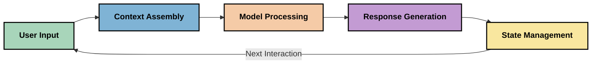
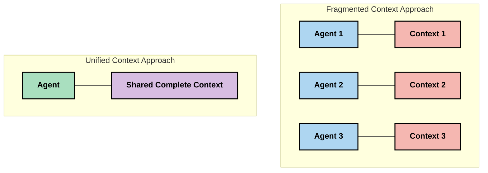
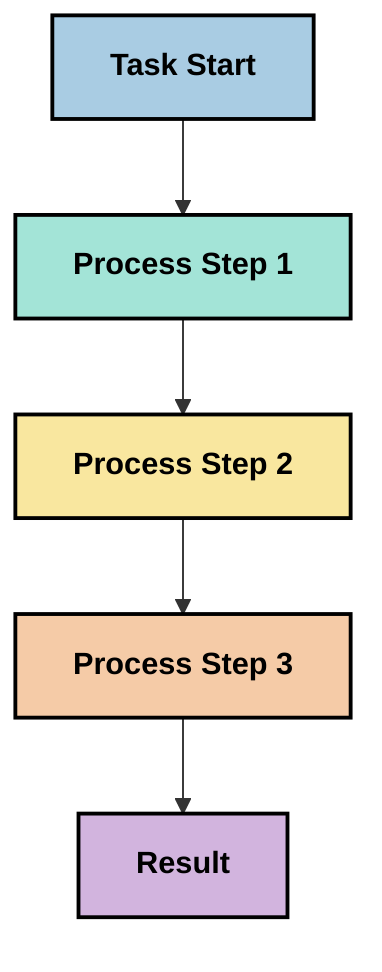
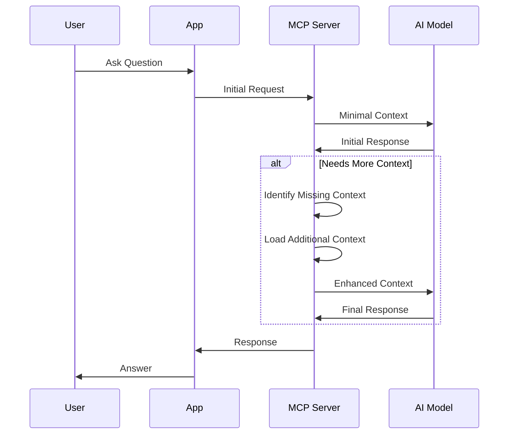
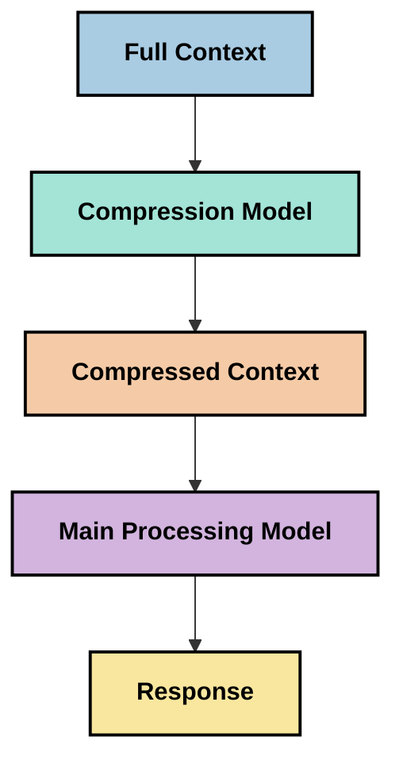
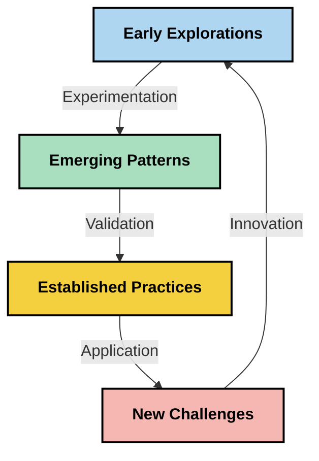

<!--
CO_OP_TRANSLATOR_METADATA:
{
  "original_hash": "5762e8e74dd99d8b7dbb31e69a82561e",
  "translation_date": "2025-07-16T22:55:53+00:00",
  "source_file": "05-AdvancedTopics/mcp-contextengineering/README.md",
  "language_code": "zh"
}
-->
# Context Engineering：MCP生态系统中的新兴概念

## 概述

Context engineering 是人工智能领域中的一个新兴概念，探讨信息在客户端与AI服务之间交互过程中如何被结构化、传递和维护。随着Model Context Protocol（MCP）生态系统的发展，如何有效管理上下文变得愈发重要。本模块介绍了context engineering的概念，并探讨其在MCP实现中的潜在应用。

## 学习目标

完成本模块后，您将能够：

- 理解context engineering这一新兴概念及其在MCP应用中的潜在作用
- 识别MCP协议设计所解决的上下文管理关键挑战
- 探索通过更好地处理上下文来提升模型性能的技术
- 考虑衡量和评估上下文有效性的方法
- 应用这些新兴概念，通过MCP框架提升AI体验

## Context Engineering简介

Context engineering聚焦于用户、应用和AI模型之间信息流的有意识设计与管理。与已成熟的prompt engineering不同，context engineering仍处于实践者定义阶段，旨在解决为AI模型在恰当时间提供恰当信息的独特挑战。

随着大型语言模型（LLM）的发展，上下文的重要性日益凸显。我们提供的上下文的质量、相关性和结构直接影响模型输出。context engineering探讨这种关系，力求制定有效上下文管理的原则。

> “到了2025年，模型已经非常智能。但即使是最聪明的人类，没有被赋予任务的上下文，也无法有效完成工作……‘Context engineering’是prompt engineering的下一阶段。它是在动态系统中自动完成这一过程。” — Walden Yan，Cognition AI

Context engineering可能涵盖：

1. **上下文选择**：确定任务相关的信息
2. **上下文结构化**：组织信息以最大化模型理解
3. **上下文传递**：优化信息发送给模型的方式和时机
4. **上下文维护**：管理上下文的状态和演变
5. **上下文评估**：衡量并提升上下文的有效性

这些关注点与MCP生态系统密切相关，MCP为应用向LLM提供上下文提供了标准化方式。

## 上下文旅程视角

一种理解context engineering的方法是追踪信息在MCP系统中的流转过程：



### 上下文旅程的关键阶段：

1. **用户输入**：用户提供的原始信息（文本、图像、文档）
2. **上下文组装**：将用户输入与系统上下文、对话历史及其他检索信息结合
3. **模型处理**：AI模型处理组装好的上下文
4. **响应生成**：模型基于提供的上下文生成输出
5. **状态管理**：系统根据交互更新内部状态

该视角凸显了AI系统中上下文的动态特性，并提出了如何在每个阶段最佳管理信息的重要问题。

## Context Engineering的新兴原则

随着context engineering领域逐渐成型，实践者开始总结出一些早期原则，这些原则有助于指导MCP的实现选择：

### 原则1：完整共享上下文

上下文应在系统所有组件间完整共享，而非分散在多个代理或进程中。上下文分散时，系统不同部分做出的决策可能相互冲突。



在MCP应用中，这意味着设计系统时应确保上下文在整个流程中无缝流动，而非被划分隔离。

### 原则2：认识到动作隐含决策

模型的每个动作都隐含了对上下文的解读决策。当多个组件基于不同上下文执行操作时，这些隐含决策可能冲突，导致结果不一致。

该原则对MCP应用有重要影响：
- 复杂任务优先采用线性处理，避免上下文分散的并行执行
- 确保所有决策点访问相同的上下文信息
- 设计系统使后续步骤能看到前面决策的完整上下文

### 原则3：平衡上下文深度与窗口限制

随着对话和流程变长，上下文窗口最终会溢出。有效的context engineering探索如何在全面上下文和技术限制之间取得平衡。

正在探索的潜在方法包括：
- 上下文压缩，保留关键信息同时减少token使用
- 根据当前需求逐步加载上下文
- 对先前交互进行总结，同时保留关键决策和事实

## 上下文挑战与MCP协议设计

Model Context Protocol（MCP）设计时充分考虑了上下文管理的独特挑战。理解这些挑战有助于解释MCP协议设计的关键方面：

### 挑战1：上下文窗口限制
大多数AI模型的上下文窗口大小固定，限制了可处理的信息量。

**MCP设计应对：**  
- 协议支持结构化、基于资源的上下文，可高效引用  
- 资源支持分页和渐进加载

### 挑战2：相关性判定
确定哪些信息最相关以纳入上下文非常困难。

**MCP设计应对：**  
- 灵活工具支持基于需求动态检索信息  
- 结构化提示确保上下文组织一致

### 挑战3：上下文持久性
跨交互管理状态需要细致跟踪上下文。

**MCP设计应对：**  
- 标准化会话管理  
- 明确定义上下文演变的交互模式

### 挑战4：多模态上下文
不同类型数据（文本、图像、结构化数据）需不同处理方式。

**MCP设计应对：**  
- 协议设计支持多种内容类型  
- 多模态信息的标准化表示

### 挑战5：安全与隐私
上下文常包含敏感信息，必须加以保护。

**MCP设计应对：**  
- 明确客户端与服务器职责边界  
- 提供本地处理选项，减少数据暴露

理解这些挑战及MCP的应对措施，为探索更高级的context engineering技术奠定基础。

## 新兴的Context Engineering方法

随着context engineering的发展，出现了几种有前景的方法。这些代表当前思考，尚非成熟最佳实践，未来随着MCP应用经验积累将不断演进。

### 1. 单线程线性处理

与分散上下文的多代理架构相比，一些实践者发现单线程线性处理能产生更一致的结果。这符合保持统一上下文的原则。



虽然此方法看似效率不及并行处理，但因每一步都基于对前面决策的完整理解，通常能产出更连贯可靠的结果。

### 2. 上下文分块与优先级排序

将大上下文拆分为可管理的块，并优先选择最重要部分。

```python
# Conceptual Example: Context Chunking and Prioritization
def process_with_chunked_context(documents, query):
    # 1. Break documents into smaller chunks
    chunks = chunk_documents(documents)
    
    # 2. Calculate relevance scores for each chunk
    scored_chunks = [(chunk, calculate_relevance(chunk, query)) for chunk in chunks]
    
    # 3. Sort chunks by relevance score
    sorted_chunks = sorted(scored_chunks, key=lambda x: x[1], reverse=True)
    
    # 4. Use the most relevant chunks as context
    context = create_context_from_chunks([chunk for chunk, score in sorted_chunks[:5]])
    
    # 5. Process with the prioritized context
    return generate_response(context, query)
```

上述示例展示了如何将大型文档拆分成块，并仅选取最相关部分作为上下文。此方法有助于在上下文窗口限制内利用庞大知识库。

### 3. 渐进式上下文加载

根据需要逐步加载上下文，而非一次性全部加载。



渐进式加载从最小上下文开始，仅在必要时扩展。这样能显著减少简单查询的token使用，同时保持处理复杂问题的能力。

### 4. 上下文压缩与总结

在保留关键信息的同时减少上下文大小。



上下文压缩关注：
- 去除冗余信息  
- 总结冗长内容  
- 提取关键事实和细节  
- 保留重要上下文元素  
- 优化token效率

此方法对维持长对话上下文或高效处理大文档尤为重要。一些实践者专门使用模型进行上下文压缩和对话历史总结。

## 探索性Context Engineering考虑事项

在探索context engineering时，以下几点值得关注，尤其是在MCP实现中。这些不是硬性最佳实践，而是可能带来改进的探索方向。

### 明确上下文目标

在实施复杂上下文管理前，清晰表达目标：
- 模型成功所需的具体信息是什么？  
- 哪些信息是必需的，哪些是辅助的？  
- 性能限制有哪些（延迟、token限制、成本）？

### 探索分层上下文方法

部分实践者在概念层面将上下文分层：
- **核心层**：模型始终需要的关键信息  
- **情境层**：当前交互特定的上下文  
- **支持层**：可能有用的额外信息  
- **备用层**：仅在需要时访问的信息

### 调查检索策略

上下文效果往往取决于信息检索方式：
- 语义搜索和嵌入用于查找概念相关信息  
- 关键词搜索用于具体事实细节  
- 混合方法结合多种检索手段  
- 元数据过滤基于类别、日期或来源缩小范围

### 试验上下文连贯性

上下文的结构和流动可能影响模型理解：
- 将相关信息归组  
- 使用一致的格式和组织方式  
- 适当保持逻辑或时间顺序  
- 避免矛盾信息

### 权衡多代理架构的利弊

多代理架构在许多AI框架中流行，但对上下文管理带来挑战：
- 上下文分散导致代理间决策不一致  
- 并行处理可能引发难以调和的冲突  
- 代理间通信开销可能抵消性能提升  
- 复杂状态管理难以保持连贯性

在许多情况下，单代理结合全面上下文管理比多个分散上下文的专用代理更可靠。

### 制定评估方法

为持续改进context engineering，考虑如何衡量成功：
- A/B测试不同上下文结构  
- 监控token使用和响应时间  
- 跟踪用户满意度和任务完成率  
- 分析上下文策略失败的原因和时机

这些考虑反映了context engineering领域的活跃探索。随着领域成熟，更明确的模式和实践将逐步形成。

## 衡量上下文有效性：不断演进的框架

随着context engineering的兴起，实践者开始探索如何衡量其有效性。尚无成熟框架，但已有多种指标被考虑，未来可能指导相关工作。

### 潜在衡量维度

#### 1. 输入效率考量

- **上下文与响应比**：相对于响应大小，所需上下文量多少？  
- **token利用率**：提供的上下文token中，有多少实际影响了响应？  
- **上下文压缩率**：原始信息压缩效果如何？

#### 2. 性能考量

- **延迟影响**：上下文管理对响应时间的影响？  
- **token经济性**：token使用是否得到优化？  
- **检索精度**：检索信息的相关性如何？  
- **资源利用**：所需计算资源多少？

#### 3. 质量考量

- **响应相关性**：响应对查询的匹配度？  
- **事实准确性**：上下文管理是否提升了事实正确性？  
- **一致性**：类似查询响应是否一致？  
- **幻觉率**：更好的上下文是否减少了模型幻觉？

#### 4. 用户体验考量

- **后续提问率**：用户需要多少澄清？  
- **任务完成率**：用户是否成功达成目标？  
- **满意度指标**：用户如何评价体验？

### 探索性衡量方法

在MCP实现中试验context engineering时，可考虑：

1. **基线比较**：先用简单上下文方法建立基线，再测试复杂方法  
2. **渐进变化**：每次只改变一个上下文管理方面，便于隔离效果  
3. **以用户为中心的评估**：结合定量指标和用户反馈  
4. **失败分析**：研究上下文策略失败案例，寻找改进空间  
5. **多维度评估**：权衡效率、质量和用户体验之间的关系

这种多面向的实验性测量方法符合context engineering的探索性质。

## 结语

Context engineering是一个新兴探索领域，可能成为有效MCP应用的核心。通过深入思考信息在系统中的流动，您有望打造更高效、准确且有价值的AI体验。

本模块介绍的技术和方法代表了该领域的早期思考，尚非成熟实践。随着AI能力提升和理解加深，context engineering有望发展为更明确的学科。目前，结合实验与细致测量是最有效的路径。

## 未来潜在方向

Context engineering领域仍处于起步阶段，但已有若干有前景的方向：

- Context engineering原则可能显著影响模型性能、效率、用户体验和可靠性  
- 单线程结合全面上下文管理的方法可能优于多代理架构  
- 专用的上下文压缩模型或将成为AI流程的标准组件  
- 上下文完整性与token限制之间的矛盾将推动上下文处理创新  
- 随着模型更高效地实现类人沟通，真正的多代理协作可能变得可行  
- MCP实现可能演进为标准化当前实验中涌现的上下文管理模式



## 资源

### 官方MCP资源
- [Model Context Protocol 网站](https://modelcontextprotocol.io/)
- [Model Context Protocol 规范](https://github.com/modelcontextprotocol/modelcontextprotocol)
- [MCP 文档](https://modelcontextprotocol.io/docs)
- [MCP C# SDK](https://github.com/modelcontextprotocol/csharp-sdk)
- [MCP Python SDK](https://github.com/modelcontextprotocol/python-sdk)
- [MCP TypeScript SDK](https://github.com/modelcontextprotocol/typescript-sdk)
- [MCP Inspector](https://github.com/modelcontextprotocol/inspector) - MCP 服务器的可视化测试工具

### 上下文工程相关文章
- [不要构建多代理：上下文工程原则](https://cognition.ai/blog/dont-build-multi-agents) - Walden Yan 关于上下文工程原则的见解
- [构建代理的实用指南](https://cdn.openai.com/business-guides-and-resources/a-practical-guide-to-building-agents.pdf) - OpenAI 关于高效代理设计的指南
- [构建高效代理](https://www.anthropic.com/engineering/building-effective-agents) - Anthropic 的代理开发方法

### 相关研究
- [大型语言模型的动态检索增强](https://arxiv.org/abs/2310.01487) - 关于动态检索方法的研究
- [迷失中间：语言模型如何使用长上下文](https://arxiv.org/abs/2307.03172) - 关于上下文处理模式的重要研究
- [基于 CLIP 潜变量的分层文本条件图像生成](https://arxiv.org/abs/2204.06125) - DALL-E 2 论文，关于上下文结构的见解
- [探索上下文在大型语言模型架构中的作用](https://aclanthology.org/2023.findings-emnlp.124/) - 最新的上下文处理研究
- [多代理协作：综述](https://arxiv.org/abs/2304.03442) - 关于多代理系统及其挑战的研究

### 额外资源
- [上下文窗口优化技术](https://learn.microsoft.com/en-us/azure/ai-services/openai/concepts/context-window)
- [高级 RAG 技术](https://www.microsoft.com/en-us/research/blog/retrieval-augmented-generation-rag-and-frontier-models/)
- [Semantic Kernel 文档](https://github.com/microsoft/semantic-kernel)
- [上下文管理的 AI 工具包](https://github.com/microsoft/aitoolkit)

## 接下来内容
- [6. 社区贡献](../../06-CommunityContributions/README.md)

**免责声明**：  
本文件使用 AI 翻译服务 [Co-op Translator](https://github.com/Azure/co-op-translator) 进行翻译。虽然我们力求准确，但请注意，自动翻译可能包含错误或不准确之处。原始语言的文档应被视为权威来源。对于重要信息，建议采用专业人工翻译。对于因使用本翻译而产生的任何误解或误释，我们不承担任何责任。