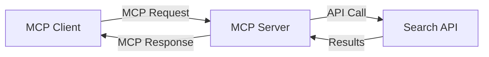
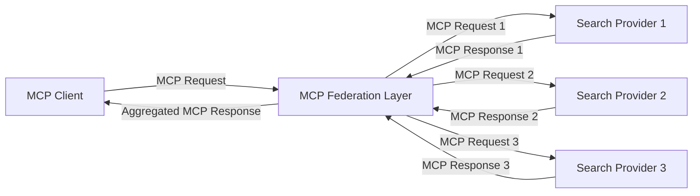
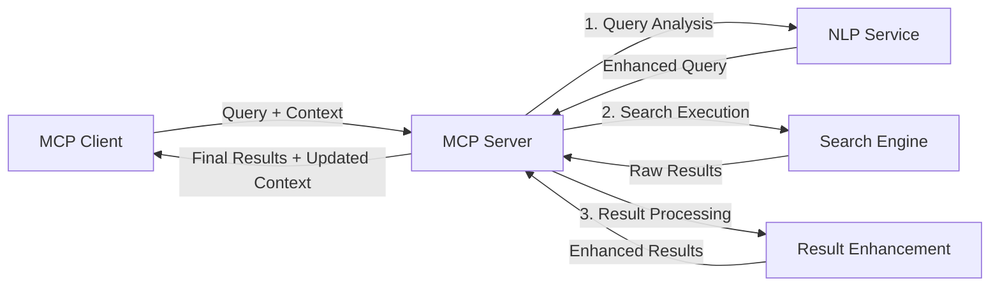

<!--
CO_OP_TRANSLATOR_METADATA:
{
  "original_hash": "eb12652eb7bd17f2193b835a344425c6",
  "translation_date": "2025-06-26T13:42:01+00:00",
  "source_file": "05-AdvancedTopics/mcp-realtimesearch/README.md",
  "language_code": "zh"
}
-->
## 代码示例免责声明

> **重要提示**：以下代码示例展示了如何将 Model Context Protocol (MCP) 与网页搜索功能集成。虽然它们遵循官方 MCP SDK 的模式和结构，但为了教学目的做了简化。
> 
> 这些示例包括：
> 
> 1. **Python 实现**：一个 FastMCP 服务器实现，提供网页搜索工具并连接外部搜索 API。该示例展示了正确的生命周期管理、上下文处理和工具实现，遵循[官方 MCP Python SDK](https://github.com/modelcontextprotocol/python-sdk)的模式。服务器使用了推荐的 Streamable HTTP 传输，这已取代旧的 SSE 传输，适合生产环境部署。
> 
> 2. **JavaScript 实现**：基于[官方 MCP TypeScript SDK](https://github.com/modelcontextprotocol/typescript-sdk)的 FastMCP 模式，使用 TypeScript/JavaScript 创建搜索服务器，具备正确的工具定义和客户端连接。遵循最新推荐的会话管理和上下文保持模式。
> 
> 这些示例在生产环境中还需补充错误处理、身份验证和具体 API 集成代码。示例中的搜索 API 端点（`https://api.search-service.example/search`）为占位符，需替换为实际搜索服务端点。
> 
> 有关完整实现细节和最新方法，请参阅[官方 MCP 规范](https://spec.modelcontextprotocol.io/)和 SDK 文档。

## 核心概念

### Model Context Protocol (MCP) 框架

MCP 从根本上为 AI 模型、应用和服务之间的上下文交换提供了标准化方式。在实时网页搜索中，这一框架对于创建连贯的多轮搜索体验至关重要。关键组件包括：

1. **客户端-服务器架构**：MCP 明确区分搜索客户端（请求方）和搜索服务器（提供方），支持灵活的部署模型。

2. **JSON-RPC 通信**：协议采用 JSON-RPC 进行消息交换，兼容网页技术，便于跨平台实现。

3. **上下文管理**：MCP 定义了结构化方法，用于维护、更新和利用跨多次交互的搜索上下文。

4. **工具定义**：将搜索功能暴露为标准化工具，具有明确的参数和返回值。

5. **流式支持**：协议支持流式结果，对于实时搜索中结果逐步到达的场景非常重要。

### 网页搜索集成模式

将 MCP 与网页搜索集成时，会出现几种典型模式：

#### 1. 直接搜索提供者集成

在此模式中，MCP 服务器直接与一个或多个搜索 API 交互，将 MCP 请求转换为特定 API 调用，并将结果格式化为 MCP 响应。

#### 2. 保持上下文的联合搜索

此模式将搜索查询分发到多个兼容 MCP 的搜索提供者，每个提供者可能专注于不同类型的内容或搜索能力，同时保持统一的上下文。

#### 3. 上下文增强的搜索链

该模式将搜索过程划分为多个阶段，每个步骤对上下文进行丰富，逐步获得更相关的结果。

### 搜索上下文组成部分

基于 MCP 的网页搜索中，上下文通常包括：

- **查询历史**：会话中的先前搜索查询
- **用户偏好**：语言、地区、安全搜索设置
- **交互历史**：点击过的结果、在结果上停留的时间
- **搜索参数**：过滤器、排序方式及其他搜索修饰符
- **领域知识**：与搜索相关的特定主题上下文
- **时间上下文**：基于时间的相关性因素
- **来源偏好**：可信或优选的信息来源

## 用例与应用

### 研究与信息收集

MCP 通过以下方式提升研究流程：

- 跨搜索会话保持研究上下文
- 支持更复杂且上下文相关的查询
- 支持多源搜索联合
- 促进从搜索结果中提取知识

### 实时新闻与趋势监控

MCP 驱动的搜索为新闻监控带来优势：

- 近实时发现新兴新闻事件
- 上下文过滤相关信息
- 跨多个来源的主题和实体跟踪
- 基于用户上下文的个性化新闻提醒

### AI 增强的浏览与研究

MCP 为 AI 增强浏览开辟新可能：

- 基于当前浏览活动的上下文搜索建议
- 与基于大语言模型的助手无缝集成网页搜索
- 保持上下文的多轮搜索优化
- 加强事实核查和信息验证

## 未来趋势与创新

### MCP 在网页搜索中的演进

未来我们预计 MCP 将发展以支持：

- **多模态搜索**：整合文本、图像、音频和视频搜索并保持上下文
- **去中心化搜索**：支持分布式和联合搜索生态系统
- **搜索隐私**：上下文感知的隐私保护搜索机制
- **查询理解**：对自然语言搜索查询进行深度语义解析

### 技术潜在进展

将塑造 MCP 搜索未来的新兴技术包括：

1. **神经搜索架构**：基于嵌入的搜索系统，针对 MCP 优化
2. **个性化搜索上下文**：随着时间学习用户搜索习惯
3. **知识图谱集成**：通过领域知识图谱增强上下文搜索
4. **跨模态上下文**：维护不同搜索模态间的上下文

## 实操练习

### 练习 1：搭建基础 MCP 搜索管道

本练习将教你如何：
- 配置基础 MCP 搜索环境
- 实现网页搜索的上下文处理器
- 测试并验证搜索迭代中的上下文保持

### 练习 2：使用 MCP 搜索构建研究助手

创建一个完整应用，能够：
- 处理自然语言研究问题
- 执行上下文感知的网页搜索
- 综合多源信息
- 呈现有条理的研究成果

### 练习 3：实现 MCP 的多源搜索联合

高级练习涵盖：
- 基于上下文的多搜索引擎查询分发
- 结果排序与聚合
- 上下文去重搜索结果
- 处理特定来源的元数据

## 附加资源

- [Model Context Protocol 规范](https://spec.modelcontextprotocol.io/) - 官方 MCP 规范及详细协议文档
- [Model Context Protocol 文档](https://modelcontextprotocol.io/) - 详细教程和实现指南
- [MCP Python SDK](https://github.com/modelcontextprotocol/python-sdk) - MCP 协议官方 Python 实现
- [MCP TypeScript SDK](https://github.com/modelcontextprotocol/typescript-sdk) - MCP 协议官方 TypeScript 实现
- [MCP 参考服务器](https://github.com/modelcontextprotocol/servers) - MCP 服务器参考实现
- [Bing Web Search API 文档](https://learn.microsoft.com/en-us/bing/search-apis/bing-web-search/overview) - 微软网页搜索 API
- [Google Custom Search JSON API](https://developers.google.com/custom-search/v1/overview) - 谷歌可编程搜索引擎
- [SerpAPI 文档](https://serpapi.com/search-api) - 搜索引擎结果页面 API
- [Meilisearch 文档](https://www.meilisearch.com/docs) - 开源搜索引擎
- [Elasticsearch 文档](https://www.elastic.co/guide/index.html) - 分布式搜索与分析引擎
- [LangChain 文档](https://python.langchain.com/docs/get_started/introduction) - 基于大语言模型构建应用

## 学习成果

完成本模块后，你将能够：

- 理解实时网页搜索的基础及其挑战
- 说明 Model Context Protocol (MCP) 如何增强实时网页搜索能力
- 使用流行框架和 API 实现基于 MCP 的搜索解决方案
- 设计并部署可扩展、高性能的 MCP 搜索架构
- 将 MCP 概念应用于语义搜索、研究助手和 AI 增强浏览等多种用例
- 评估 MCP 搜索技术的新兴趋势和未来创新

### 信任与安全考虑

在实现基于 MCP 的网页搜索解决方案时，请牢记 MCP 规范中的重要原则：

1. **用户同意与控制**：用户必须明确同意并理解所有数据访问和操作。对于可能访问外部数据源的网页搜索实现，这一点尤为重要。

2. **数据隐私**：妥善处理搜索查询和结果，尤其是当其中可能包含敏感信息时。实施适当的访问控制以保护用户数据。

3. **工具安全**：为搜索工具实施适当的授权和验证，因为它们通过任意代码执行可能带来安全风险。除非来自可信服务器，否则工具行为描述应视为不可信。

4. **清晰文档**：提供关于 MCP 搜索实现能力、限制和安全考量的清晰文档，遵循 MCP 规范中的实施指南。

5. **健壮的同意流程**：构建健全的同意和授权流程，在授权使用工具前清楚说明其功能，特别是那些与外部网页资源交互的工具。

有关 MCP 安全与信任考虑的完整细节，请参阅[官方文档](https://modelcontextprotocol.io/specification/2025-03-26#security-and-trust-%26-safety)。

## 接下来

- [5.11 Entra ID 认证用于 Model Context Protocol 服务器](../mcp-security-entra/README.md)

**免责声明**：  
本文件使用 AI 翻译服务 [Co-op Translator](https://github.com/Azure/co-op-translator) 进行翻译。虽然我们努力确保准确性，但请注意，自动翻译可能包含错误或不准确之处。原始语言的文件应被视为权威来源。对于重要信息，建议采用专业人工翻译。对于因使用本翻译而产生的任何误解或误释，我们不承担任何责任。