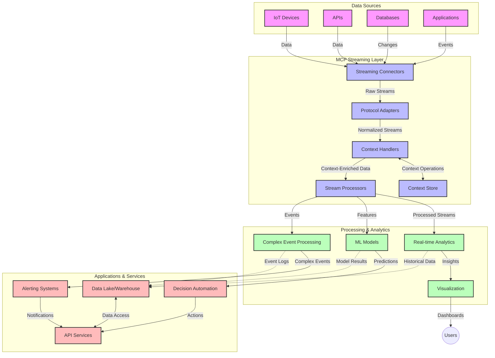

<!--
CO_OP_TRANSLATOR_METADATA:
{
  "original_hash": "195f7287638b77a549acadd96c8f981c",
  "translation_date": "2025-07-14T01:28:30+00:00",
  "source_file": "05-AdvancedTopics/mcp-realtimestreaming/README.md",
  "language_code": "zh"
}
-->
# Model Context Protocol 实时数据流传输协议

## 概述

在当今数据驱动的世界中，实时数据流传输已成为必不可少的技术，企业和应用程序需要即时获取信息以做出及时决策。Model Context Protocol（MCP）代表了优化实时流传输流程的重要进展，提升了数据处理效率，保持了上下文的完整性，并改善了整体系统性能。

本模块探讨了 MCP 如何通过为 AI 模型、流平台和应用程序提供标准化的上下文管理方法，改变实时数据流传输的方式。

## 实时数据流传输简介

实时数据流传输是一种技术范式，支持数据在生成时持续传输、处理和分析，使系统能够立即响应新信息。与传统的批处理操作静态数据集不同，流处理对动态数据进行处理，能够以极低的延迟提供洞察和响应。

### 实时数据流传输的核心概念：

- **持续数据流**：数据作为连续不断的事件或记录流进行处理。
- **低延迟处理**：系统设计旨在最大限度减少数据生成与处理之间的时间。
- **可扩展性**：流架构必须能够应对变化的数据量和速度。
- **容错性**：系统需要具备抗故障能力，确保数据流不中断。
- **有状态处理**：跨事件维护上下文对于有意义的分析至关重要。

### Model Context Protocol 与实时流传输

Model Context Protocol（MCP）解决了实时流环境中的若干关键挑战：

1. **上下文连续性**：MCP 标准化了分布式流组件间的上下文维护，确保 AI 模型和处理节点能够访问相关的历史和环境上下文。

2. **高效状态管理**：通过提供结构化的上下文传输机制，MCP 降低了流管道中状态管理的开销。

3. **互操作性**：MCP 为不同流技术和 AI 模型之间的上下文共享创建了通用语言，实现更灵活和可扩展的架构。

4. **流优化上下文**：MCP 实现可以优先考虑对实时决策最相关的上下文元素，兼顾性能和准确性。

5. **自适应处理**：通过 MCP 的上下文管理，流系统能够根据数据中不断变化的条件和模式动态调整处理。

在从物联网传感器网络到金融交易平台的现代应用中，MCP 与流技术的结合实现了更智能、具备上下文感知的处理，能够实时应对复杂且不断演变的场景。

## 学习目标

完成本课后，您将能够：

- 理解实时数据流传输的基本原理及其挑战
- 说明 Model Context Protocol（MCP）如何增强实时数据流传输
- 使用 Kafka 和 Pulsar 等流行框架实现基于 MCP 的流解决方案
- 设计并部署具备容错性和高性能的 MCP 流架构
- 将 MCP 概念应用于物联网、金融交易和 AI 驱动的分析场景
- 评估基于 MCP 流技术的新兴趋势和未来创新

### 定义与意义

实时数据流传输涉及数据的持续生成、处理和传递，延迟极低。与批处理将数据收集后分批处理不同，流数据在到达时逐步处理，实现即时洞察和响应。

实时数据流传输的关键特征包括：

- **低延迟**：在毫秒到秒级别内处理和分析数据
- **持续流动**：来自多源的不断数据流
- **即时处理**：数据到达即被分析，而非批量处理
- **事件驱动架构**：对事件发生即时响应

### 传统数据流传输的挑战

传统流传输方法存在若干限制：

1. **上下文丢失**：难以在分布式系统间保持上下文
2. **可扩展性问题**：难以扩展以处理高量、高速数据
3. **集成复杂性**：不同系统间互操作性差
4. **延迟管理**：在吞吐量和处理时间间权衡
5. **数据一致性**：确保流中数据的准确性和完整性

## 理解 Model Context Protocol（MCP）

### 什么是 MCP？

Model Context Protocol（MCP）是一种标准化通信协议，旨在促进 AI 模型与应用之间的高效交互。在实时数据流传输中，MCP 提供了：

- 在数据管道中保持上下文
- 标准化数据交换格式
- 优化大规模数据传输
- 增强模型间及模型与应用间的通信

### 核心组件与架构

MCP 实时流架构包含以下关键组件：

1. **上下文处理器**：管理并维护流管道中的上下文信息
2. **流处理器**：利用上下文感知技术处理输入数据流
3. **协议适配器**：在不同流协议间转换，同时保持上下文
4. **上下文存储**：高效存储和检索上下文信息
5. **流连接器**：连接各种流平台（Kafka、Pulsar、Kinesis 等）



### MCP 如何提升实时数据处理

MCP 通过以下方式解决传统流处理难题：

- **上下文完整性**：维护整个管道中数据点间的关系
- **传输优化**：通过智能上下文管理减少数据交换冗余
- **标准化接口**：为流组件提供一致的 API
- **降低延迟**：通过高效上下文处理减少处理开销
- **增强可扩展性**：支持横向扩展同时保持上下文

## 集成与实现

实时数据流系统需要精心设计架构和实现，以兼顾性能和上下文完整性。Model Context Protocol 提供了标准化方法，将 AI 模型与流技术集成，构建更复杂、具备上下文感知的处理管道。

### MCP 在流架构中的集成概述

在实时流环境中实现 MCP 需考虑以下关键点：

1. **上下文序列化与传输**：MCP 提供高效机制，将上下文信息编码进流数据包，确保关键上下文随数据贯穿处理管道。包括针对流传输优化的标准序列化格式。

2. **有状态流处理**：MCP 通过在处理节点间保持一致的上下文表示，实现更智能的有状态处理。这在分布式流架构中尤为重要，因状态管理传统上较为复杂。

3. **事件时间与处理时间**：MCP 实现需解决事件发生时间与处理时间的区分问题，协议可包含保留事件时间语义的时间上下文。

4. **背压管理**：通过标准化上下文处理，MCP 有助于管理流系统中的背压，使组件能传达处理能力并相应调整数据流。

5. **上下文窗口与聚合**：MCP 支持更复杂的窗口操作，提供时间和关系上下文的结构化表示，实现跨事件流的更有意义聚合。

6. **精确一次处理**：在需要精确一次语义的流系统中，MCP 可包含处理元数据，帮助跟踪和验证分布式组件的处理状态。

MCP 在多种流技术中的实现，形成了统一的上下文管理方法，减少了定制集成代码的需求，同时增强了系统在数据流动过程中保持有意义上下文的能力。

### MCP 在各类数据流框架中的应用

以下示例基于当前 MCP 规范，采用基于 JSON-RPC 的协议及不同传输机制。代码展示了如何实现自定义传输，集成 Kafka 和 Pulsar 等流平台，同时保持与 MCP 协议的完全兼容。

示例旨在展示如何将流平台与 MCP 集成，实现实时数据处理并保持 MCP 核心的上下文感知能力。此方法确保代码示例准确反映截至 2025 年 6 月的 MCP 规范状态。

MCP 可集成于以下流行框架：

#### Apache Kafka 集成

```python
import asyncio
import json
from typing import Dict, Any, Optional
from confluent_kafka import Consumer, Producer, KafkaError
from mcp.client import Client, ClientCapabilities
from mcp.core.message import JsonRpcMessage
from mcp.core.transports import Transport

# Custom transport class to bridge MCP with Kafka
class KafkaMCPTransport(Transport):
    def __init__(self, bootstrap_servers: str, input_topic: str, output_topic: str):
        self.bootstrap_servers = bootstrap_servers
        self.input_topic = input_topic
        self.output_topic = output_topic
        self.producer = Producer({'bootstrap.servers': bootstrap_servers})
        self.consumer = Consumer({
            'bootstrap.servers': bootstrap_servers,
            'group.id': 'mcp-client-group',
            'auto.offset.reset': 'earliest'
        })
        self.message_queue = asyncio.Queue()
        self.running = False
        self.consumer_task = None
        
    async def connect(self):
        """Connect to Kafka and start consuming messages"""
        self.consumer.subscribe([self.input_topic])
        self.running = True
        self.consumer_task = asyncio.create_task(self._consume_messages())
        return self
        
    async def _consume_messages(self):
        """Background task to consume messages from Kafka and queue them for processing"""
        while self.running:
            try:
                msg = self.consumer.poll(1.0)
                if msg is None:
                    await asyncio.sleep(0.1)
                    continue
                
                if msg.error():
                    if msg.error().code() == KafkaError._PARTITION_EOF:
                        continue
                    print(f"Consumer error: {msg.error()}")
                    continue
                
                # Parse the message value as JSON-RPC
                try:
                    message_str = msg.value().decode('utf-8')
                    message_data = json.loads(message_str)
                    mcp_message = JsonRpcMessage.from_dict(message_data)
                    await self.message_queue.put(mcp_message)
                except Exception as e:
                    print(f"Error parsing message: {e}")
            except Exception as e:
                print(f"Error in consumer loop: {e}")
                await asyncio.sleep(1)
    
    async def read(self) -> Optional[JsonRpcMessage]:
        """Read the next message from the queue"""
        try:
            message = await self.message_queue.get()
            return message
        except Exception as e:
            print(f"Error reading message: {e}")
            return None
    
    async def write(self, message: JsonRpcMessage) -> None:
        """Write a message to the Kafka output topic"""
        try:
            message_json = json.dumps(message.to_dict())
            self.producer.produce(
                self.output_topic,
                message_json.encode('utf-8'),
                callback=self._delivery_report
            )
            self.producer.poll(0)  # Trigger callbacks
        except Exception as e:
            print(f"Error writing message: {e}")
    
    def _delivery_report(self, err, msg):
        """Kafka producer delivery callback"""
        if err is not None:
            print(f'Message delivery failed: {err}')
        else:
            print(f'Message delivered to {msg.topic()} [{msg.partition()}]')
    
    async def close(self) -> None:
        """Close the transport"""
        self.running = False
        if self.consumer_task:
            self.consumer_task.cancel()
            try:
                await self.consumer_task
            except asyncio.CancelledError:
                pass
        self.consumer.close()
        self.producer.flush()

# Example usage of the Kafka MCP transport
async def kafka_mcp_example():
    # Create MCP client with Kafka transport
    client = Client(
        {"name": "kafka-mcp-client", "version": "1.0.0"},
        ClientCapabilities({})
    )
    
    # Create and connect the Kafka transport
    transport = KafkaMCPTransport(
        bootstrap_servers="localhost:9092",
        input_topic="mcp-responses",
        output_topic="mcp-requests"
    )
    
    await client.connect(transport)
    
    try:
        # Initialize the MCP session
        await client.initialize()
        
        # Example of executing a tool via MCP
        response = await client.execute_tool(
            "process_data",
            {
                "data": "sample data",
                "metadata": {
                    "source": "sensor-1",
                    "timestamp": "2025-06-12T10:30:00Z"
                }
            }
        )
        
        print(f"Tool execution response: {response}")
        
        # Clean shutdown
        await client.shutdown()
    finally:
        await transport.close()

# Run the example
if __name__ == "__main__":
    asyncio.run(kafka_mcp_example())
```

#### Apache Pulsar 实现

```python
import asyncio
import json
import pulsar
from typing import Dict, Any, Optional
from mcp.core.message import JsonRpcMessage
from mcp.core.transports import Transport
from mcp.server import Server, ServerOptions
from mcp.server.tools import Tool, ToolExecutionContext, ToolMetadata

# Create a custom MCP transport that uses Pulsar
class PulsarMCPTransport(Transport):
    def __init__(self, service_url: str, request_topic: str, response_topic: str):
        self.service_url = service_url
        self.request_topic = request_topic
        self.response_topic = response_topic
        self.client = pulsar.Client(service_url)
        self.producer = self.client.create_producer(response_topic)
        self.consumer = self.client.subscribe(
            request_topic,
            "mcp-server-subscription",
            consumer_type=pulsar.ConsumerType.Shared
        )
        self.message_queue = asyncio.Queue()
        self.running = False
        self.consumer_task = None
    
    async def connect(self):
        """Connect to Pulsar and start consuming messages"""
        self.running = True
        self.consumer_task = asyncio.create_task(self._consume_messages())
        return self
    
    async def _consume_messages(self):
        """Background task to consume messages from Pulsar and queue them for processing"""
        while self.running:
            try:
                # Non-blocking receive with timeout
                msg = self.consumer.receive(timeout_millis=500)
                
                # Process the message
                try:
                    message_str = msg.data().decode('utf-8')
                    message_data = json.loads(message_str)
                    mcp_message = JsonRpcMessage.from_dict(message_data)
                    await self.message_queue.put(mcp_message)
                    
                    # Acknowledge the message
                    self.consumer.acknowledge(msg)
                except Exception as e:
                    print(f"Error processing message: {e}")
                    # Negative acknowledge if there was an error
                    self.consumer.negative_acknowledge(msg)
            except Exception as e:
                # Handle timeout or other exceptions
                await asyncio.sleep(0.1)
    
    async def read(self) -> Optional[JsonRpcMessage]:
        """Read the next message from the queue"""
        try:
            message = await self.message_queue.get()
            return message
        except Exception as e:
            print(f"Error reading message: {e}")
            return None
    
    async def write(self, message: JsonRpcMessage) -> None:
        """Write a message to the Pulsar output topic"""
        try:
            message_json = json.dumps(message.to_dict())
            self.producer.send(message_json.encode('utf-8'))
        except Exception as e:
            print(f"Error writing message: {e}")
    
    async def close(self) -> None:
        """Close the transport"""
        self.running = False
        if self.consumer_task:
            self.consumer_task.cancel()
            try:
                await self.consumer_task
            except asyncio.CancelledError:
                pass
        self.consumer.close()
        self.producer.close()
        self.client.close()

# Define a sample MCP tool that processes streaming data
@Tool(
    name="process_streaming_data",
    description="Process streaming data with context preservation",
    metadata=ToolMetadata(
        required_capabilities=["streaming"]
    )
)
async def process_streaming_data(
    ctx: ToolExecutionContext,
    data: str,
    source: str,
    priority: str = "medium"
) -> Dict[str, Any]:
    """
    Process streaming data while preserving context
    
    Args:
        ctx: Tool execution context
        data: The data to process
        source: The source of the data
        priority: Priority level (low, medium, high)
        
    Returns:
        Dict containing processed results and context information
    """
    # Example processing that leverages MCP context
    print(f"Processing data from {source} with priority {priority}")
    
    # Access conversation context from MCP
    conversation_id = ctx.conversation_id if hasattr(ctx, 'conversation_id') else "unknown"
    
    # Return results with enhanced context
    return {
        "processed_data": f"Processed: {data}",
        "context": {
            "conversation_id": conversation_id,
            "source": source,
            "priority": priority,
            "processing_timestamp": ctx.get_current_time_iso()
        }
    }

# Example MCP server implementation using Pulsar transport
async def run_mcp_server_with_pulsar():
    # Create MCP server
    server = Server(
        {"name": "pulsar-mcp-server", "version": "1.0.0"},
        ServerOptions(
            capabilities={"streaming": True}
        )
    )
    
    # Register our tool
    server.register_tool(process_streaming_data)
    
    # Create and connect Pulsar transport
    transport = PulsarMCPTransport(
        service_url="pulsar://localhost:6650",
        request_topic="mcp-requests",
        response_topic="mcp-responses"
    )
    
    try:
        # Start the server with the Pulsar transport
        await server.run(transport)
    finally:
        await transport.close()

# Run the server
if __name__ == "__main__":
    asyncio.run(run_mcp_server_with_pulsar())
```

### 部署最佳实践

实施 MCP 实时流时应注意：

1. **设计容错性**：
   - 实现完善的错误处理
   - 使用死信队列处理失败消息
   - 设计幂等处理器

2. **性能优化**：
   - 配置合适的缓冲区大小
   - 适当使用批处理
   - 实施背压机制

3. **监控与观察**：
   - 跟踪流处理指标
   - 监控上下文传播
   - 设置异常告警

4. **保障流安全**：
   - 对敏感数据加密
   - 使用身份验证和授权
   - 应用适当的访问控制

### MCP 在物联网和边缘计算中的应用

MCP 通过以下方式增强物联网流处理：

- 在处理管道中保持设备上下文
- 实现高效的边缘到云数据流传输
- 支持物联网数据流的实时分析
- 促进设备间基于上下文的通信

示例：智慧城市传感器网络  
```
Sensors → Edge Gateways → MCP Stream Processors → Real-time Analytics → Automated Responses
```

### 在金融交易和高频交易中的作用

MCP 为金融数据流传输带来显著优势：

- 超低延迟处理支持交易决策
- 维护交易上下文贯穿处理流程
- 支持具备上下文感知的复杂事件处理
- 确保分布式交易系统中的数据一致性

### 增强 AI 驱动的数据分析

MCP 为流分析开辟新可能：

- 实时模型训练与推理
- 持续从流数据中学习
- 上下文感知的特征提取
- 多模型推理管道中保持上下文

## 未来趋势与创新

### MCP 在实时环境中的演进

展望未来，MCP 预计将应对：

- **量子计算集成**：为量子流系统做准备
- **边缘原生处理**：将更多上下文感知处理迁移至边缘设备
- **自主流管理**：实现自我优化的流管道
- **联邦流处理**：在保护隐私的前提下实现分布式处理

### 技术潜在进展

将塑造 MCP 流未来的新兴技术：

1. **AI 优化流协议**：专为 AI 工作负载设计的定制协议
2. **类脑计算集成**：基于脑启发的流处理计算
3. **无服务器流处理**：事件驱动、可扩展且无需基础设施管理的流
4. **分布式上下文存储**：全球分布且高度一致的上下文管理

## 实践练习

### 练习 1：搭建基础 MCP 流管道

本练习将指导您：

- 配置基础 MCP 流环境
- 实现流处理的上下文处理器
- 测试并验证上下文保持

### 练习 2：构建实时分析仪表盘

创建完整应用，实现：

- 使用 MCP 采集流数据
- 在保持上下文的同时处理流
- 实时可视化结果

### 练习 3：基于 MCP 实现复杂事件处理

高级练习涵盖：

- 流中的模式检测
- 多流间的上下文关联
- 生成带有上下文的复杂事件

## 额外资源

- [Model Context Protocol Specification](https://github.com/modelcontextprotocol) - MCP 官方规范与文档
- [Apache Kafka Documentation](https://kafka.apache.org/documentation/) - Kafka 流处理学习资料
- [Apache Pulsar](https://pulsar.apache.org/) - 统一消息与流平台
- [Streaming Systems: The What, Where, When, and How of Large-Scale Data Processing](https://www.oreilly.com/library/view/streaming-systems/9781491983867/) - 流架构综合书籍
- [Microsoft Azure Event Hubs](https://learn.microsoft.com/azure/event-hubs/event-hubs-about) - 托管事件流服务
- [MLflow Documentation](https://mlflow.org/docs/latest/index.html) - 机器学习模型跟踪与部署
- [Real-Time Analytics with Apache Storm](https://storm.apache.org/releases/current/index.html) - 实时计算处理框架
- [Flink ML](https://nightlies.apache.org/flink/flink-ml-docs-master/) - Apache Flink 机器学习库
- [LangChain Documentation](https://python.langchain.com/docs/get_started/introduction) - 使用大型语言模型构建应用

## 学习成果

完成本模块后，您将能够：

- 理解实时数据流传输的基本原理及其挑战
- 说明 Model Context Protocol（MCP）如何增强实时数据流传输
- 使用 Kafka 和 Pulsar 等流行框架实现基于 MCP 的流解决方案
- 设计并部署具备容错性和高性能的 MCP 流架构
- 将 MCP 概念应用于物联网、金融交易和 AI 驱动的分析场景
- 评估基于 MCP 流技术的新兴趋势和未来创新

## 后续内容

- [5.11 Realtime Search](../mcp-realtimesearch/README.md)

**免责声明**：  
本文件使用 AI 翻译服务 [Co-op Translator](https://github.com/Azure/co-op-translator) 进行翻译。虽然我们力求准确，但请注意，自动翻译可能包含错误或不准确之处。原始文件的母语版本应被视为权威来源。对于重要信息，建议采用专业人工翻译。因使用本翻译而产生的任何误解或误释，我们概不负责。