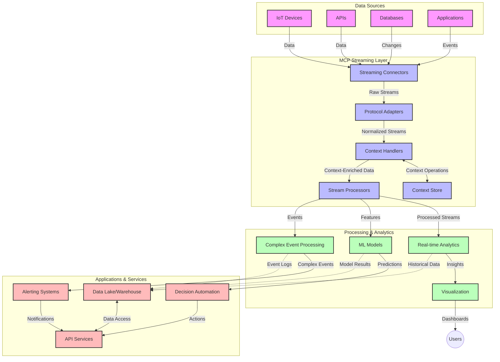

<!--
CO_OP_TRANSLATOR_METADATA:
{
  "original_hash": "68c518dbff8a3b127ed2aa934054c56c",
  "translation_date": "2025-06-11T17:00:13+00:00",
  "source_file": "05-AdvancedTopics/mcp-realtimestreaming/README.md",
  "language_code": "zh"
}
-->
# 实时数据流的模型上下文协议

## 概述

在当今数据驱动的世界中，实时数据流变得至关重要，企业和应用需要即时访问信息以做出及时决策。模型上下文协议（MCP）在优化这些实时流处理过程中取得了重大进展，提升了数据处理效率，保持上下文完整性，并改善整体系统性能。

本模块探讨了 MCP 如何通过为 AI 模型、流处理平台和应用提供标准化的上下文管理方法，改变实时数据流处理的方式。

## 实时数据流简介

实时数据流是一种技术范式，能够实现数据的持续传输、处理和分析，使系统能立即响应新信息。与传统批处理只处理静态数据集不同，流处理对动态数据进行处理，几乎无延迟地提供洞察和操作。

### 实时数据流的核心概念：

- **持续数据流**：数据作为连续不断的事件或记录流进行处理。
- **低延迟处理**：系统设计旨在最大限度减少数据生成与处理之间的时间。
- **可扩展性**：流架构必须能应对变化的数据量和速度。
- **容错性**：系统需具备抗故障能力，确保数据流不中断。
- **有状态处理**：跨事件维护上下文对有意义的分析至关重要。

### 模型上下文协议与实时流处理

模型上下文协议（MCP）解决了实时流环境中的几个关键挑战：

1. **上下文连续性**：MCP 标准化了分布式流组件间上下文的维护，确保 AI 模型和处理节点能访问相关的历史及环境上下文。

2. **高效状态管理**：通过提供结构化的上下文传输机制，MCP 降低了流处理管道中状态管理的开销。

3. **互操作性**：MCP 创建了一个通用语言，用于不同流技术和 AI 模型之间的上下文共享，实现更灵活、可扩展的架构。

4. **流处理优化的上下文**：MCP 实现能够优先考虑对实时决策最相关的上下文元素，兼顾性能和准确性。

5. **自适应处理**：通过 MCP 的上下文管理，流处理系统可以根据数据中不断变化的条件和模式动态调整处理策略。

在从物联网传感器网络到金融交易平台的现代应用中，MCP 与流技术的结合使得处理更加智能和具备上下文感知，能实时响应复杂且不断变化的情况。

## 学习目标

完成本课程后，您将能够：

- 理解实时数据流的基础及其挑战
- 说明模型上下文协议（MCP）如何增强实时数据流
- 使用 Kafka 和 Pulsar 等流行框架实现基于 MCP 的流处理解决方案
- 设计并部署具备容错性和高性能的 MCP 流架构
- 将 MCP 概念应用于物联网、金融交易及 AI 驱动的分析场景
- 评估基于 MCP 流技术的新兴趋势和未来创新

### 定义与重要性

实时数据流涉及数据的持续生成、处理和传递，延迟极低。不同于将数据收集后批量处理的方式，流数据是随着数据到达逐步处理，支持即时洞察和响应。

实时数据流的关键特征包括：

- **低延迟**：在毫秒到秒级内处理和分析数据
- **持续流动**：来自多源的不中断数据流
- **即时处理**：数据到达即被分析，而非批量处理
- **事件驱动架构**：对事件的实时响应

### 传统数据流的挑战

传统数据流方法存在若干限制：

1. **上下文丢失**：难以在分布式系统间维护上下文
2. **扩展性问题**：难以应对高量、高速数据
3. **集成复杂**：不同系统间互操作性不足
4. **延迟管理**：需在吞吐量和处理时间间权衡
5. **数据一致性**：确保流中数据准确完整

## 理解模型上下文协议（MCP）

### 什么是 MCP？

模型上下文协议（MCP）是一种标准化通信协议，旨在促进 AI 模型与应用间的高效交互。在实时数据流中，MCP 提供了一个框架，用于：

- 在数据管道中保持上下文
- 标准化数据交换格式
- 优化大数据集的传输
- 增强模型间及模型与应用间的通信

### 核心组件与架构

实时流处理的 MCP 架构包含以下关键组件：

1. **上下文处理器**：管理并维护流处理管道中的上下文信息
2. **流处理器**：使用上下文感知技术处理传入数据流
3. **协议适配器**：在不同流协议间转换，同时保持上下文
4. **上下文存储**：高效存储和检索上下文信息
5. **流连接器**：连接多种流平台（Kafka、Pulsar、Kinesis 等）



### MCP 如何提升实时数据处理

MCP 通过以下方式解决传统流处理挑战：

- **上下文完整性**：保持数据点间在整个管道中的关联
- **优化传输**：通过智能上下文管理减少数据交换冗余
- **标准化接口**：为流组件提供一致的 API
- **降低延迟**：通过高效上下文处理减少开销
- **增强可扩展性**：支持横向扩展同时保持上下文

## 集成与实现

实时数据流系统需要精心设计架构和实现，以兼顾性能和上下文完整性。模型上下文协议提供了将 AI 模型与流技术集成的标准方法，支持更复杂、具备上下文感知的处理管道。

### MCP 在流架构中的集成概述

在实时流环境中实现 MCP 需考虑以下关键点：

1. **上下文序列化与传输**：MCP 提供高效机制，将上下文信息编码到流数据包中，确保关键上下文随数据贯穿整个处理管道。包括为流传输优化的标准序列化格式。

2. **有状态流处理**：MCP 通过维护处理节点间一致的上下文表示，实现更智能的有状态处理。这在传统上状态管理困难的分布式流架构中尤为重要。

3. **事件时间与处理时间**：MCP 实现需解决事件发生时间与处理时间的区分，协议可包含保留事件时间语义的时间上下文。

4. **背压管理**：通过标准化上下文处理，MCP 有助于管理流系统中的背压，使组件能通报处理能力并相应调整数据流。

5. **上下文窗口与聚合**：MCP 提供结构化的时间和关联上下文表示，支持更有意义的事件流窗口操作和聚合。

6. **精确一次处理**：在需要精确一次语义的流系统中，MCP 可集成处理元数据，帮助跟踪和验证分布式组件的处理状态。

MCP 在多种流技术中的实现，形成了统一的上下文管理方法，减少定制集成代码，同时增强系统在数据流转过程中保持有意义上下文的能力。

### MCP 在多种数据流框架中的应用

MCP 可集成于多种流行框架，包括：

#### Apache Kafka 集成

```python
from mcp_streaming import MCPKafkaConnector

# Initialize MCP Kafka connector
connector = MCPKafkaConnector(
    bootstrap_servers='localhost:9092',
    context_preservation=True
)

# Create a context-aware consumer
consumer = connector.create_consumer('input-topic')

# Process streaming data with context
for message in consumer:
    context = message.get_context()
    data = message.get_value()
    
    # Process with context awareness
    result = process_with_context(data, context)
    
    # Produce output with preserved context
    connector.produce('output-topic', result, context=context)
```

#### Apache Pulsar 实现

```python
from mcp_streaming import MCPPulsarClient

# Initialize MCP Pulsar client
client = MCPPulsarClient('pulsar://localhost:6650')

# Subscribe with context awareness
consumer = client.subscribe('input-topic', 'subscription-name', 
                           context_enabled=True)

# Process messages with context preservation
while True:
    message = consumer.receive()
    context = message.get_context()
    
    # Process with context
    result = process_with_context(message.data(), context)
    
    # Acknowledge the message
    consumer.acknowledge(message)
    
    # Send result with preserved context
    producer = client.create_producer('output-topic')
    producer.send(result, context=context)
```

### 部署最佳实践

实现 MCP 实时流处理时应：

1. **设计容错机制**：
   - 实施完善的错误处理
   - 使用死信队列处理失败消息
   - 设计幂等处理器

2. **性能优化**：
   - 配置合适的缓冲区大小
   - 合理使用批处理
   - 实施背压机制

3. **监控与观测**：
   - 跟踪流处理指标
   - 监控上下文传播
   - 设置异常警报

4. **流安全保障**：
   - 对敏感数据加密
   - 使用身份验证和授权
   - 应用适当访问控制

### MCP 在物联网与边缘计算中的应用

MCP 通过以下方式提升物联网流处理：

- 在处理管道中保持设备上下文
- 支持高效的边缘到云数据流
- 支持物联网数据流的实时分析
- 促进带上下文的设备间通信

示例：智慧城市传感器网络  
```
Sensors → Edge Gateways → MCP Stream Processors → Real-time Analytics → Automated Responses
```

### 在金融交易与高频交易中的作用

MCP 为金融数据流带来显著优势：

- 超低延迟处理支持交易决策
- 维护交易处理全过程的上下文
- 支持具备上下文感知的复杂事件处理
- 确保分布式交易系统中的数据一致性

### 增强 AI 驱动的数据分析

MCP 为流分析带来新可能：

- 实时模型训练与推断
- 从流数据持续学习
- 上下文感知的特征提取
- 保持上下文的多模型推断管道

## 未来趋势与创新

### MCP 在实时环境中的演进

展望未来，MCP 预计将应对以下方向：

- **量子计算集成**：为量子流处理系统做准备
- **边缘原生处理**：将更多上下文感知处理移至边缘设备
- **自主流管理**：自我优化的流处理管道
- **联邦流处理**：在保护隐私的前提下进行分布式处理

### 技术潜在进展

将影响 MCP 流处理未来的技术包括：

1. **AI 优化流协议**：专为 AI 工作负载设计的定制协议
2. **类脑计算集成**：受大脑启发的流处理计算
3. **无服务器流处理**：事件驱动、可扩展且无需基础设施管理的流处理
4. **分布式上下文存储**：全球分布且高度一致的上下文管理

## 实践练习

### 练习 1：搭建基础 MCP 流处理管道

本练习将指导您：

- 配置基础 MCP 流处理环境
- 实现流处理的上下文处理器
- 测试并验证上下文保持

### 练习 2：构建实时分析仪表盘

创建完整应用，完成以下任务：

- 使用 MCP 采集流数据
- 在处理流时保持上下文
- 实时可视化结果

### 练习 3：使用 MCP 实现复杂事件处理

高级练习涵盖：

- 流中的模式检测
- 多流间的上下文关联
- 生成带上下文的复杂事件

## 附加资源

- [Model Context Protocol Specification](https://github.com/microsoft/model-context-protocol) - MCP 官方规范与文档
- [Apache Kafka Documentation](https://kafka.apache.org/documentation/) - Kafka 流处理学习资料
- [Apache Pulsar](https://pulsar.apache.org/) - 统一消息与流处理平台
- [Streaming Systems: The What, Where, When, and How of Large-Scale Data Processing](https://www.oreilly.com/library/view/streaming-systems/9781491983867/) - 流架构综合书籍
- [Microsoft Azure Event Hubs](https://learn.microsoft.com/en-us/azure/event-hubs/event-hubs-about) - 托管事件流服务
- [MLflow Documentation](https://mlflow.org/docs/latest/index.html) - 机器学习模型跟踪与部署
- [Real-Time Analytics with Apache Storm](https://storm.apache.org/releases/current/index.html) - 实时计算处理框架
- [Flink ML](https://nightlies.apache.org/flink/flink-ml-docs-master/) - Apache Flink 机器学习库
- [LangChain Documentation](https://python.langchain.com/docs/get_started/introduction) - 使用大型语言模型构建应用

## 学习成果

完成本模块后，您将能够：

- 理解实时数据流的基础及其挑战
- 说明模型上下文协议（MCP）如何增强实时数据流
- 使用 Kafka 和 Pulsar 等流行框架实现基于 MCP 的流处理解决方案
- 设计并部署具备容错性和高性能的 MCP 流架构
- 将 MCP 概念应用于物联网、金融交易及 AI 驱动的分析场景
- 评估基于 MCP 流技术的新兴趋势和未来创新

## 下一步

- [6. Community Contributions](../../06-CommunityContributions/README.md)

**免责声明**：  
本文件由AI翻译服务[Co-op Translator](https://github.com/Azure/co-op-translator)翻译而成。尽管我们力求准确，但请注意，自动翻译可能存在错误或不准确之处。原始文件的母语版本应被视为权威来源。对于重要信息，建议采用专业人工翻译。我们不对因使用本翻译而产生的任何误解或误释承担责任。