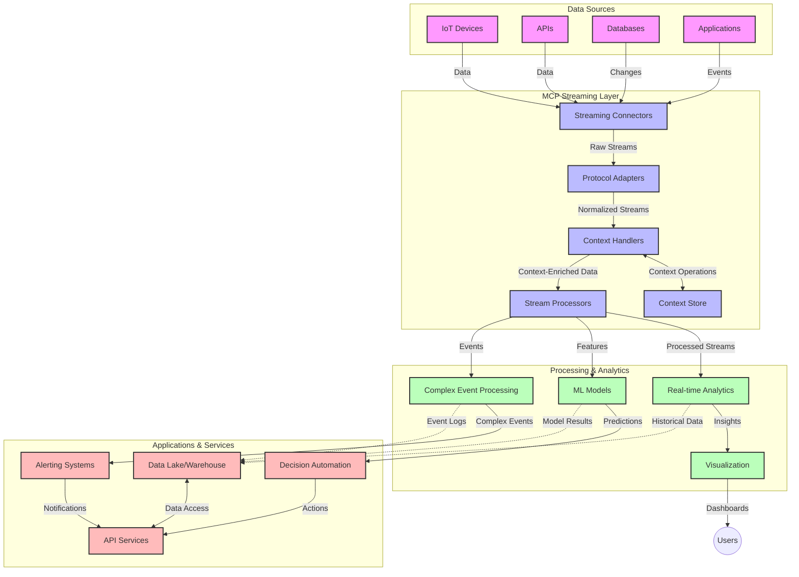

<!--
CO_OP_TRANSLATOR_METADATA:
{
  "original_hash": "195f7287638b77a549acadd96c8f981c",
  "translation_date": "2025-06-12T21:15:56+00:00",
  "source_file": "05-AdvancedTopics/mcp-realtimestreaming/README.md",
  "language_code": "zh"
}
-->
# 实时数据流的模型上下文协议

## 概述

在当今数据驱动的世界中，实时数据流已成为关键，企业和应用程序需要即时访问信息以做出及时决策。模型上下文协议（MCP）在优化这些实时流处理流程方面取得了重大进展，提高了数据处理效率，保持了上下文的完整性，并提升了整体系统性能。

本模块探讨了MCP如何通过为AI模型、流平台和应用程序之间的上下文管理提供标准化方法，改变实时数据流处理。

## 实时数据流简介

实时数据流是一种技术范式，支持数据在生成时持续传输、处理和分析，使系统能够即时响应新信息。不同于处理静态数据集的传统批处理，流处理针对动态数据，提供低延迟的洞察和响应。

### 实时数据流的核心概念：

- **连续数据流**：数据以连续、不断的事件或记录流形式处理。
- **低延迟处理**：系统设计旨在最小化数据生成与处理之间的时间差。
- **可扩展性**：流架构需应对变化的数据量和速度。
- **容错能力**：系统必须具备故障恢复能力，保证数据流不中断。
- **有状态处理**：跨事件维护上下文对于有意义的分析至关重要。

### 模型上下文协议与实时流处理

模型上下文协议（MCP）解决了实时流环境中的多个关键挑战：

1. **上下文连续性**：MCP标准化了分布式流组件之间的上下文维护，确保AI模型和处理节点能够访问相关的历史及环境上下文。

2. **高效状态管理**：通过提供结构化的上下文传输机制，MCP降低了流处理管道中状态管理的开销。

3. **互操作性**：MCP创建了不同流技术和AI模型之间共享上下文的通用语言，实现更灵活、可扩展的架构。

4. **流处理优化的上下文**：MCP实现可以优先考虑对实时决策最相关的上下文元素，兼顾性能和准确性。

5. **自适应处理**：通过MCP的上下文管理，流系统能够根据数据中不断变化的条件和模式动态调整处理策略。

从物联网传感器网络到金融交易平台，MCP与流技术的结合使得处理更加智能、具备上下文感知能力，能够实时响应复杂多变的场景。

## 学习目标

完成本课后，您将能够：

- 理解实时数据流的基本原理及其挑战
- 解释模型上下文协议（MCP）如何增强实时数据流
- 使用Kafka和Pulsar等流行框架实现基于MCP的流处理解决方案
- 设计并部署具备容错能力和高性能的MCP流处理架构
- 将MCP概念应用于物联网、金融交易和AI驱动的分析场景
- 评估基于MCP的流处理技术的最新趋势和未来创新

### 定义与重要性

实时数据流涉及数据的连续生成、处理和传递，延迟极低。与批处理将数据分批收集处理不同，流数据在到达时逐步处理，实现即时洞察和响应。

实时数据流的关键特性包括：

- **低延迟**：在毫秒到秒级内处理和分析数据
- **连续流动**：来自多源的持续不断的数据流
- **即时处理**：实时分析数据，而非批量处理
- **事件驱动架构**：响应事件发生的瞬间

### 传统数据流的挑战

传统流处理存在若干局限：

1. **上下文丢失**：难以在分布式系统间保持上下文
2. **扩展性问题**：难以应对大规模高速度数据
3. **集成复杂**：不同系统间互操作性差
4. **延迟管理**：需平衡吞吐量与处理时间
5. **数据一致性**：确保数据准确完整贯穿流处理

## 理解模型上下文协议（MCP）

### 什么是MCP？

模型上下文协议（MCP）是一种标准化通信协议，旨在促进AI模型与应用间的高效交互。在实时数据流场景中，MCP提供了：

- 在数据管道中保持上下文
- 标准化数据交换格式
- 优化大规模数据传输
- 增强模型间及模型与应用间的通信

### 核心组件与架构

实时流处理的MCP架构包含以下关键组件：

1. **上下文处理器**：管理并维护流处理管道中的上下文信息
2. **流处理器**：利用上下文感知技术处理输入数据流
3. **协议适配器**：在不同流协议间转换并保持上下文
4. **上下文存储**：高效存储和检索上下文信息
5. **流连接器**：连接多种流平台（Kafka、Pulsar、Kinesis等）



### MCP如何提升实时数据处理

MCP通过以下方式解决传统流处理难题：

- **上下文完整性**：保持数据点间在整个管道中的关系
- **优化传输**：通过智能上下文管理减少数据交换冗余
- **标准接口**：为流组件提供一致的API
- **降低延迟**：通过高效上下文处理减少处理开销
- **增强可扩展性**：支持横向扩展同时保持上下文

## 集成与实现

实时数据流系统需精心设计架构与实现，兼顾性能与上下文完整性。模型上下文协议提供了标准化方法，将AI模型与流技术集成，实现更智能、具备上下文感知的处理管道。

### MCP在流处理架构中的集成概览

在实时流环境中实施MCP需考虑：

1. **上下文序列化与传输**：MCP提供高效机制，将上下文信息编码于流数据包中，确保关键上下文伴随数据贯穿处理流程，包括针对流传输优化的标准序列化格式。

2. **有状态流处理**：MCP通过维护一致的上下文表示，支持更智能的有状态处理，尤其适合传统上状态管理困难的分布式流架构。

3. **事件时间与处理时间**：MCP实现需解决事件发生时间与处理时间的区分，协议可包含保留事件时间语义的时间上下文。

4. **背压管理**：通过标准化上下文处理，MCP帮助流系统管理背压，使组件能传达处理能力并调整数据流。

5. **上下文窗口与聚合**：MCP提供结构化的时间和关系上下文表示，支持更复杂的窗口操作和跨事件流的有意义聚合。

6. **精确一次处理**：在需要精确一次语义的流系统中，MCP可包含处理元数据，帮助跟踪和验证分布式组件的处理状态。

MCP在各种流技术中的实施，形成了统一的上下文管理方法，减少定制集成代码需求，同时增强系统在数据流动中保持有意义上下文的能力。

### MCP在各类数据流框架中的应用

以下示例基于当前MCP规范，采用基于JSON-RPC的协议和不同传输机制。代码演示了如何实现自定义传输，将Kafka和Pulsar等流平台与MCP集成，同时保持完全兼容。

这些示例展示了如何将流平台与MCP结合，实现实时数据处理并保持MCP核心的上下文感知能力。此方法确保代码示例准确反映截至2025年6月的MCP规范现状。

MCP可集成于以下流行框架：

#### Apache Kafka 集成

```python
import asyncio
import json
from typing import Dict, Any, Optional
from confluent_kafka import Consumer, Producer, KafkaError
from mcp.client import Client, ClientCapabilities
from mcp.core.message import JsonRpcMessage
from mcp.core.transports import Transport

# Custom transport class to bridge MCP with Kafka
class KafkaMCPTransport(Transport):
    def __init__(self, bootstrap_servers: str, input_topic: str, output_topic: str):
        self.bootstrap_servers = bootstrap_servers
        self.input_topic = input_topic
        self.output_topic = output_topic
        self.producer = Producer({'bootstrap.servers': bootstrap_servers})
        self.consumer = Consumer({
            'bootstrap.servers': bootstrap_servers,
            'group.id': 'mcp-client-group',
            'auto.offset.reset': 'earliest'
        })
        self.message_queue = asyncio.Queue()
        self.running = False
        self.consumer_task = None
        
    async def connect(self):
        """Connect to Kafka and start consuming messages"""
        self.consumer.subscribe([self.input_topic])
        self.running = True
        self.consumer_task = asyncio.create_task(self._consume_messages())
        return self
        
    async def _consume_messages(self):
        """Background task to consume messages from Kafka and queue them for processing"""
        while self.running:
            try:
                msg = self.consumer.poll(1.0)
                if msg is None:
                    await asyncio.sleep(0.1)
                    continue
                
                if msg.error():
                    if msg.error().code() == KafkaError._PARTITION_EOF:
                        continue
                    print(f"Consumer error: {msg.error()}")
                    continue
                
                # Parse the message value as JSON-RPC
                try:
                    message_str = msg.value().decode('utf-8')
                    message_data = json.loads(message_str)
                    mcp_message = JsonRpcMessage.from_dict(message_data)
                    await self.message_queue.put(mcp_message)
                except Exception as e:
                    print(f"Error parsing message: {e}")
            except Exception as e:
                print(f"Error in consumer loop: {e}")
                await asyncio.sleep(1)
    
    async def read(self) -> Optional[JsonRpcMessage]:
        """Read the next message from the queue"""
        try:
            message = await self.message_queue.get()
            return message
        except Exception as e:
            print(f"Error reading message: {e}")
            return None
    
    async def write(self, message: JsonRpcMessage) -> None:
        """Write a message to the Kafka output topic"""
        try:
            message_json = json.dumps(message.to_dict())
            self.producer.produce(
                self.output_topic,
                message_json.encode('utf-8'),
                callback=self._delivery_report
            )
            self.producer.poll(0)  # Trigger callbacks
        except Exception as e:
            print(f"Error writing message: {e}")
    
    def _delivery_report(self, err, msg):
        """Kafka producer delivery callback"""
        if err is not None:
            print(f'Message delivery failed: {err}')
        else:
            print(f'Message delivered to {msg.topic()} [{msg.partition()}]')
    
    async def close(self) -> None:
        """Close the transport"""
        self.running = False
        if self.consumer_task:
            self.consumer_task.cancel()
            try:
                await self.consumer_task
            except asyncio.CancelledError:
                pass
        self.consumer.close()
        self.producer.flush()

# Example usage of the Kafka MCP transport
async def kafka_mcp_example():
    # Create MCP client with Kafka transport
    client = Client(
        {"name": "kafka-mcp-client", "version": "1.0.0"},
        ClientCapabilities({})
    )
    
    # Create and connect the Kafka transport
    transport = KafkaMCPTransport(
        bootstrap_servers="localhost:9092",
        input_topic="mcp-responses",
        output_topic="mcp-requests"
    )
    
    await client.connect(transport)
    
    try:
        # Initialize the MCP session
        await client.initialize()
        
        # Example of executing a tool via MCP
        response = await client.execute_tool(
            "process_data",
            {
                "data": "sample data",
                "metadata": {
                    "source": "sensor-1",
                    "timestamp": "2025-06-12T10:30:00Z"
                }
            }
        )
        
        print(f"Tool execution response: {response}")
        
        # Clean shutdown
        await client.shutdown()
    finally:
        await transport.close()

# Run the example
if __name__ == "__main__":
    asyncio.run(kafka_mcp_example())
```

#### Apache Pulsar 实现

```python
import asyncio
import json
import pulsar
from typing import Dict, Any, Optional
from mcp.core.message import JsonRpcMessage
from mcp.core.transports import Transport
from mcp.server import Server, ServerOptions
from mcp.server.tools import Tool, ToolExecutionContext, ToolMetadata

# Create a custom MCP transport that uses Pulsar
class PulsarMCPTransport(Transport):
    def __init__(self, service_url: str, request_topic: str, response_topic: str):
        self.service_url = service_url
        self.request_topic = request_topic
        self.response_topic = response_topic
        self.client = pulsar.Client(service_url)
        self.producer = self.client.create_producer(response_topic)
        self.consumer = self.client.subscribe(
            request_topic,
            "mcp-server-subscription",
            consumer_type=pulsar.ConsumerType.Shared
        )
        self.message_queue = asyncio.Queue()
        self.running = False
        self.consumer_task = None
    
    async def connect(self):
        """Connect to Pulsar and start consuming messages"""
        self.running = True
        self.consumer_task = asyncio.create_task(self._consume_messages())
        return self
    
    async def _consume_messages(self):
        """Background task to consume messages from Pulsar and queue them for processing"""
        while self.running:
            try:
                # Non-blocking receive with timeout
                msg = self.consumer.receive(timeout_millis=500)
                
                # Process the message
                try:
                    message_str = msg.data().decode('utf-8')
                    message_data = json.loads(message_str)
                    mcp_message = JsonRpcMessage.from_dict(message_data)
                    await self.message_queue.put(mcp_message)
                    
                    # Acknowledge the message
                    self.consumer.acknowledge(msg)
                except Exception as e:
                    print(f"Error processing message: {e}")
                    # Negative acknowledge if there was an error
                    self.consumer.negative_acknowledge(msg)
            except Exception as e:
                # Handle timeout or other exceptions
                await asyncio.sleep(0.1)
    
    async def read(self) -> Optional[JsonRpcMessage]:
        """Read the next message from the queue"""
        try:
            message = await self.message_queue.get()
            return message
        except Exception as e:
            print(f"Error reading message: {e}")
            return None
    
    async def write(self, message: JsonRpcMessage) -> None:
        """Write a message to the Pulsar output topic"""
        try:
            message_json = json.dumps(message.to_dict())
            self.producer.send(message_json.encode('utf-8'))
        except Exception as e:
            print(f"Error writing message: {e}")
    
    async def close(self) -> None:
        """Close the transport"""
        self.running = False
        if self.consumer_task:
            self.consumer_task.cancel()
            try:
                await self.consumer_task
            except asyncio.CancelledError:
                pass
        self.consumer.close()
        self.producer.close()
        self.client.close()

# Define a sample MCP tool that processes streaming data
@Tool(
    name="process_streaming_data",
    description="Process streaming data with context preservation",
    metadata=ToolMetadata(
        required_capabilities=["streaming"]
    )
)
async def process_streaming_data(
    ctx: ToolExecutionContext,
    data: str,
    source: str,
    priority: str = "medium"
) -> Dict[str, Any]:
    """
    Process streaming data while preserving context
    
    Args:
        ctx: Tool execution context
        data: The data to process
        source: The source of the data
        priority: Priority level (low, medium, high)
        
    Returns:
        Dict containing processed results and context information
    """
    # Example processing that leverages MCP context
    print(f"Processing data from {source} with priority {priority}")
    
    # Access conversation context from MCP
    conversation_id = ctx.conversation_id if hasattr(ctx, 'conversation_id') else "unknown"
    
    # Return results with enhanced context
    return {
        "processed_data": f"Processed: {data}",
        "context": {
            "conversation_id": conversation_id,
            "source": source,
            "priority": priority,
            "processing_timestamp": ctx.get_current_time_iso()
        }
    }

# Example MCP server implementation using Pulsar transport
async def run_mcp_server_with_pulsar():
    # Create MCP server
    server = Server(
        {"name": "pulsar-mcp-server", "version": "1.0.0"},
        ServerOptions(
            capabilities={"streaming": True}
        )
    )
    
    # Register our tool
    server.register_tool(process_streaming_data)
    
    # Create and connect Pulsar transport
    transport = PulsarMCPTransport(
        service_url="pulsar://localhost:6650",
        request_topic="mcp-requests",
        response_topic="mcp-responses"
    )
    
    try:
        # Start the server with the Pulsar transport
        await server.run(transport)
    finally:
        await transport.close()

# Run the server
if __name__ == "__main__":
    asyncio.run(run_mcp_server_with_pulsar())
```

### 部署最佳实践

实施MCP实时流处理时：

1. **设计容错机制**：
   - 实现完善的错误处理
   - 使用死信队列处理失败消息
   - 设计幂等处理器

2. **性能优化**：
   - 配置合适的缓冲区大小
   - 适当使用批处理
   - 实施背压机制

3. **监控与观测**：
   - 跟踪流处理指标
   - 监测上下文传播
   - 设置异常告警

4. **流安全保障**：
   - 对敏感数据进行加密
   - 使用身份认证和授权
   - 应用适当访问控制

### MCP在物联网与边缘计算中的应用

MCP提升物联网流处理能力：

- 在处理管道中保持设备上下文
- 支持高效的边缘到云数据流
- 支持物联网数据流的实时分析
- 促进设备间具备上下文的通信

示例：智能城市传感器网络  
```
Sensors → Edge Gateways → MCP Stream Processors → Real-time Analytics → Automated Responses
```

### 在金融交易与高频交易中的作用

MCP为金融数据流带来显著优势：

- 超低延迟处理以支持交易决策
- 维护交易上下文贯穿整个处理过程
- 支持具备上下文感知的复杂事件处理
- 确保分布式交易系统中的数据一致性

### 增强AI驱动的数据分析

MCP为流分析开辟新可能：

- 实时模型训练与推断
- 持续从流数据中学习
- 基于上下文的特征提取
- 多模型推断管道中的上下文保持

## 未来趋势与创新

### MCP在实时环境中的演进

未来我们预见MCP将发展以应对：

- **量子计算集成**：为量子流处理系统做准备
- **边缘原生处理**：将更多上下文感知处理迁移至边缘设备
- **自主流管理**：实现自我优化的流处理管道
- **联合流处理**：在保护隐私的前提下实现分布式处理

### 未来技术潜在进展

将塑造MCP流处理未来的新兴技术：

1. **AI优化的流协议**：专为AI工作负载设计的定制协议
2. **神经形态计算集成**：基于脑科学的流处理计算
3. **无服务器流处理**：事件驱动、可扩展且无需基础设施管理的流处理
4. **分布式上下文存储**：全球分布且高度一致的上下文管理

## 实践练习

### 练习1：搭建基础MCP流处理管道

本练习将帮助你：

- 配置基础MCP流处理环境
- 实现流处理上下文处理器
- 测试并验证上下文保持效果

### 练习2：构建实时分析仪表盘

创建完整应用，具备：

- 使用MCP摄取流数据
- 保持上下文处理流数据
- 实时可视化处理结果

### 练习3：基于MCP实现复杂事件处理

高级练习涵盖：

- 流中的模式检测
- 多流间的上下文关联
- 生成具上下文保持的复杂事件

## 附加资源

- [Model Context Protocol Specification](https://github.com/modelcontextprotocol) - 官方MCP规范与文档
- [Apache Kafka Documentation](https://kafka.apache.org/documentation/) - Kafka流处理学习资料
- [Apache Pulsar](https://pulsar.apache.org/) - 统一消息与流平台
- [Streaming Systems: The What, Where, When, and How of Large-Scale Data Processing](https://www.oreilly.com/library/view/streaming-systems/9781491983867/) - 流架构权威书籍
- [Microsoft Azure Event Hubs](https://learn.microsoft.com/azure/event-hubs/event-hubs-about) - 托管事件流服务
- [MLflow Documentation](https://mlflow.org/docs/latest/index.html) - 机器学习模型跟踪与部署
- [Real-Time Analytics with Apache Storm](https://storm.apache.org/releases/current/index.html) - 实时计算处理框架
- [Flink ML](https://nightlies.apache.org/flink/flink-ml-docs-master/) - Apache Flink机器学习库
- [LangChain Documentation](https://python.langchain.com/docs/get_started/introduction) - 使用大语言模型构建应用

## 学习成果

完成本模块后，您将能够：

- 理解实时数据流的基础及其挑战
- 解释模型上下文协议（MCP）如何提升实时数据流
- 使用Kafka和Pulsar等主流框架实现基于MCP的流处理方案
- 设计并部署具备容错和高性能的MCP流架构
- 将MCP应用于物联网、金融交易及AI驱动的分析场景
- 评估基于MCP流技术的新兴趋势和未来创新

## 后续学习

- [5.11 实时搜索](../mcp-realtimesearch/README.md)

**免责声明**：  
本文件由 AI 翻译服务 [Co-op Translator](https://github.com/Azure/co-op-translator) 翻译而成。尽管我们力求准确，但请注意，自动翻译可能存在错误或不准确之处。原始文件的母语版本应被视为权威来源。对于重要信息，建议采用专业人工翻译。对于因使用本翻译而产生的任何误解或误释，我们概不负责。