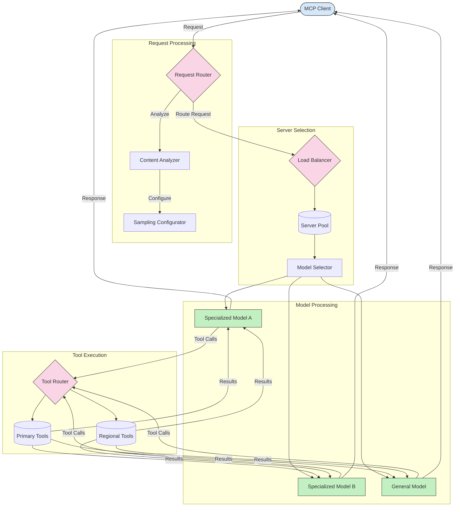

<!--
CO_OP_TRANSLATOR_METADATA:
{
  "original_hash": "a621fc52c7daec552eb8b3b48c0361dd",
  "translation_date": "2025-06-02T19:42:33+00:00",
  "source_file": "05-AdvancedTopics/mcp-routing/README.md",
  "language_code": "zh"
}
-->
## MCP中的采样与路由架构

采样是模型上下文协议（MCP）中的关键组成部分，它能够实现高效的请求处理和路由。采样通过分析传入请求，根据内容类型、用户上下文和系统负载等多种标准，确定最合适的模型或服务来处理请求。

采样与路由相结合，能够构建一个稳健的架构，优化资源利用率并确保高可用性。采样过程用于对请求进行分类，而路由则将请求定向到合适的模型或服务。

下图展示了采样与路由如何在完整的MCP架构中协同工作：

## 接下来内容

- [采样](../mcp-sampling/README.md)

**免责声明**：  
本文件使用AI翻译服务[Co-op Translator](https://github.com/Azure/co-op-translator)进行翻译。尽管我们努力确保准确性，但请注意，自动翻译可能存在错误或不准确之处。原始文件的原文版本应被视为权威来源。对于重要信息，建议采用专业人工翻译。对于因使用本翻译而引起的任何误解或误释，我们不承担任何责任。