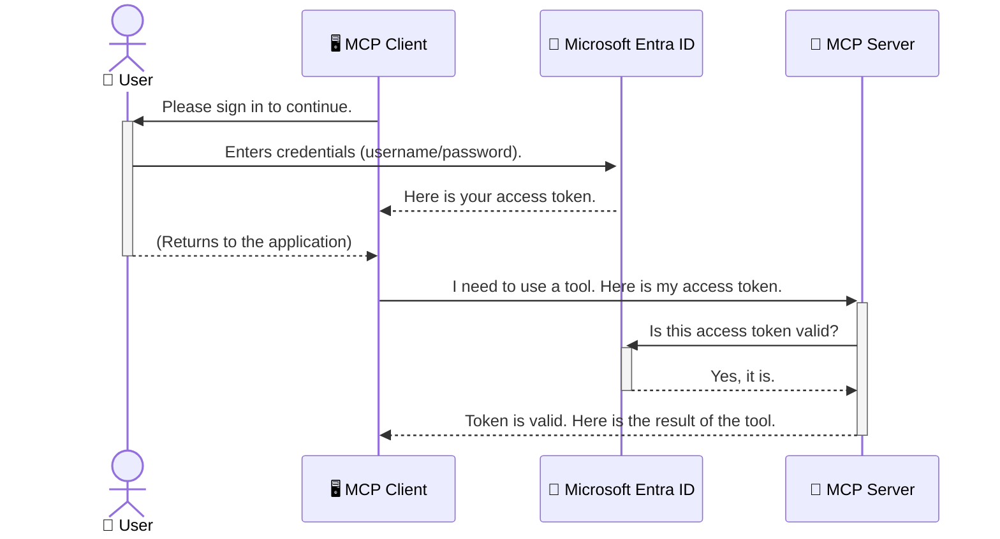

<!--
CO_OP_TRANSLATOR_METADATA:
{
  "original_hash": "6e562d7e5a77c8982da4aa8f762ad1d8",
  "translation_date": "2025-07-14T02:51:05+00:00",
  "source_file": "05-AdvancedTopics/mcp-security-entra/README.md",
  "language_code": "zh"
}
-->
# 保护 AI 工作流：Model Context Protocol 服务器的 Entra ID 认证

## 介绍
保护您的 Model Context Protocol (MCP) 服务器就像锁好家门一样重要。将 MCP 服务器暴露在外会使您的工具和数据面临未经授权的访问，进而导致安全漏洞。Microsoft Entra ID 提供了强大的云端身份和访问管理解决方案，帮助确保只有授权的用户和应用程序能够与您的 MCP 服务器交互。本节将教您如何使用 Entra ID 认证来保护您的 AI 工作流。

## 学习目标
完成本节后，您将能够：

- 理解保护 MCP 服务器的重要性。
- 解释 Microsoft Entra ID 和 OAuth 2.0 认证的基础知识。
- 识别公共客户端和机密客户端的区别。
- 在本地（公共客户端）和远程（机密客户端）MCP 服务器场景中实现 Entra ID 认证。
- 在开发 AI 工作流时应用安全最佳实践。

## 安全性与 MCP

正如您不会把家门敞开不锁一样，也不应让 MCP 服务器对任何人开放。保护您的 AI 工作流对于构建稳健、可信赖且安全的应用至关重要。本章将介绍如何使用 Microsoft Entra ID 来保护您的 MCP 服务器，确保只有授权的用户和应用程序能够访问您的工具和数据。

## 为什么 MCP 服务器的安全性很重要

想象一下，您的 MCP 服务器拥有一个可以发送电子邮件或访问客户数据库的工具。如果服务器没有安全保护，任何人都可能使用该工具，导致未经授权的数据访问、垃圾邮件或其他恶意行为。

通过实施认证，您可以确保每个请求都经过验证，确认发起请求的用户或应用程序的身份。这是保护 AI 工作流的第一步，也是最关键的一步。

## Microsoft Entra ID 简介

[**Microsoft Entra ID**](https://adoption.microsoft.com/microsoft-security/entra/) 是一项基于云的身份和访问管理服务。可以把它看作是您应用程序的通用安全守卫。它负责处理验证用户身份（认证）和确定用户权限（授权）的复杂过程。

使用 Entra ID，您可以：

- 实现用户的安全登录。
- 保护 API 和服务。
- 从中心位置管理访问策略。

对于 MCP 服务器，Entra ID 提供了一个强大且广受信赖的解决方案，用于管理谁可以访问服务器的功能。

---

## 揭秘 Entra ID 认证的原理

Entra ID 使用像 **OAuth 2.0** 这样的开放标准来处理认证。虽然细节可能较为复杂，但核心概念很简单，可以通过一个类比来理解。

### OAuth 2.0 简介：代客钥匙

把 OAuth 2.0 想象成您汽车的代客泊车服务。当您到达餐厅时，您不会把汽车的主钥匙交给代客，而是给他一把**代客钥匙**，这把钥匙权限有限——它可以启动车辆并锁车门，但不能打开后备箱或手套箱。

在这个类比中：

- **您** 是 **用户**。
- **您的车** 是拥有宝贵工具和数据的 **MCP 服务器**。
- **代客** 是 **Microsoft Entra ID**。
- **停车员** 是尝试访问服务器的 **MCP 客户端**（应用程序）。
- **代客钥匙** 是 **访问令牌**。

访问令牌是一串安全的文本，MCP 客户端在您登录后从 Entra ID 获取。客户端随后在每次请求时将该令牌发送给 MCP 服务器。服务器可以验证令牌，确保请求合法且客户端拥有必要权限，而无需处理您的实际凭据（如密码）。

### 认证流程

实际流程如下：



### 介绍 Microsoft Authentication Library (MSAL)

在深入代码之前，先介绍一个示例中会用到的重要组件：**Microsoft Authentication Library (MSAL)**。

MSAL 是微软开发的一个库，极大简化了开发者处理认证的工作。您无需编写复杂的代码来管理安全令牌、登录和会话刷新，MSAL 会帮您完成这些繁重任务。

推荐使用 MSAL 的原因：

- **安全可靠**：它实现了行业标准协议和安全最佳实践，降低代码中出现漏洞的风险。
- **简化开发**：它封装了 OAuth 2.0 和 OpenID Connect 协议的复杂性，让您只需几行代码即可为应用添加强大的认证功能。
- **持续维护**：微软会持续维护和更新 MSAL，以应对新的安全威胁和平台变化。

MSAL 支持多种语言和应用框架，包括 .NET、JavaScript/TypeScript、Python、Java、Go 以及 iOS 和 Android 等移动平台。这意味着您可以在整个技术栈中使用一致的认证模式。

想了解更多 MSAL 信息，请参阅官方 [MSAL 概览文档](https://learn.microsoft.com/entra/identity-platform/msal-overview)。

---

## 使用 Entra ID 保护 MCP 服务器：分步指南

接下来，我们演示如何使用 Entra ID 保护本地 MCP 服务器（通过 `stdio` 通信）。此示例使用**公共客户端**，适合运行在用户设备上的应用，如桌面应用或本地开发服务器。

### 场景一：保护本地 MCP 服务器（公共客户端）

本场景中，我们将演示一个本地运行的 MCP 服务器，通过 `stdio` 通信，使用 Entra ID 认证用户后才允许访问工具。服务器包含一个工具，用于从 Microsoft Graph API 获取用户的个人资料信息。

#### 1. 在 Entra ID 中注册应用

在编写代码之前，您需要在 Microsoft Entra ID 中注册应用，告知 Entra ID 您的应用信息并授予认证权限。

1. 访问 **[Microsoft Entra 门户](https://entra.microsoft.com/)**。
2. 进入 **应用注册**，点击 **新注册**。
3. 为应用命名（例如 “My Local MCP Server”）。
4. 在 **支持的账户类型** 中选择 **仅限此组织目录中的账户**。
5. 本示例中可将 **重定向 URI** 留空。
6. 点击 **注册**。

注册完成后，记下 **应用（客户端）ID** 和 **目录（租户）ID**，后续代码中会用到。

#### 2. 代码解析

下面是处理认证的关键代码部分。完整示例代码可在 [mcp-auth-servers GitHub 仓库](https://github.com/Azure-Samples/mcp-auth-servers) 的 [Entra ID - Local - WAM](https://github.com/Azure-Samples/mcp-auth-servers/tree/main/src/entra-id-local-wam) 文件夹中找到。

**`AuthenticationService.cs`**

该类负责与 Entra ID 交互。

- **`CreateAsync`**：初始化 MSAL 的 `PublicClientApplication`，配置您的 `clientId` 和 `tenantId`。
- **`WithBroker`**：启用使用代理（如 Windows Web Account Manager），提供更安全、无缝的单点登录体验。
- **`AcquireTokenAsync`**：核心方法。它首先尝试静默获取令牌（如果已有有效会话，用户无需再次登录）。若静默获取失败，则会提示用户交互式登录。

```csharp
// Simplified for clarity
public static async Task<AuthenticationService> CreateAsync(ILogger<AuthenticationService> logger)
{
    var msalClient = PublicClientApplicationBuilder
        .Create(_clientId) // Your Application (client) ID
        .WithAuthority(AadAuthorityAudience.AzureAdMyOrg)
        .WithTenantId(_tenantId) // Your Directory (tenant) ID
        .WithBroker(new BrokerOptions(BrokerOptions.OperatingSystems.Windows))
        .Build();

    // ... cache registration ...

    return new AuthenticationService(logger, msalClient);
}

public async Task<string> AcquireTokenAsync()
{
    try
    {
        // Try silent authentication first
        var accounts = await _msalClient.GetAccountsAsync();
        var account = accounts.FirstOrDefault();

        AuthenticationResult? result = null;

        if (account != null)
        {
            result = await _msalClient.AcquireTokenSilent(_scopes, account).ExecuteAsync();
        }
        else
        {
            // If no account, or silent fails, go interactive
            result = await _msalClient.AcquireTokenInteractive(_scopes).ExecuteAsync();
        }

        return result.AccessToken;
    }
    catch (Exception ex)
    {
        _logger.LogError(ex, "An error occurred while acquiring the token.");
        throw; // Optionally rethrow the exception for higher-level handling
    }
}
```

**`Program.cs`**

这里设置 MCP 服务器并集成认证服务。

- **`AddSingleton<AuthenticationService>`**：将 `AuthenticationService` 注册到依赖注入容器，供应用其他部分（如工具）使用。
- **`GetUserDetailsFromGraph` 工具**：该工具依赖 `AuthenticationService` 实例。执行前调用 `authService.AcquireTokenAsync()` 获取有效访问令牌。认证成功后，使用令牌调用 Microsoft Graph API 获取用户信息。

```csharp
// Simplified for clarity
[McpServerTool(Name = "GetUserDetailsFromGraph")]
public static async Task<string> GetUserDetailsFromGraph(
    AuthenticationService authService)
{
    try
    {
        // This will trigger the authentication flow
        var accessToken = await authService.AcquireTokenAsync();

        // Use the token to create a GraphServiceClient
        var graphClient = new GraphServiceClient(
            new BaseBearerTokenAuthenticationProvider(new TokenProvider(authService)));

        var user = await graphClient.Me.GetAsync();

        return System.Text.Json.JsonSerializer.Serialize(user);
    }
    catch (Exception ex)
    {
        return $"Error: {ex.Message}";
    }
}
```

#### 3. 整体工作流程

1. MCP 客户端尝试使用 `GetUserDetailsFromGraph` 工具时，工具先调用 `AcquireTokenAsync`。
2. `AcquireTokenAsync` 触发 MSAL 库检查是否已有有效令牌。
3. 若无令牌，MSAL 通过代理提示用户使用 Entra ID 账户登录。
4. 用户登录后，Entra ID 颁发访问令牌。
5. 工具接收令牌，使用它安全调用 Microsoft Graph API。
6. 用户信息返回给 MCP 客户端。

此流程确保只有经过认证的用户才能使用该工具，有效保护您的本地 MCP 服务器。

### 场景二：保护远程 MCP 服务器（机密客户端）

当 MCP 服务器运行在远程机器（如云服务器）并通过 HTTP Streaming 协议通信时，安全需求不同。此时应使用**机密客户端**和**授权码流程**。这种方式更安全，因为应用的机密信息不会暴露给浏览器。

本示例使用基于 TypeScript 的 MCP 服务器，采用 Express.js 处理 HTTP 请求。

#### 1. 在 Entra ID 中注册应用

Entra ID 中的设置与公共客户端类似，但有一个关键区别：需要创建**客户端密钥**。

1. 访问 **[Microsoft Entra 门户](https://entra.microsoft.com/)**。
2. 在应用注册中，进入 **证书和密钥** 标签页。
3. 点击 **新建客户端密钥**，填写描述后点击 **添加**。
4. **重要提示：** 请立即复制密钥值，之后无法再次查看。
5. 还需配置 **重定向 URI**。进入 **身份验证** 标签页，点击 **添加平台**，选择 **Web**，输入应用的重定向 URI（例如 `http://localhost:3001/auth/callback`）。

> **⚠️ 重要安全提示：** 对于生产环境应用，微软强烈建议使用**无密钥认证**方式，如**托管身份**或**工作负载身份联合**，而非客户端密钥。客户端密钥存在被泄露或被攻破的风险。托管身份通过消除在代码或配置中存储凭据的需求，提供了更安全的方案。
>
> 有关托管身份及其实现的更多信息，请参阅 [Azure 资源的托管身份概述](https://learn.microsoft.com/entra/identity/managed-identities-azure-resources/overview)。

#### 2. 代码解析

本示例采用基于会话的方式。用户认证后，服务器将访问令牌和刷新令牌存储在会话中，并向用户发放会话令牌。后续请求使用该会话令牌。完整代码可在 [mcp-auth-servers GitHub 仓库](https://github.com/Azure-Samples/mcp-auth-servers) 的 [Entra ID - Confidential client](https://github.com/Azure-Samples/mcp-auth-servers/tree/main/src/entra-id-cca-session) 文件夹中找到。

**`Server.ts`**

该文件设置 Express 服务器和 MCP 传输层。

- **`requireBearerAuth`**：中间件，保护 `/sse` 和 `/message` 端点。检查请求的 `Authorization` 头中是否包含有效的 Bearer 令牌。
- **`EntraIdServerAuthProvider`**：自定义类，实现 `McpServerAuthorizationProvider` 接口，负责处理 OAuth 2.0 流程。
- **`/auth/callback`**：该端点处理用户认证后 Entra ID 的重定向。它将授权码交换为访问令牌和刷新令牌。

```typescript
// Simplified for clarity
const app = express();
const { server } = createServer();
const provider = new EntraIdServerAuthProvider();

// Protect the SSE endpoint
app.get("/sse", requireBearerAuth({
  provider,
  requiredScopes: ["User.Read"]
}), async (req, res) => {
  // ... connect to the transport ...
});

// Protect the message endpoint
app.post("/message", requireBearerAuth({
  provider,
  requiredScopes: ["User.Read"]
}), async (req, res) => {
  // ... handle the message ...
});

// Handle the OAuth 2.0 callback
app.get("/auth/callback", (req, res) => {
  provider.handleCallback(req.query.code, req.query.state)
    .then(result => {
      // ... handle success or failure ...
    });
});
```

**`Tools.ts`**

定义 MCP 服务器提供的工具。`getUserDetails` 工具与前例类似，但访问令牌从会话中获取。

```typescript
// Simplified for clarity
server.setRequestHandler(CallToolRequestSchema, async (request) => {
  const { name } = request.params;
  const context = request.params?.context as { token?: string } | undefined;
  const sessionToken = context?.token;

  if (name === ToolName.GET_USER_DETAILS) {
    if (!sessionToken) {
      throw new AuthenticationError("Authentication token is missing or invalid. Ensure the token is provided in the request context.");
    }

    // Get the Entra ID token from the session store
    const tokenData = tokenStore.getToken(sessionToken);
    const entraIdToken = tokenData.accessToken;

    const graphClient = Client.init({
      authProvider: (done) => {
        done(null, entraIdToken);
      }
    });

    const user = await graphClient.api('/me').get();

    // ... return user details ...
  }
});
```

**`auth/EntraIdServerAuthProvider.ts`**

该类负责：

- 将用户重定向到 Entra ID 登录页面。
- 用授权码换取访问令牌。
- 将令牌存储在 `tokenStore` 中。
- 在访问令牌过期时刷新令牌。

#### 3. 整体工作流程

1. 用户首次尝试连接 MCP 服务器时，`requireBearerAuth` 中间件发现无有效会话，重定向用户到 Entra ID 登录页面。
2. 用户使用 Entra ID 账户登录。
3. Entra ID 将用户重定向回 `/auth/callback` 端点，并附带授权码。
4. 服务器用代码交换访问令牌和刷新令牌，存储它们，并创建一个会话令牌发送给客户端。  
5. 客户端现在可以在所有后续请求的 `Authorization` 头中使用该会话令牌访问 MCP 服务器。  
6. 当调用 `getUserDetails` 工具时，它会使用会话令牌查找 Entra ID 访问令牌，然后使用该令牌调用 Microsoft Graph API。

这个流程比公共客户端流程更复杂，但对于面向互联网的端点是必须的。由于远程 MCP 服务器可通过公共互联网访问，因此需要更强的安全措施来防止未经授权的访问和潜在攻击。

## 安全最佳实践

- **始终使用 HTTPS**：加密客户端和服务器之间的通信，防止令牌被截获。  
- **实施基于角色的访问控制（RBAC）**：不仅要检查用户是否已认证，还要检查他们被授权执行的操作。你可以在 Entra ID 中定义角色，并在 MCP 服务器中进行检查。  
- **监控和审计**：记录所有身份验证事件，以便检测和响应可疑活动。  
- **处理速率限制和节流**：Microsoft Graph 和其他 API 实施速率限制以防止滥用。在 MCP 服务器中实现指数退避和重试逻辑，以优雅地处理 HTTP 429（请求过多）响应。考虑缓存频繁访问的数据以减少 API 调用。  
- **安全存储令牌**：安全存储访问令牌和刷新令牌。对于本地应用，使用系统的安全存储机制。对于服务器应用，考虑使用加密存储或安全密钥管理服务，如 Azure Key Vault。  
- **令牌过期处理**：访问令牌有有限的有效期。使用刷新令牌实现自动令牌刷新，保持无缝的用户体验，无需重新认证。  
- **考虑使用 Azure API Management**：虽然直接在 MCP 服务器中实现安全性可以获得细粒度控制，但像 Azure API Management 这样的 API 网关可以自动处理许多安全问题，包括身份验证、授权、速率限制和监控。它们提供了一个位于客户端和 MCP 服务器之间的集中安全层。有关使用 API 网关与 MCP 的更多详情，请参见我们的[Azure API Management Your Auth Gateway For MCP Servers](https://techcommunity.microsoft.com/blog/integrationsonazureblog/azure-api-management-your-auth-gateway-for-mcp-servers/4402690)。

## 关键要点

- 保护你的 MCP 服务器对于保障数据和工具安全至关重要。  
- Microsoft Entra ID 提供了强大且可扩展的身份验证和授权解决方案。  
- 本地应用使用**公共客户端**，远程服务器使用**机密客户端**。  
- **授权码流程**是 Web 应用最安全的选项。

## 练习

1. 想想你可能构建的 MCP 服务器。它是本地服务器还是远程服务器？  
2. 根据你的答案，你会使用公共客户端还是机密客户端？  
3. 你的 MCP 服务器会请求哪些权限来对 Microsoft Graph 执行操作？

## 实操练习

### 练习 1：在 Entra ID 中注册应用  
进入 Microsoft Entra 门户。  
为你的 MCP 服务器注册一个新应用。  
记录应用（客户端）ID 和目录（租户）ID。

### 练习 2：保护本地 MCP 服务器（公共客户端）  
- 按照代码示例集成 MSAL（Microsoft Authentication Library）进行用户身份验证。  
- 通过调用获取 Microsoft Graph 用户详细信息的 MCP 工具测试身份验证流程。

### 练习 3：保护远程 MCP 服务器（机密客户端）  
- 在 Entra ID 中注册机密客户端并创建客户端密钥。  
- 配置你的 Express.js MCP 服务器使用授权码流程。  
- 测试受保护的端点，确认基于令牌的访问。

### 练习 4：应用安全最佳实践  
- 为本地或远程服务器启用 HTTPS。  
- 在服务器逻辑中实现基于角色的访问控制（RBAC）。  
- 添加令牌过期处理和安全令牌存储。

## 资源

1. **MSAL 概述文档**  
   了解 Microsoft Authentication Library (MSAL) 如何实现跨平台的安全令牌获取：  
   [MSAL Overview on Microsoft Learn](https://learn.microsoft.com/en-gb/entra/msal/overview)

2. **Azure-Samples/mcp-auth-servers GitHub 仓库**  
   MCP 服务器身份验证流程的参考实现：  
   [Azure-Samples/mcp-auth-servers on GitHub](https://github.com/Azure-Samples/mcp-auth-servers)

3. **Azure 资源的托管身份概述**  
   了解如何通过使用系统分配或用户分配的托管身份来消除密钥：  
   [Managed Identities Overview on Microsoft Learn](https://learn.microsoft.com/en-us/entra/identity/managed-identities-azure-resources/)

4. **Azure API Management：你的 MCP 服务器身份验证网关**  
   深入了解如何使用 APIM 作为 MCP 服务器的安全 OAuth2 网关：  
   [Azure API Management Your Auth Gateway For MCP Servers](https://techcommunity.microsoft.com/blog/integrationsonazureblog/azure-api-management-your-auth-gateway-for-mcp-servers/4402690)

5. **Microsoft Graph 权限参考**  
   Microsoft Graph 的委托权限和应用权限完整列表：  
   [Microsoft Graph Permissions Reference](https://learn.microsoft.com/zh-tw/graph/permissions-reference)

## 学习成果  
完成本节后，你将能够：

- 阐述身份验证为何对 MCP 服务器和 AI 工作流至关重要。  
- 为本地和远程 MCP 服务器场景设置和配置 Entra ID 身份验证。  
- 根据服务器部署选择合适的客户端类型（公共或机密）。  
- 实施安全编码实践，包括令牌存储和基于角色的授权。  
- 自信地保护你的 MCP 服务器及其工具免受未经授权的访问。

## 接下来是什么

- [5.13 Model Context Protocol (MCP) 与 Azure AI Foundry 集成](../mcp-foundry-agent-integration/README.md)

**免责声明**：  
本文件使用 AI 翻译服务 [Co-op Translator](https://github.com/Azure/co-op-translator) 进行翻译。虽然我们力求准确，但请注意，自动翻译可能包含错误或不准确之处。原始文件的母语版本应被视为权威来源。对于重要信息，建议采用专业人工翻译。对于因使用本翻译而产生的任何误解或误释，我们概不负责。