<!--
CO_OP_TRANSLATOR_METADATA:
{
  "original_hash": "6e562d7e5a77c8982da4aa8f762ad1d8",
  "translation_date": "2025-07-02T08:59:30+00:00",
  "source_file": "05-AdvancedTopics/mcp-security-entra/README.md",
  "language_code": "zh"
}
-->
# 保护 AI 工作流：为 Model Context Protocol 服务器使用 Entra ID 认证

## 介绍
保护你的 Model Context Protocol（MCP）服务器就像锁好家门一样重要。若让 MCP 服务器处于开放状态，可能会导致工具和数据被未经授权访问，带来安全隐患。Microsoft Entra ID 提供了强大的云端身份和访问管理解决方案，帮助确保只有授权的用户和应用程序可以访问你的 MCP 服务器。本节将教你如何通过 Entra ID 认证来保护你的 AI 工作流。

## 学习目标
完成本节后，你将能够：

- 理解保护 MCP 服务器的重要性。
- 解释 Microsoft Entra ID 和 OAuth 2.0 认证的基础知识。
- 识别公共客户端和机密客户端的区别。
- 在本地（公共客户端）和远程（机密客户端）MCP 服务器场景中实现 Entra ID 认证。
- 在开发 AI 工作流时应用安全最佳实践。

## 安全性与 MCP

就像你不会让家门大开一样，也不应让 MCP 服务器随意访问。保护你的 AI 工作流对于构建健壮、可信且安全的应用至关重要。本章将介绍如何使用 Microsoft Entra ID 保护 MCP 服务器，确保只有授权用户和应用能访问你的工具和数据。

## 为什么 MCP 服务器的安全性很重要

想象一下你的 MCP 服务器中有个工具可以发送邮件或访问客户数据库。如果服务器没有安全保护，任何人都可能使用该工具，导致数据泄露、垃圾邮件或其他恶意行为。

通过实施认证，你可以确保每个请求都经过验证，确认发起请求的用户或应用身份。这是保护 AI 工作流的第一步，也是最关键的一步。

## Microsoft Entra ID 简介

[**Microsoft Entra ID**](https://adoption.microsoft.com/microsoft-security/entra/) 是一项基于云的身份和访问管理服务。可以把它看作是你应用的通用保安，负责验证用户身份（认证）以及确定他们的权限（授权）。

使用 Entra ID，你可以：

- 实现用户的安全登录。
- 保护 API 和服务。
- 从中心位置管理访问策略。

对于 MCP 服务器，Entra ID 提供了一个强大且广泛信赖的解决方案，帮助管理谁能访问服务器的功能。

---

## 揭秘：Entra ID 认证的工作原理

Entra ID 使用像 **OAuth 2.0** 这样的开放标准来处理认证。虽然细节可能复杂，但核心概念可以通过一个比喻轻松理解。

### OAuth 2.0 简单介绍：代客钥匙

把 OAuth 2.0 想象成汽车代客服务。当你到餐厅时，你不会把车的主钥匙交给代客，而是给他一把**代客钥匙**，这把钥匙权限有限——能启动车辆并锁门，但不能打开后备箱或手套箱。

在这个比喻中：

- **你** 是 **用户**。
- **你的车** 是拥有宝贵工具和数据的 **MCP 服务器**。
- **代客** 是 **Microsoft Entra ID**。
- **停车员** 是尝试访问服务器的 **MCP 客户端**（应用程序）。
- **代客钥匙** 是 **访问令牌（Access Token）**。

访问令牌是 MCP 客户端在你登录后从 Entra ID 获得的一串安全字符串。客户端在每次请求 MCP 服务器时都会携带该令牌。服务器通过验证令牌，确认请求是否合法，且客户端是否具备所需权限，而无需直接处理你的真实凭据（如密码）。

### 认证流程

实际流程如下：

```mermaid
sequenceDiagram
    actor User as 👤 User
    participant Client as 🖥️ MCP Client
    participant Entra as 🔐 Microsoft Entra ID
    participant Server as 🔧 MCP Server

    Client->>+User: Please sign in to continue.
    User->>+Entra: Enters credentials (username/password).
    Entra-->>Client: Here is your access token.
    User-->>-Client: (Returns to the application)

    Client->>+Server: I need to use a tool. Here is my access token.
    Server->>+Entra: Is this access token valid?
    Entra-->>-Server: Yes, it is.
    Server-->>-Client: Token is valid. Here is the result of the tool.
```



### 介绍 Microsoft Authentication Library (MSAL)

在深入代码之前，先介绍一个示例中会用到的重要组件：**Microsoft Authentication Library (MSAL)**。

MSAL 是微软开发的一个库，极大简化了开发者处理认证的工作。你无需编写复杂代码来管理安全令牌、登录流程和会话刷新，MSAL 会帮你完成这些繁重任务。

推荐使用 MSAL 的原因包括：

- **安全性高**：实现了行业标准协议和安全最佳实践，降低代码漏洞风险。
- **简化开发**：抽象了 OAuth 2.0 和 OpenID Connect 的复杂细节，几行代码即可为应用添加强认证功能。
- **持续维护**：微软持续更新 MSAL，应对新安全威胁和平台变化。

MSAL 支持多种语言和应用框架，包括 .NET、JavaScript/TypeScript、Python、Java、Go 以及 iOS 和 Android 移动平台，确保你能在整个技术栈中使用一致的认证模式。

想了解更多 MSAL，可以查看官方[MSAL 概览文档](https://learn.microsoft.com/entra/identity-platform/msal-overview)。

---

## 使用 Entra ID 保护你的 MCP 服务器：逐步指南

现在，让我们通过示例了解如何保护一个本地 MCP 服务器（通过 `stdio`) using Entra ID. This example uses a **public client**, which is suitable for applications running on a user's machine, like a desktop app or a local development server.

### Scenario 1: Securing a Local MCP Server (with a Public Client)

In this scenario, we'll look at an MCP server that runs locally, communicates over `stdio`, and uses Entra ID to authenticate the user before allowing access to its tools. The server will have a single tool that fetches the user's profile information from the Microsoft Graph API.

#### 1. Setting Up the Application in Entra ID

Before writing any code, you need to register your application in Microsoft Entra ID. This tells Entra ID about your application and grants it permission to use the authentication service.

1. Navigate to the **[Microsoft Entra portal](https://entra.microsoft.com/)**.
2. Go to **App registrations** and click **New registration**.
3. Give your application a name (e.g., "My Local MCP Server").
4. For **Supported account types**, select **Accounts in this organizational directory only**.
5. You can leave the **Redirect URI** blank for this example.
6. Click **Register**.

Once registered, take note of the **Application (client) ID** and **Directory (tenant) ID**. You'll need these in your code.

#### 2. The Code: A Breakdown

Let's look at the key parts of the code that handle authentication. The full code for this example is available in the [Entra ID - Local - WAM](https://github.com/Azure-Samples/mcp-auth-servers/tree/main/src/entra-id-local-wam) folder of the [mcp-auth-servers GitHub repository](https://github.com/Azure-Samples/mcp-auth-servers).

**`AuthenticationService.cs`**

This class is responsible for handling the interaction with Entra ID.

- **`CreateAsync`**: This method initializes the `PublicClientApplication` from the MSAL (Microsoft Authentication Library). It's configured with your application's `clientId` and `tenantId`.
- **`WithBroker`**: This enables the use of a broker (like the Windows Web Account Manager), which provides a more secure and seamless single sign-on experience.
- **`AcquireTokenAsync`**：这是核心方法。它会先尝试静默获取令牌（如果已有有效会话，用户无需再次登录）。若静默获取失败，则会提示用户交互式登录。

```csharp
// Simplified for clarity
public static async Task<AuthenticationService> CreateAsync(ILogger<AuthenticationService> logger)
{
    var msalClient = PublicClientApplicationBuilder
        .Create(_clientId) // Your Application (client) ID
        .WithAuthority(AadAuthorityAudience.AzureAdMyOrg)
        .WithTenantId(_tenantId) // Your Directory (tenant) ID
        .WithBroker(new BrokerOptions(BrokerOptions.OperatingSystems.Windows))
        .Build();

    // ... cache registration ...

    return new AuthenticationService(logger, msalClient);
}

public async Task<string> AcquireTokenAsync()
{
    try
    {
        // Try silent authentication first
        var accounts = await _msalClient.GetAccountsAsync();
        var account = accounts.FirstOrDefault();

        AuthenticationResult? result = null;

        if (account != null)
        {
            result = await _msalClient.AcquireTokenSilent(_scopes, account).ExecuteAsync();
        }
        else
        {
            // If no account, or silent fails, go interactive
            result = await _msalClient.AcquireTokenInteractive(_scopes).ExecuteAsync();
        }

        return result.AccessToken;
    }
    catch (Exception ex)
    {
        _logger.LogError(ex, "An error occurred while acquiring the token.");
        throw; // Optionally rethrow the exception for higher-level handling
    }
}
```

**`Program.cs`**

This is where the MCP server is set up and the authentication service is integrated.

- **`AddSingleton<AuthenticationService>`**: This registers the `AuthenticationService` with the dependency injection container, so it can be used by other parts of the application (like our tool).
- **`GetUserDetailsFromGraph` tool**: This tool requires an instance of `AuthenticationService`. Before it does anything, it calls `authService.AcquireTokenAsync()` 用于获取有效访问令牌。认证成功后，使用令牌调用 Microsoft Graph API 获取用户详细信息。

```csharp
// Simplified for clarity
[McpServerTool(Name = "GetUserDetailsFromGraph")]
public static async Task<string> GetUserDetailsFromGraph(
    AuthenticationService authService)
{
    try
    {
        // This will trigger the authentication flow
        var accessToken = await authService.AcquireTokenAsync();

        // Use the token to create a GraphServiceClient
        var graphClient = new GraphServiceClient(
            new BaseBearerTokenAuthenticationProvider(new TokenProvider(authService)));

        var user = await graphClient.Me.GetAsync();

        return System.Text.Json.JsonSerializer.Serialize(user);
    }
    catch (Exception ex)
    {
        return $"Error: {ex.Message}";
    }
}
```

#### 3. 整体流程说明

1. 当 MCP 客户端尝试调用 `GetUserDetailsFromGraph` tool, the tool first calls `AcquireTokenAsync`.
2. `AcquireTokenAsync` triggers the MSAL library to check for a valid token.
3. If no token is found, MSAL, through the broker, will prompt the user to sign in with their Entra ID account.
4. Once the user signs in, Entra ID issues an access token.
5. The tool receives the token and uses it to make a secure call to the Microsoft Graph API.
6. The user's details are returned to the MCP client.

This process ensures that only authenticated users can use the tool, effectively securing your local MCP server.

### Scenario 2: Securing a Remote MCP Server (with a Confidential Client)

When your MCP server is running on a remote machine (like a cloud server) and communicates over a protocol like HTTP Streaming, the security requirements are different. In this case, you should use a **confidential client** and the **Authorization Code Flow**. This is a more secure method because the application's secrets are never exposed to the browser.

This example uses a TypeScript-based MCP server that uses Express.js to handle HTTP requests.

#### 1. Setting Up the Application in Entra ID

The setup in Entra ID is similar to the public client, but with one key difference: you need to create a **client secret**.

1. Navigate to the **[Microsoft Entra portal](https://entra.microsoft.com/)**.
2. In your app registration, go to the **Certificates & secrets** tab.
3. Click **New client secret**, give it a description, and click **Add**.
4. **Important:** Copy the secret value immediately. You will not be able to see it again.
5. You also need to configure a **Redirect URI**. Go to the **Authentication** tab, click **Add a platform**, select **Web**, and enter the redirect URI for your application (e.g., `http://localhost:3001/auth/callback`).

> **⚠️ Important Security Note:** For production applications, Microsoft strongly recommends using **secretless authentication** methods such as **Managed Identity** or **Workload Identity Federation** instead of client secrets. Client secrets pose security risks as they can be exposed or compromised. Managed identities provide a more secure approach by eliminating the need to store credentials in your code or configuration.
>
> For more information about managed identities and how to implement them, see the [Managed identities for Azure resources overview](https://learn.microsoft.com/entra/identity/managed-identities-azure-resources/overview).

#### 2. The Code: A Breakdown

This example uses a session-based approach. When the user authenticates, the server stores the access token and refresh token in a session and gives the user a session token. This session token is then used for subsequent requests. The full code for this example is available in the [Entra ID - Confidential client](https://github.com/Azure-Samples/mcp-auth-servers/tree/main/src/entra-id-cca-session) folder of the [mcp-auth-servers GitHub repository](https://github.com/Azure-Samples/mcp-auth-servers).

**`Server.ts`**

This file sets up the Express server and the MCP transport layer.

- **`requireBearerAuth`**: This is middleware that protects the `/sse` and `/message` endpoints. It checks for a valid bearer token in the `Authorization` header of the request.
- **`EntraIdServerAuthProvider`**: This is a custom class that implements the `McpServerAuthorizationProvider` interface. It's responsible for handling the OAuth 2.0 flow.
- **`/auth/callback`**：该端点处理用户认证后 Entra ID 的重定向，负责用授权码交换访问令牌和刷新令牌。

```typescript
// Simplified for clarity
const app = express();
const { server } = createServer();
const provider = new EntraIdServerAuthProvider();

// Protect the SSE endpoint
app.get("/sse", requireBearerAuth({
  provider,
  requiredScopes: ["User.Read"]
}), async (req, res) => {
  // ... connect to the transport ...
});

// Protect the message endpoint
app.post("/message", requireBearerAuth({
  provider,
  requiredScopes: ["User.Read"]
}), async (req, res) => {
  // ... handle the message ...
});

// Handle the OAuth 2.0 callback
app.get("/auth/callback", (req, res) => {
  provider.handleCallback(req.query.code, req.query.state)
    .then(result => {
      // ... handle success or failure ...
    });
});
```

**`Tools.ts`**

This file defines the tools that the MCP server provides. The `getUserDetails` 工具与前例类似，但从会话中获取访问令牌。

```typescript
// Simplified for clarity
server.setRequestHandler(CallToolRequestSchema, async (request) => {
  const { name } = request.params;
  const context = request.params?.context as { token?: string } | undefined;
  const sessionToken = context?.token;

  if (name === ToolName.GET_USER_DETAILS) {
    if (!sessionToken) {
      throw new AuthenticationError("Authentication token is missing or invalid. Ensure the token is provided in the request context.");
    }

    // Get the Entra ID token from the session store
    const tokenData = tokenStore.getToken(sessionToken);
    const entraIdToken = tokenData.accessToken;

    const graphClient = Client.init({
      authProvider: (done) => {
        done(null, entraIdToken);
      }
    });

    const user = await graphClient.api('/me').get();

    // ... return user details ...
  }
});
```

**`auth/EntraIdServerAuthProvider.ts`**

This class handles the logic for:

- Redirecting the user to the Entra ID sign-in page.
- Exchanging the authorization code for an access token.
- Storing the tokens in the `tokenStore`.
- Refreshing the access token when it expires.

#### 3. How It All Works Together

1. When a user first tries to connect to the MCP server, the `requireBearerAuth` middleware will see that they don't have a valid session and will redirect them to the Entra ID sign-in page.
2. The user signs in with their Entra ID account.
3. Entra ID redirects the user back to the `/auth/callback` endpoint with an authorization code.
4. The server exchanges the code for an access token and a refresh token, stores them, and creates a session token which is sent to the client.
5. The client can now use this session token in the `Authorization` header for all future requests to the MCP server.
6. When the `getUserDetails` 工具调用时，会用会话令牌查找 Entra ID 访问令牌，再用该令牌调用 Microsoft Graph API。

该流程比公共客户端流程更复杂，但针对面向互联网的端点是必须的。远程 MCP 服务器通过公网访问，需要更严格的安全措施防止未授权访问和潜在攻击。

## 安全最佳实践

- **始终使用 HTTPS**：加密客户端与服务器之间的通信，防止令牌被截获。
- **实施基于角色的访问控制（RBAC）**：不仅验证用户是否登录，还要检查其权限。可在 Entra ID 中定义角色，并在 MCP 服务器中进行权限检查。
- **监控与审计**：记录所有认证事件，便于检测和应对异常行为。
- **处理速率限制和流控**：Microsoft Graph 和其他 API 实施速率限制以防滥用。MCP 服务器应实现指数退避和重试逻辑，优雅处理 HTTP 429（请求过多）响应。考虑缓存频繁访问的数据以减少 API 调用。
- **安全存储令牌**：安全保存访问令牌和刷新令牌。本地应用使用系统安全存储，服务器应用可考虑加密存储或安全密钥管理服务，如 Azure Key Vault。
- **令牌过期处理**：访问令牌有效期有限。实现自动刷新令牌功能，确保用户体验流畅，无需频繁重新认证。
- **考虑使用 Azure API Management**：直接在 MCP 服务器中实现安全控制虽细致，但 API 网关如 Azure API Management 可自动处理认证、授权、速率限制和监控，提供客户端与 MCP 服务器之间的集中安全层。更多关于使用 API 网关保护 MCP 的内容，请参见[Azure API Management Your Auth Gateway For MCP Servers](https://techcommunity.microsoft.com/blog/integrationsonazureblog/azure-api-management-your-auth-gateway-for-mcp-servers/4402690)。

## 关键要点

- 保护 MCP 服务器对保障数据和工具安全至关重要。
- Microsoft Entra ID 提供了强大且可扩展的认证和授权解决方案。
- 本地应用使用**公共客户端**，远程服务器使用**机密客户端**。
- **授权码流程**是 Web 应用最安全的认证方式。

## 练习

1. 思考你可能构建的 MCP 服务器，是本地服务器还是远程服务器？
2. 根据你的选择，会使用公共客户端还是机密客户端？
3. 你的 MCP 服务器会请求哪些权限来调用 Microsoft Graph？

## 实操练习

### 练习 1：在 Entra ID 中注册应用
进入 Microsoft Entra 门户。
为你的 MCP 服务器注册一个新应用。
记录应用（客户端）ID 和目录（租户）ID。

### 练习 2：保护本地 MCP 服务器（公共客户端）
- 按照示例代码集成 MSAL 进行用户认证。
- 通过调用获取用户详细信息的 MCP 工具测试认证流程。

### 练习 3：保护远程 MCP 服务器（机密客户端）
- 在 Entra ID 中注册机密客户端并创建客户端密钥。
- 配置 Express.js MCP 服务器使用授权码流程。
- 测试受保护端点，确认基于令牌的访问。

### 练习 4：应用安全最佳实践
- 为本地或远程服务器启用 HTTPS。
- 在服务器逻辑中实现基于角色的访问控制（RBAC）。
- 添加令牌过期处理和安全令牌存储。

## 资源

1. **MSAL 概览文档**  
   了解 Microsoft Authentication Library (MSAL) 如何实现跨平台的安全令牌获取：  
   [MSAL Overview on Microsoft Learn](https://learn.microsoft.com/en-gb/entra/msal/overview)

2. **Azure-Samples/mcp-auth-servers GitHub 仓库**  
   MCP 服务器认证流程的参考实现：  
   [Azure-Samples/mcp-auth-servers on GitHub](https://github.com/Azure-Samples/mcp-auth-servers)

3. **Azure 资源的托管身份概览**  
   了解如何通过系统或用户分配的托管身份消除密钥使用：  
   [Managed Identities Overview on Microsoft Learn](https://learn.microsoft.com/en-us/entra/identity/managed-identities-azure-resources/)

4. **Azure API Management：MCP 服务器的认证网关**  
   深入了解如何使用 APIM 作为 MCP 服务器的安全 OAuth2 网关：  
   [Azure API Management Your Auth Gateway For MCP Servers](https://techcommunity.microsoft.com/blog/integrationsonazureblog/azure-api-management-your-auth-gateway-for-mcp-servers/4402690)

5. **Microsoft Graph 权限参考**  
   Microsoft Graph 委托权限和应用权限的完整列表：  
   [Microsoft Graph Permissions Reference](https://learn.microsoft.com/zh-tw/graph/permissions-reference)

## 学习成果
完成本节后，你将能够：

- 阐述认证为何对 MCP 服务器和 AI 工作流至关重要。
- 为本地和远程 MCP 服务器配置 Entra ID 认证。
- 根据服务器部署选择合适的客户端类型（公共或机密）。
- 实施安全编码实践，包括令牌存储和基于角色的授权。
- 自信地保护你的 MCP 服务器及其工具免受未授权访问。

## 下一步

- [5.13 Model Context Protocol (MCP) 与 Azure AI Foundry 集成](../mcp-foundry-agent-integration/README.md)

**免责声明**：  
本文件使用 AI 翻译服务 [Co-op Translator](https://github.com/Azure/co-op-translator) 进行翻译。虽然我们力求准确，但请注意，自动翻译可能存在错误或不准确之处。原始文件的原文版本应被视为权威来源。对于重要信息，建议使用专业人工翻译。我们不对因使用本翻译而产生的任何误解或误释承担责任。