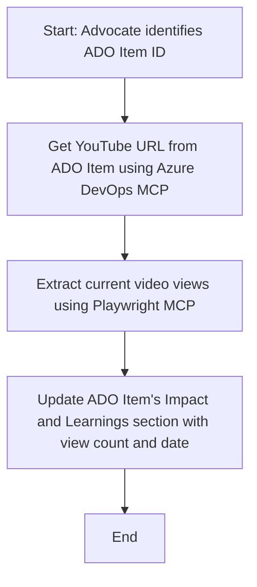

<!--
CO_OP_TRANSLATOR_METADATA:
{
  "original_hash": "14a2dfbea55ef735660a06bd6bdfe5f3",
  "translation_date": "2025-07-14T06:09:28+00:00",
  "source_file": "09-CaseStudy/UpdateADOItemsFromYT.md",
  "language_code": "zh"
}
-->
# 案例研究：使用 MCP 从 YouTube 数据更新 Azure DevOps 项目

> **免责声明：** 目前已有在线工具和报告可以自动化地将来自 YouTube 等平台的数据更新到 Azure DevOps 项目中。以下场景仅作为示例用例，展示如何利用 MCP 工具实现自动化和集成任务。

## 概述

本案例展示了如何使用 Model Context Protocol (MCP) 及其工具，自动将来自在线平台（如 YouTube）的信息更新到 Azure DevOps (ADO) 工作项中。所描述的场景只是这些工具更广泛功能的一个示例，能够适应许多类似的自动化需求。

在此示例中，一位 Advocate 使用 ADO 工作项跟踪在线会议，每个工作项包含一个 YouTube 视频链接。通过利用 MCP 工具，Advocate 可以以可重复且自动化的方式，保持 ADO 工作项中视频指标（如观看次数）的最新状态。这种方法同样适用于需要将在线来源信息集成到 ADO 或其他系统的其他用例。

## 场景

一位 Advocate 负责跟踪在线会议和社区互动的影响力。每场会议都作为 'DevRel' 项目中的 ADO 工作项进行记录，工作项中包含一个用于存放 YouTube 视频链接的字段。为了准确报告会议的覆盖范围，Advocate 需要将当前的视频观看次数及数据获取日期更新到 ADO 工作项中。

## 使用工具

- [Azure DevOps MCP](https://github.com/microsoft/azure-devops-mcp)：通过 MCP 实现对 ADO 工作项的编程访问和更新。
- [Playwright MCP](https://github.com/microsoft/playwright-mcp)：自动化浏览器操作，从网页（如 YouTube 视频页面）提取实时数据。

## 逐步工作流程

1. **确定 ADO 工作项**：从 'DevRel' 项目中的 ADO 工作项 ID（例如 1234）开始。
2. **获取 YouTube 链接**：使用 Azure DevOps MCP 工具从工作项中提取 YouTube 视频链接。
3. **提取视频观看次数**：使用 Playwright MCP 工具访问该 YouTube 链接，提取当前观看次数。
4. **更新 ADO 工作项**：通过 Azure DevOps MCP 工具，将最新观看次数和数据获取日期写入 ADO 工作项的“Impact and Learnings”部分。

## 示例提示

```bash
- Work with the ADO Item ID: 1234
- The project is '2025-Awesome'
- Get the YouTube URL for the ADO item
- Use Playwright to get the current views from the YouTube video
- Update the ADO item with the current video views and the updated date of the information
```

## Mermaid 流程图



## 技术实现

- **MCP 编排**：整个流程由 MCP 服务器编排，协调 Azure DevOps MCP 和 Playwright MCP 工具的使用。
- **自动化**：该过程可手动触发，也可定时运行，确保 ADO 工作项保持最新。
- **可扩展性**：同样的模式可扩展用于更新 ADO 工作项中的其他在线指标（如点赞数、评论数）或来自其他平台的数据。

## 结果与影响

- **效率提升**：通过自动获取和更新视频指标，减少 Advocate 的手动工作量。
- **数据准确**：确保 ADO 工作项反映来自在线来源的最新数据。
- **可重复性**：为类似场景提供可复用的工作流程，适用于其他数据源或指标。

## 参考资料

- [Azure DevOps MCP](https://github.com/microsoft/azure-devops-mcp)
- [Playwright MCP](https://github.com/microsoft/playwright-mcp)
- [Model Context Protocol (MCP)](https://modelcontextprotocol.io/)

**免责声明**：  
本文件使用 AI 翻译服务 [Co-op Translator](https://github.com/Azure/co-op-translator) 进行翻译。虽然我们力求准确，但请注意自动翻译可能包含错误或不准确之处。原始文件的母语版本应被视为权威来源。对于重要信息，建议使用专业人工翻译。对于因使用本翻译而产生的任何误解或误释，我们概不负责。