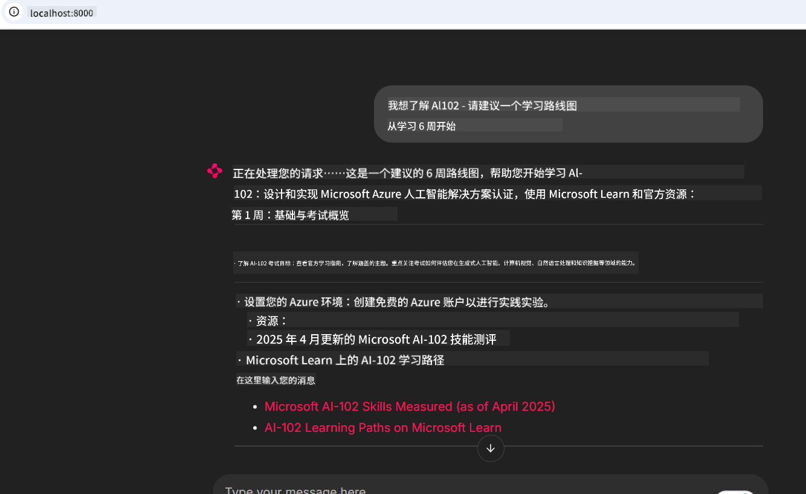

<!--
CO_OP_TRANSLATOR_METADATA:
{
  "original_hash": "4319d291c9d124ecafea52b3d04bfa0e",
  "translation_date": "2025-07-14T06:19:04+00:00",
  "source_file": "09-CaseStudy/docs-mcp/README.md",
  "language_code": "zh"
}
-->
# 案例研究：从客户端连接到 Microsoft Learn Docs MCP 服务器

你是否曾经在文档网站、Stack Overflow 和无数搜索引擎标签页之间切换，同时试图解决代码中的问题？也许你专门留了第二个显示器用来看文档，或者不断在 IDE 和浏览器之间切换。有没有想过，如果能把文档直接集成到你的工作流程中——无论是在应用程序、IDE，还是你自己的定制工具里——会不会更好？在本案例研究中，我们将探讨如何通过客户端应用程序直接连接到 Microsoft Learn Docs MCP 服务器，实现这一目标。

## 概述

现代开发不仅仅是写代码，更是要在正确的时间找到正确的信息。文档无处不在，但很少出现在你最需要的地方：你的工具和工作流程中。通过将文档检索直接集成到应用程序中，你可以节省时间，减少上下文切换，提高工作效率。本节将向你展示如何连接客户端到 Microsoft Learn Docs MCP 服务器，从而无需离开应用即可访问实时、上下文相关的文档。

我们将演示如何建立连接、发送请求以及高效处理流式响应。这种方法不仅简化了工作流程，还为构建更智能、更有帮助的开发者工具打开了大门。

## 学习目标

为什么要这样做？因为最好的开发者体验是消除摩擦。想象一个世界，你的代码编辑器、聊天机器人或网页应用能即时回答你的文档问题，且使用的是 Microsoft Learn 的最新内容。完成本章后，你将学会：

- 理解 MCP 服务器与客户端之间文档通信的基础
- 实现控制台或网页应用，连接到 Microsoft Learn Docs MCP 服务器
- 使用流式 HTTP 客户端实现实时文档检索
- 在应用中记录并解析文档响应

你将看到这些技能如何帮助你构建不仅是被动响应，而是真正交互且具备上下文感知的工具。

## 场景 1 - 使用 MCP 实时文档检索

在此场景中，我们将演示如何连接客户端到 Microsoft Learn Docs MCP 服务器，从而无需离开应用即可访问实时、上下文相关的文档。

让我们动手实践。你的任务是编写一个应用，连接到 Microsoft Learn Docs MCP 服务器，调用 `microsoft_docs_search` 工具，并将流式响应记录到控制台。

### 为什么采用这种方法？
因为这是构建更高级集成的基础——无论你是想驱动聊天机器人、IDE 扩展还是网页仪表盘。

你可以在本案例研究的 [`solution`](./solution/README.md) 文件夹中找到此场景的代码和说明。步骤将指导你完成连接设置：
- 使用官方 MCP SDK 和支持流式的 HTTP 客户端进行连接
- 使用查询参数调用 `microsoft_docs_search` 工具以检索文档
- 实现适当的日志记录和错误处理
- 创建交互式控制台界面，允许用户输入多个搜索查询

此场景演示如何：
- 连接到 Docs MCP 服务器
- 发送查询
- 解析并打印结果

运行示例可能如下所示：

```
Prompt> What is Azure Key Vault?
Answer> Azure Key Vault is a cloud service for securely storing and accessing secrets. ...
```

以下是一个最简示例。完整代码和详细信息请参见 solution 文件夹。

<details>
<summary>Python</summary>

```python
import asyncio
from mcp.client.streamable_http import streamablehttp_client
from mcp import ClientSession

async def main():
    async with streamablehttp_client("https://learn.microsoft.com/api/mcp") as (read_stream, write_stream, _):
        async with ClientSession(read_stream, write_stream) as session:
            await session.initialize()
            result = await session.call_tool("microsoft_docs_search", {"query": "Azure Functions best practices"})
            print(result.content)

if __name__ == "__main__":
    asyncio.run(main())
```

- 完整实现和日志记录请参见 [`scenario1.py`](../../../../09-CaseStudy/docs-mcp/solution/python/scenario1.py)。
- 安装和使用说明请参见同一文件夹下的 [`README.md`](./solution/python/README.md)。
</details>

## 场景 2 - 使用 MCP 的交互式学习计划生成网页应用

在此场景中，你将学习如何将 Docs MCP 集成到网页开发项目中。目标是让用户能够直接从网页界面搜索 Microsoft Learn 文档，使文档在你的应用或网站中即时可用。

你将学习如何：
- 搭建网页应用
- 连接到 Docs MCP 服务器
- 处理用户输入并显示结果

运行示例可能如下所示：

```
User> I want to learn about AI102 - so suggest the roadmap to get it started from learn for 6 weeks

Assistant> Here’s a detailed 6-week roadmap to start your preparation for the AI-102: Designing and Implementing a Microsoft Azure AI Solution certification, using official Microsoft resources and focusing on exam skills areas:

---
## Week 1: Introduction & Fundamentals
- **Understand the Exam**: Review the [AI-102 exam skills outline](https://learn.microsoft.com/en-us/credentials/certifications/exams/ai-102/).
- **Set up Azure**: Sign up for a free Azure account if you don't have one.
- **Learning Path**: [Introduction to Azure AI services](https://learn.microsoft.com/en-us/training/modules/intro-to-azure-ai/)
- **Focus**: Get familiar with Azure portal, AI capabilities, and necessary tools.

....more weeks of the roadmap...

Let me know if you want module-specific recommendations or need more customized weekly tasks!
```

以下是一个最简示例。完整代码和详细信息请参见 solution 文件夹。



<details>
<summary>Python (Chainlit)</summary>

Chainlit 是一个用于构建对话式 AI 网页应用的框架。它使创建能够调用 MCP 工具并实时显示结果的交互式聊天机器人和助手变得简单。非常适合快速原型开发和用户友好界面。

```python
import chainlit as cl
import requests

MCP_URL = "https://learn.microsoft.com/api/mcp"

@cl.on_message
def handle_message(message):
    query = {"question": message}
    response = requests.post(MCP_URL, json=query)
    if response.ok:
        result = response.json()
        cl.Message(content=result.get("answer", "No answer found.")).send()
    else:
        cl.Message(content="Error: " + response.text).send()
```

- 完整实现请参见 [`scenario2.py`](../../../../09-CaseStudy/docs-mcp/solution/python/scenario2.py)。
- 安装和运行说明请参见 [`README.md`](./solution/python/README.md)。
</details>

## 场景 3：在 VS Code 中使用 MCP 服务器实现编辑器内文档

如果你想直接在 VS Code 中获取 Microsoft Learn Docs（而不是切换浏览器标签页），可以在编辑器中使用 MCP 服务器。这样你可以：
- 在 VS Code 中搜索和阅读文档，无需离开编码环境
- 直接在 README 或课程文件中引用文档并插入链接
- 将 GitHub Copilot 与 MCP 结合，打造无缝的 AI 驱动文档工作流

**你将学会：**
- 在工作区根目录添加有效的 `.vscode/mcp.json` 文件（见下方示例）
- 打开 MCP 面板或使用 VS Code 命令面板搜索并插入文档
- 在编辑 Markdown 文件时直接引用文档
- 将此工作流与 GitHub Copilot 结合，进一步提升效率

以下是在 VS Code 中设置 MCP 服务器的示例：

```json
{
  "servers": {
    "LearnDocsMCP": {
      "url": "https://learn.microsoft.com/api/mcp"
    }
  }
}
```

</details>

> 有关详细的图文步骤指南，请参见 [`README.md`](./solution/scenario3/README.md)。


这种方法非常适合构建技术课程、编写文档或需要频繁参考的代码开发者。

## 关键要点

将文档直接集成到你的工具中不仅仅是方便——它是提升生产力的关键。通过从客户端连接到 Microsoft Learn Docs MCP 服务器，你可以：

- 消除代码与文档之间的上下文切换
- 实时获取最新的、上下文相关的文档
- 构建更智能、更具交互性的开发者工具

这些技能将帮助你打造既高效又令人愉悦的解决方案。

## 额外资源

为了加深理解，请参考以下官方资源：

- [Microsoft Learn Docs MCP Server (GitHub)](https://github.com/MicrosoftDocs/mcp)
- [Get started with Azure MCP Server (mcp-python)](https://learn.microsoft.com/en-us/azure/developer/azure-mcp-server/get-started#create-the-python-app)
- [What is the Azure MCP Server?](https://learn.microsoft.com/en-us/azure/developer/azure-mcp-server/)
- [Model Context Protocol (MCP) Introduction](https://modelcontextprotocol.io/introduction)
- [Add plugins from a MCP Server (Python)](https://learn.microsoft.com/en-us/semantic-kernel/concepts/plugins/adding-mcp-plugins)

**免责声明**：  
本文件使用 AI 翻译服务 [Co-op Translator](https://github.com/Azure/co-op-translator) 进行翻译。虽然我们力求准确，但请注意，自动翻译可能包含错误或不准确之处。原始文件的母语版本应被视为权威来源。对于重要信息，建议使用专业人工翻译。对于因使用本翻译而产生的任何误解或误释，我们不承担任何责任。