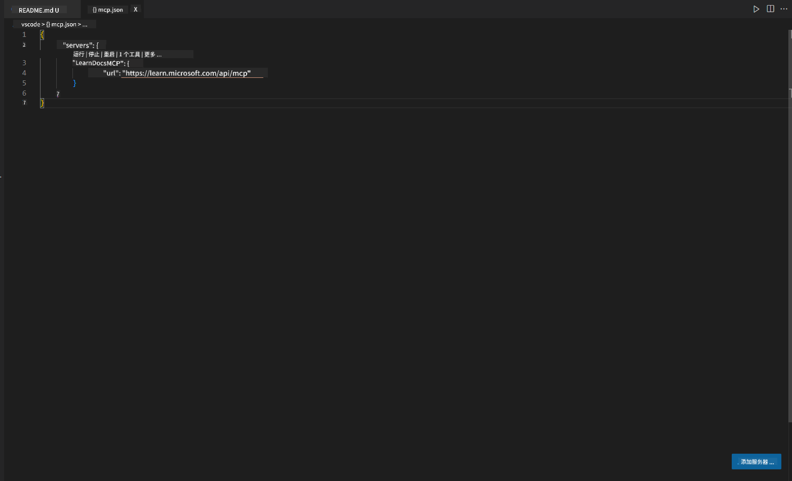
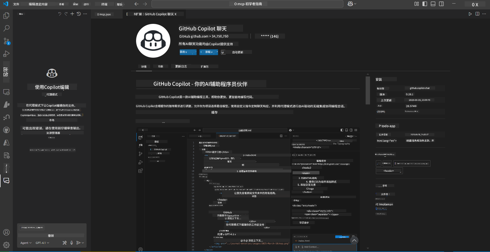
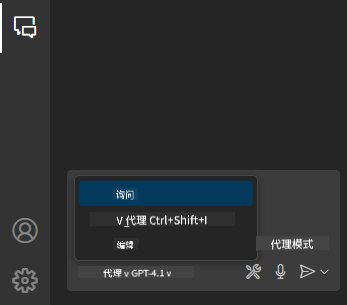
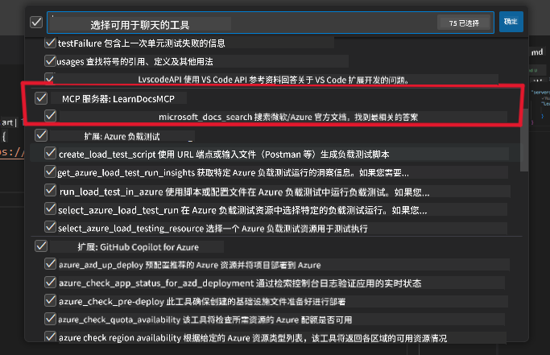
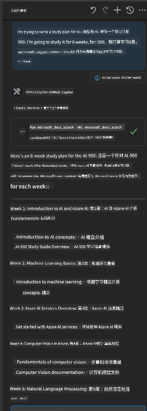
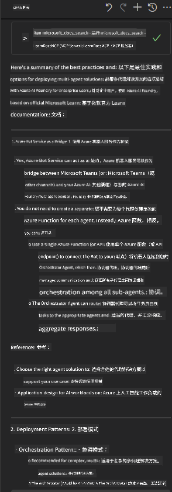

<!--
CO_OP_TRANSLATOR_METADATA:
{
  "original_hash": "db532b1ec386c9ce38c791653dc3c881",
  "translation_date": "2025-07-14T06:47:29+00:00",
  "source_file": "09-CaseStudy/docs-mcp/solution/scenario3/README.md",
  "language_code": "zh"
}
-->
# 场景 3：在 VS Code 中使用 MCP 服务器的编辑器内文档

## 概述

在本场景中，您将学习如何通过 MCP 服务器将 Microsoft Learn 文档直接引入 Visual Studio Code 环境。无需频繁切换浏览器标签页查找文档，您可以在编辑器内访问、搜索并引用官方文档。这种方式简化了工作流程，让您保持专注，并能与 GitHub Copilot 等工具无缝集成。

- 在 VS Code 内搜索和阅读文档，无需离开编码环境。
- 直接引用文档并插入链接到 README 或课程文件中。
- 结合使用 GitHub Copilot 和 MCP，实现无缝的 AI 驱动文档工作流。

## 学习目标

完成本章后，您将了解如何在 VS Code 中设置和使用 MCP 服务器，以提升文档和开发工作流程。您将能够：

- 配置工作区以使用 MCP 服务器进行文档查询。
- 在 VS Code 内直接搜索并插入文档内容。
- 结合 GitHub Copilot 和 MCP 的优势，实现更高效的 AI 辅助工作流。

这些技能将帮助您保持专注，提高文档质量，并提升作为开发者或技术写作者的工作效率。

## 解决方案

为了实现编辑器内文档访问，您将按照一系列步骤，将 MCP 服务器与 VS Code 和 GitHub Copilot 集成。此方案非常适合课程作者、文档编写者和开发者，他们希望在编辑器内专注工作，同时使用文档和 Copilot。

- 在编写课程或项目文档时，快速向 README 添加引用链接。
- 使用 Copilot 生成代码，利用 MCP 即时查找并引用相关文档。
- 保持编辑器内专注，提高工作效率。

### 逐步指南

开始操作，请按照以下步骤进行。每个步骤都可以从资源文件夹中添加截图以直观展示流程。

1. **添加 MCP 配置：**  
   在项目根目录下创建 `.vscode/mcp.json` 文件，并添加以下配置：  
   ```json
   {
     "servers": {
       "LearnDocsMCP": {
         "url": "https://learn.microsoft.com/api/mcp"
       }
     }
   }
   ```  
   该配置告诉 VS Code 如何连接到 [`Microsoft Learn Docs MCP server`](https://github.com/MicrosoftDocs/mcp)。
   
   
    
2. **打开 GitHub Copilot Chat 面板：**  
   如果尚未安装 GitHub Copilot 扩展，请在 VS Code 的扩展视图中安装。您可以直接从 [Visual Studio Code Marketplace](https://marketplace.visualstudio.com/items?itemName=GitHub.copilot-chat) 下载。然后，从侧边栏打开 Copilot Chat 面板。

   

3. **启用代理模式并验证工具：**  
   在 Copilot Chat 面板中启用代理模式。

   

   启用代理模式后，确认 MCP 服务器已列为可用工具之一。这确保 Copilot 代理可以访问文档服务器，获取相关信息。
   
   

4. **开始新聊天并向代理提问：**  
   在 Copilot Chat 面板打开新聊天。现在，您可以向代理提出文档查询请求。代理将使用 MCP 服务器，直接在编辑器中获取并展示相关的 Microsoft Learn 文档。

   - *“我正在为主题 X 制定学习计划，计划学习 8 周，请为每周推荐应学习的内容。”*

   

5. **实时查询：**

   > 让我们来看一个来自 Azure AI Foundry Discord [#get-help](https://discord.gg/D6cRhjHWSC) 频道的实时查询（[查看原始消息](https://discord.com/channels/1113626258182504448/1385498306720829572)）：
   
   *“我想了解如何使用 Azure AI Foundry 开发的 AI 代理部署多代理解决方案。我发现没有直接的部署方式，比如 Copilot Studio 频道。那么，企业用户如何通过不同方式部署，以实现交互和完成任务？  
   有很多文章/博客说可以用 Azure Bot 服务作为 MS Teams 和 Azure AI Foundry 代理之间的桥梁。如果我设置一个 Azure Bot，通过 Azure Function 连接到 Azure AI Foundry 的 Orchestrator Agent 来执行编排，这样可行吗？还是需要为多代理解决方案中的每个 AI 代理创建 Azure Function，在 Bot 框架中进行编排？欢迎其他建议。”*

   

   代理会返回相关文档链接和摘要，您可以直接插入到 Markdown 文件中，或作为代码中的参考。

### 示例查询

以下是一些示例查询，您可以尝试。这些查询展示了 MCP 服务器和 Copilot 如何协同工作，在不离开 VS Code 的情况下，提供即时且上下文相关的文档和引用：

- “告诉我如何使用 Azure Functions 触发器。”
- “插入 Azure Key Vault 官方文档的链接。”
- “Azure 资源安全的最佳实践有哪些？”
- “找一个 Azure AI 服务的快速入门教程。”

这些查询将展示 MCP 服务器和 Copilot 如何协同工作，提供即时且上下文相关的文档和引用，无需离开 VS Code。

---

**免责声明**：  
本文件使用 AI 翻译服务 [Co-op Translator](https://github.com/Azure/co-op-translator) 进行翻译。虽然我们力求准确，但请注意，自动翻译可能包含错误或不准确之处。原始语言的文档应被视为权威来源。对于重要信息，建议使用专业人工翻译。对于因使用本翻译而产生的任何误解或误释，我们概不负责。