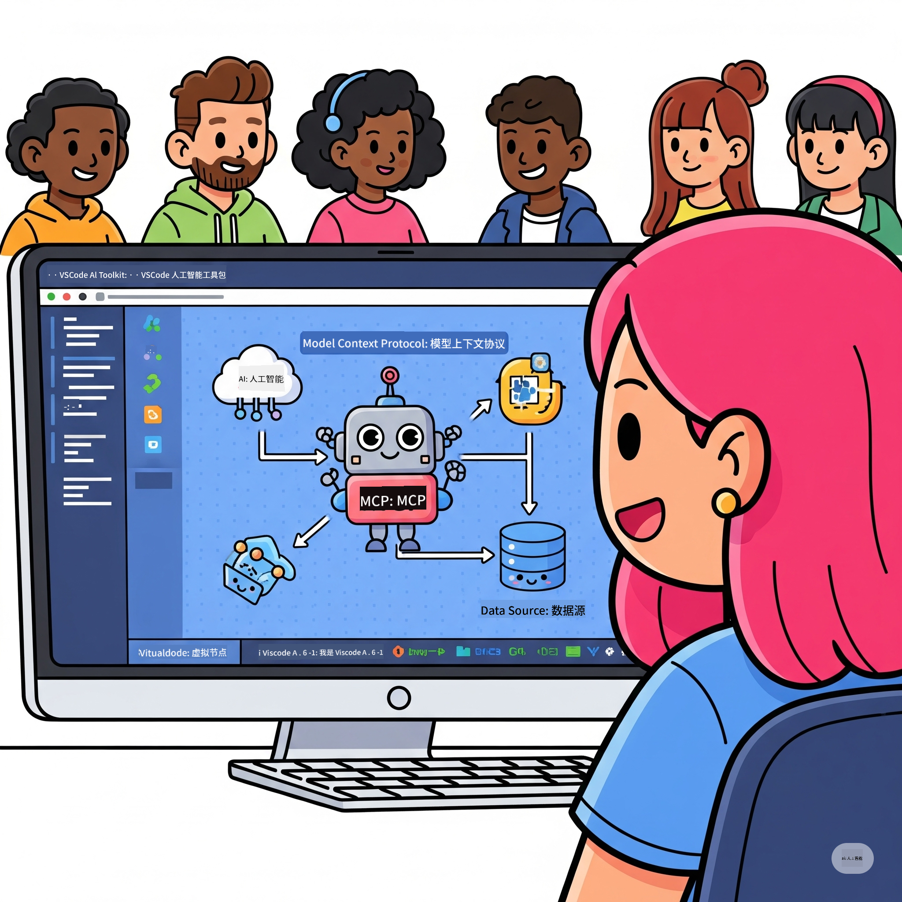
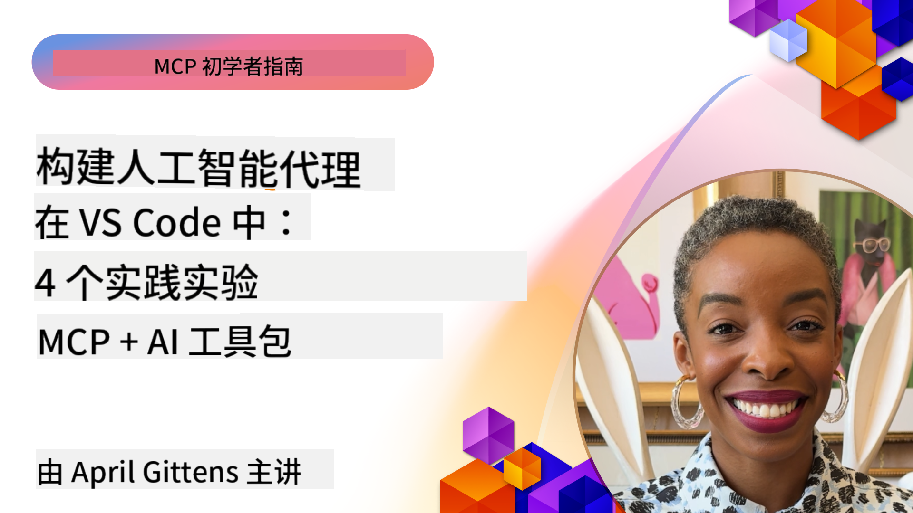

<!--
CO_OP_TRANSLATOR_METADATA:
{
  "original_hash": "1b000fd6e1b04c047578bfc5d07d54eb",
  "translation_date": "2025-07-28T23:27:15+00:00",
  "source_file": "10-StreamliningAIWorkflowsBuildingAnMCPServerWithAIToolkit/README.md",
  "language_code": "zh"
}
-->
# 简化 AI 工作流：使用 AI 工具包构建 MCP 服务器

## 🎯 概述

_（点击上方图片观看本课程视频）_

欢迎来到 **模型上下文协议（MCP）工作坊**！这个全面的动手工作坊结合了两项前沿技术，旨在彻底改变 AI 应用开发：

- **🔗 模型上下文协议（MCP）**：一种开放标准，用于无缝集成 AI 工具
- **🛠️ Visual Studio Code 的 AI 工具包（AITK）**：微软强大的 AI 开发扩展

### 🎓 学习内容

通过本次工作坊，您将掌握构建智能应用的艺术，这些应用能够将 AI 模型与现实世界的工具和服务连接起来。从自动化测试到自定义 API 集成，您将获得解决复杂业务挑战的实用技能。

## 🏗️ 技术栈

### 🔌 模型上下文协议（MCP）

MCP 是 AI 的 **“USB-C”**——一种连接 AI 模型与外部工具和数据源的通用标准。

**✨ 关键特性：**

- 🔄 **标准化集成**：为 AI 工具连接提供通用接口
- 🏛️ **灵活架构**：通过 stdio/SSE 传输支持本地和远程服务器
- 🧰 **丰富生态系统**：工具、提示和资源集成于一个协议
- 🔒 **企业级准备**：内置安全性和可靠性

**🎯 MCP 的重要性：**
就像 USB-C 消除了线缆混乱，MCP 消除了 AI 集成的复杂性。一个协议，无限可能。

### 🤖 Visual Studio Code 的 AI 工具包（AITK）

微软的旗舰 AI 开发扩展，将 VS Code 转变为 AI 开发的强大工具。

**🚀 核心功能：**

- 📦 **模型目录**：访问来自 Azure AI、GitHub、Hugging Face、Ollama 的模型
- ⚡ **本地推理**：支持 ONNX 优化的 CPU/GPU/NPU 执行
- 🏗️ **代理构建器**：通过 MCP 集成进行可视化 AI 代理开发
- 🎭 **多模态支持**：支持文本、视觉和结构化输出

**💡 开发优势：**

- 零配置模型部署
- 可视化提示工程
- 实时测试环境
- 无缝 MCP 服务器集成

## 📚 学习路径

### [🚀 模块 1：AI 工具包基础](./lab1/README.md)

**时长**：15 分钟

- 🛠️ 安装并配置 Visual Studio Code 的 AI 工具包
- 🗂️ 探索模型目录（来自 GitHub、ONNX、OpenAI、Anthropic、Google 的 100+ 模型）
- 🎮 掌握实时模型测试的交互式环境
- 🤖 使用代理构建器构建您的第一个 AI 代理
- 📊 使用内置指标（F1、相关性、相似性、一致性）评估模型性能
- ⚡ 学习批处理和多模态支持功能

**🎯 学习成果**：创建一个功能性 AI 代理，并全面了解 AITK 的功能

### [🌐 模块 2：MCP 与 AI 工具包基础](./lab2/README.md)

**时长**：20 分钟

- 🧠 掌握模型上下文协议（MCP）的架构和概念
- 🌐 探索微软的 MCP 服务器生态系统
- 🤖 使用 Playwright MCP 服务器构建一个浏览器自动化代理
- 🔧 将 MCP 服务器与 AI 工具包代理构建器集成
- 📊 配置并测试代理中的 MCP 工具
- 🚀 导出并部署支持 MCP 的代理以供生产使用

**🎯 学习成果**：部署一个通过 MCP 增强的 AI 代理，连接外部工具

### [🔧 模块 3：使用 AI 工具包进行高级 MCP 开发](./lab3/README.md)

**时长**：20 分钟

- 💻 使用 AI 工具包创建自定义 MCP 服务器
- 🐍 配置并使用最新的 MCP Python SDK（v1.9.3）
- 🔍 设置并使用 MCP Inspector 进行调试
- 🛠️ 使用专业调试工作流构建一个天气 MCP 服务器
- 🧪 在代理构建器和 Inspector 环境中调试 MCP 服务器

**🎯 学习成果**：使用现代工具开发并调试自定义 MCP 服务器

### [🐙 模块 4：实践 MCP 开发 - 自定义 GitHub 克隆服务器](./lab4/README.md)

**时长**：30 分钟

- 🏗️ 构建一个用于开发工作流的真实 GitHub 克隆 MCP 服务器
- 🔄 实现智能仓库克隆功能，支持验证和错误处理
- 📁 创建智能目录管理和 VS Code 集成
- 🤖 使用 GitHub Copilot 代理模式与自定义 MCP 工具结合
- 🛡️ 应用生产级可靠性和跨平台兼容性

**🎯 学习成果**：部署一个生产级 MCP 服务器，简化真实开发工作流

## 💡 实际应用与影响

### 🏢 企业应用场景

#### 🔄 DevOps 自动化

通过智能自动化改造您的开发工作流：

- **智能仓库管理**：AI 驱动的代码审查和合并决策
- **智能 CI/CD**：基于代码变更的自动化管道优化
- **问题分类**：自动化的错误分类和分配

#### 🧪 质量保证革命

通过 AI 驱动的自动化提升测试质量：

- **智能测试生成**：自动创建全面的测试套件
- **视觉回归测试**：AI 驱动的 UI 变化检测
- **性能监控**：主动识别和解决问题

#### 📊 数据管道智能化

构建更智能的数据处理工作流：

- **自适应 ETL 流程**：自我优化的数据转换
- **异常检测**：实时数据质量监控
- **智能路由**：智能数据流管理

#### 🎧 客户体验提升

创造卓越的客户互动：

- **上下文感知支持**：具有客户历史访问能力的 AI 代理
- **主动问题解决**：预测性客户服务
- **多渠道集成**：跨平台统一的 AI 体验

## 🛠️ 先决条件与设置

### 💻 系统要求

| 组件 | 要求 | 备注 |
|------|------|------|
| **操作系统** | Windows 10+、macOS 10.15+、Linux | 任意现代操作系统 |
| **Visual Studio Code** | 最新稳定版本 | AITK 必需 |
| **Node.js** | v18.0+ 和 npm | 用于 MCP 服务器开发 |
| **Python** | 3.10+ | 可选，用于 Python MCP 服务器 |
| **内存** | 至少 8GB RAM | 本地模型推荐 16GB |

### 🔧 开发环境

#### 推荐的 VS Code 扩展

- **AI Toolkit** (ms-windows-ai-studio.windows-ai-studio)
- **Python** (ms-python.python)
- **Python Debugger** (ms-python.debugpy)
- **GitHub Copilot** (GitHub.copilot) - 可选但有帮助

#### 可选工具

- **uv**：现代 Python 包管理器
- **MCP Inspector**：用于 MCP 服务器的可视化调试工具
- **Playwright**：用于网页自动化示例

## 🎖️ 学习成果与认证路径

### 🏆 技能掌握清单

完成本次工作坊后，您将掌握以下技能：

#### 🎯 核心能力

- [ ] **MCP 协议掌握**：深入理解架构和实现模式
- [ ] **AITK 熟练度**：熟练使用 AI 工具包进行快速开发
- [ ] **自定义服务器开发**：构建、部署和维护生产级 MCP 服务器
- [ ] **工具集成能力**：无缝连接 AI 与现有开发工作流
- [ ] **问题解决应用**：将所学技能应用于真实业务挑战

#### 🔧 技术技能

- [ ] 设置并配置 VS Code 中的 AI 工具包
- [ ] 设计并实现自定义 MCP 服务器
- [ ] 将 GitHub 模型与 MCP 架构集成
- [ ] 使用 Playwright 构建自动化测试工作流
- [ ] 部署 AI 代理以供生产使用
- [ ] 调试并优化 MCP 服务器性能

#### 🚀 高级能力

- [ ] 构建企业级 AI 集成架构
- [ ] 实施 AI 应用的安全最佳实践
- [ ] 设计可扩展的 MCP 服务器架构
- [ ] 为特定领域创建自定义工具链
- [ ] 指导他人进行 AI 原生开发

## 📖 其他资源

- [MCP 规范](https://modelcontextprotocol.io/docs)
- [AI 工具包 GitHub 仓库](https://github.com/microsoft/vscode-ai-toolkit)
- [MCP 服务器示例集合](https://github.com/modelcontextprotocol/servers)
- [最佳实践指南](https://modelcontextprotocol.io/docs/best-practices)

---

**🚀 准备好彻底改变您的 AI 开发工作流了吗？**

让我们一起通过 MCP 和 AI 工具包构建智能应用的未来！

**免责声明**：  
本文档使用AI翻译服务[Co-op Translator](https://github.com/Azure/co-op-translator)进行翻译。尽管我们努力确保翻译的准确性，但请注意，自动翻译可能包含错误或不准确之处。原始语言的文档应被视为权威来源。对于关键信息，建议使用专业人工翻译。我们不对因使用此翻译而产生的任何误解或误读承担责任。