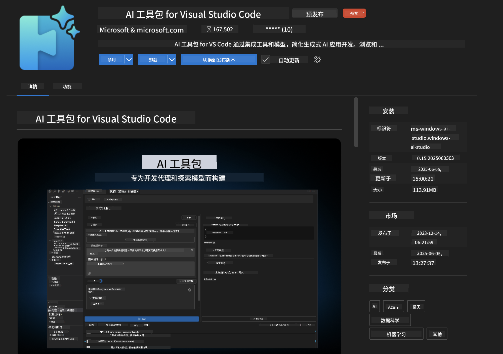
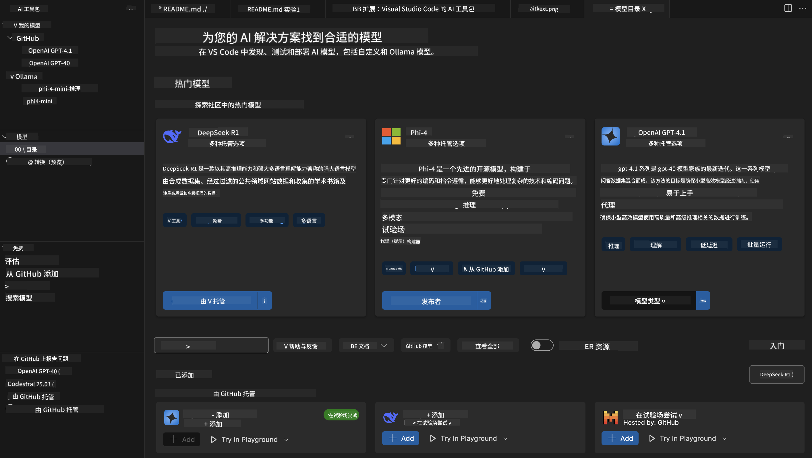
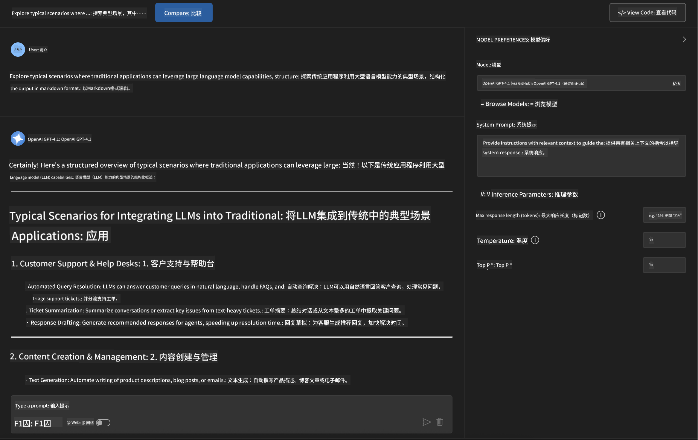
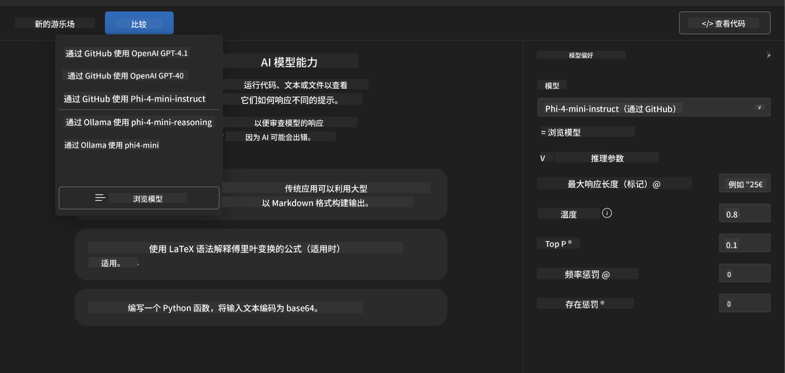
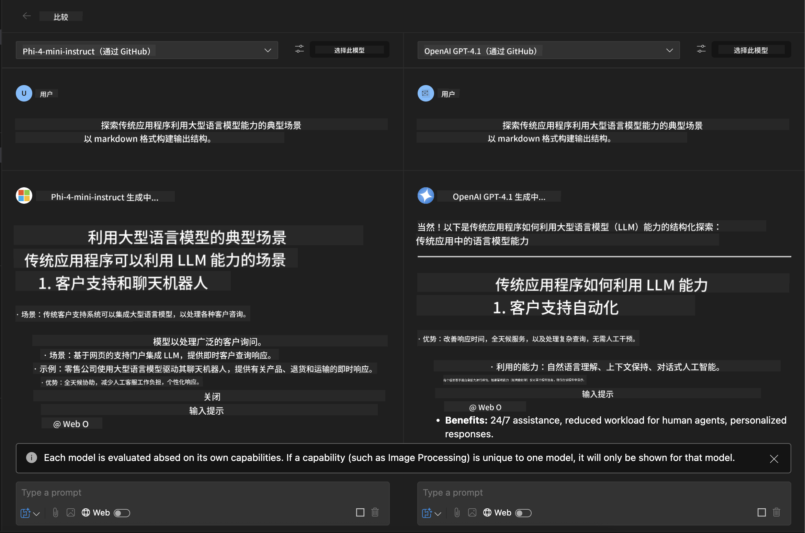
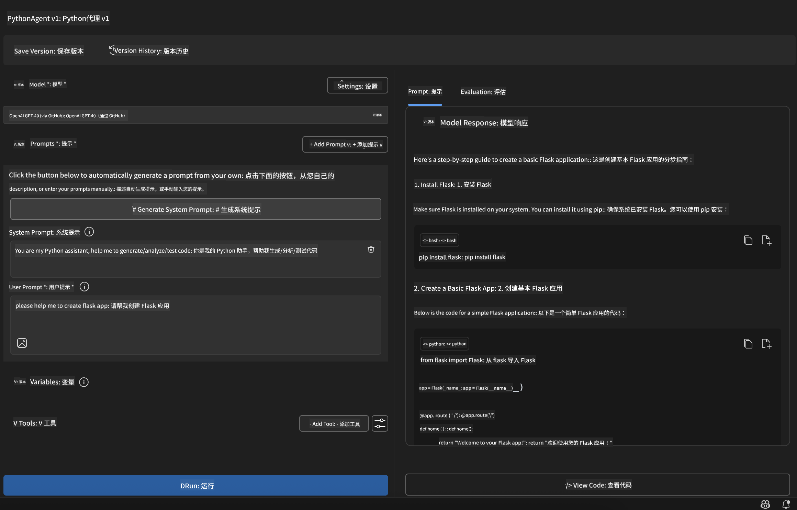

<!--
CO_OP_TRANSLATOR_METADATA:
{
  "original_hash": "2aa9dbc165e104764fa57e8a0d3f1c73",
  "translation_date": "2025-06-10T05:11:26+00:00",
  "source_file": "10-StreamliningAIWorkflowsBuildingAnMCPServerWithAIToolkit/lab1/README.md",
  "language_code": "zh"
}
-->
# 🚀 模块 1：AI 工具包基础

[]()
[]()
[]()

## 📋 学习目标

完成本模块后，你将能够：
- ✅ 安装并配置适用于 Visual Studio Code 的 AI 工具包
- ✅ 浏览模型目录，了解不同模型来源
- ✅ 使用 Playground 进行模型测试和实验
- ✅ 利用 Agent Builder 创建自定义 AI 代理
- ✅ 对比不同提供商的模型性能
- ✅ 应用提示工程的最佳实践

## 🧠 AI 工具包简介 (AITK)

**适用于 Visual Studio Code 的 AI 工具包**是微软的旗舰扩展，将 VS Code 打造为一个全面的 AI 开发环境。它连接了 AI 研究与实际应用开发，让各种技能水平的开发者都能轻松使用生成式 AI。

### 🌟 主要功能

| 功能 | 描述 | 使用场景 |
|---------|-------------|----------|
| **🗂️ 模型目录** | 访问来自 GitHub、ONNX、OpenAI、Anthropic、Google 的 100+ 模型 | 模型发现与选择 |
| **🔌 BYOM 支持** | 集成你自己的模型（本地或远程） | 定制模型部署 |
| **🎮 交互式 Playground** | 通过聊天界面实时测试模型 | 快速原型设计与测试 |
| **📎 多模态支持** | 处理文本、图像和附件 | 复杂 AI 应用 |
| **⚡ 批量处理** | 同时运行多个提示 | 高效测试流程 |
| **📊 模型评估** | 内置指标（F1、相关性、相似度、一致性） | 性能评估 |

### 🎯 AI 工具包的重要性

- **🚀 加速开发**：从创意到原型只需几分钟
- **🔄 统一工作流**：一个界面管理多个 AI 提供商
- **🧪 简易实验**：无需复杂设置即可对比模型
- **📈 生产就绪**：从原型到部署无缝衔接

## 🛠️ 前置条件与安装

### 📦 安装 AI 工具包扩展

**步骤 1：访问扩展市场**
1. 打开 Visual Studio Code
2. 进入扩展视图（`Ctrl+Shift+X` 或 `Cmd+Shift+X`）
3. 搜索 “AI Toolkit”

**步骤 2：选择版本**
- **🟢 正式版**：推荐用于生产环境
- **🔶 预览版**：抢先体验最新功能

**步骤 3：安装并激活**



### ✅ 验证清单
- [ ] VS Code 侧边栏显示 AI Toolkit 图标
- [ ] 扩展已启用并激活
- [ ] 输出面板无安装错误

## 🧪 实操练习 1：探索 GitHub 模型

**🎯 目标**：熟悉模型目录并测试你的第一个 AI 模型

### 📊 第 1 步：浏览模型目录

模型目录是你进入 AI 生态系统的入口。它汇聚了多个提供商的模型，方便发现和比较。

**🔍 导航指南：**

点击 AI 工具包侧边栏中的 **MODELS - Catalog**



**💡 小贴士**：寻找具备你用例所需特性的模型（例如代码生成、创意写作、分析）。

**⚠️ 注意**：GitHub 托管的模型（即 GitHub Models）免费使用，但请求和令牌有速率限制。若要访问非 GitHub 模型（例如通过 Azure AI 或其他端点托管的外部模型），需要提供相应的 API 密钥或认证信息。

### 🚀 第 2 步：添加并配置你的第一个模型

**模型选择策略：**
- **GPT-4.1**：适合复杂推理与分析
- **Phi-4-mini**：轻量级，响应快速，适合简单任务

**🔧 配置流程：**
1. 从目录中选择 **OpenAI GPT-4.1**
2. 点击 **Add to My Models** —— 注册模型以供使用
3. 选择 **Try in Playground** 启动测试环境
4. 等待模型初始化（首次启动可能稍慢）


**⚙️ 理解模型参数：**
- **Temperature**：控制创造力（0 = 确定性，1 = 创造性）
- **Max Tokens**：最大响应长度
- **Top-p**：核采样，提升响应多样性

### 🎯 第 3 步：掌握 Playground 界面

Playground 是你的 AI 实验室。以下方法能帮助你最大化其价值：

**🎨 提示工程最佳实践：**
1. **具体明确**：清晰详细的指令效果更好
2. **提供上下文**：包含相关背景信息
3. **使用示例**：用例子展示你想要的结果
4. **反复迭代**：根据初次结果不断优化提示

**🧪 测试场景：**
```markdown
# Example 1: Code Generation
"Write a Python function that calculates the factorial of a number using recursion. Include error handling and docstrings."

# Example 2: Creative Writing
"Write a professional email to a client explaining a project delay, maintaining a positive tone while being transparent about challenges."

# Example 3: Data Analysis
"Analyze this sales data and provide insights: [paste your data]. Focus on trends, anomalies, and actionable recommendations."
```



### 🏆 挑战练习：模型性能对比

**🎯 目标**：使用相同提示对比不同模型，了解各自优势

**📋 操作说明：**
1. 将 **Phi-4-mini** 添加到你的工作区
2. 对 GPT-4.1 和 Phi-4-mini 使用相同提示



3. 对比响应质量、速度和准确性
4. 在结果部分记录你的发现



**💡 关键洞察：**
- 何时使用大语言模型 (LLM) vs 小语言模型 (SLM)
- 成本与性能的权衡
- 不同模型的专长能力

## 🤖 实操练习 2：使用 Agent Builder 构建自定义代理

**🎯 目标**：创建针对特定任务和工作流的专业 AI 代理

### 🏗️ 第 1 步：了解 Agent Builder

Agent Builder 是 AI 工具包的核心。它允许你创建专用的 AI 助手，结合大型语言模型的能力与自定义指令、特定参数和专业知识。

**🧠 代理架构组件：**
- **核心模型**：基础大语言模型（GPT-4、Groks、Phi 等）
- **系统提示**：定义代理的个性和行为
- **参数**：针对性能优化的调优设置
- **工具集成**：连接外部 API 和 MCP 服务
- **记忆**：对话上下文和会话持久化


### ⚙️ 第 2 步：深入代理配置

**🎨 创建有效的系统提示：**
```markdown
# Template Structure:
## Role Definition
You are a [specific role] with expertise in [domain].

## Capabilities
- List specific abilities
- Define scope of knowledge
- Clarify limitations

## Behavior Guidelines
- Response style (formal, casual, technical)
- Output format preferences
- Error handling approach

## Examples
Provide 2-3 examples of ideal interactions
```

*当然，你也可以使用 Generate System Prompt 让 AI 帮助生成和优化提示*

**🔧 参数优化：**
| 参数 | 推荐范围 | 使用场景 |
|-----------|------------------|----------|
| **Temperature** | 0.1-0.3 | 技术性/事实性回答 |
| **Temperature** | 0.7-0.9 | 创意/头脑风暴任务 |
| **Max Tokens** | 500-1000 | 简洁回答 |
| **Max Tokens** | 2000-4000 | 详细解释 |

### 🐍 第 3 步：实战练习 - Python 编程代理

**🎯 任务**：创建专门的 Python 编程助手

**📋 配置步骤：**

1. **模型选择**：选择 **Claude 3.5 Sonnet**（非常适合代码）

2. **系统提示设计**：
```markdown
# Python Programming Expert Agent

## Role
You are a senior Python developer with 10+ years of experience. You excel at writing clean, efficient, and well-documented Python code.

## Capabilities
- Write production-ready Python code
- Debug complex issues
- Explain code concepts clearly
- Suggest best practices and optimizations
- Provide complete working examples

## Response Format
- Always include docstrings
- Add inline comments for complex logic
- Suggest testing approaches
- Mention relevant libraries when applicable

## Code Quality Standards
- Follow PEP 8 style guidelines
- Use type hints where appropriate
- Handle exceptions gracefully
- Write readable, maintainable code
```

3. **参数配置**：
   - Temperature: 0.2（保持代码稳定可靠）
   - Max Tokens: 2000（详细解释）
   - Top-p: 0.9（平衡创造力）



### 🧪 第 4 步：测试你的 Python 代理

**测试场景：**
1. **基础功能**：“创建一个寻找质数的函数”
2. **复杂算法**：“实现一个包含插入、删除和搜索方法的二叉搜索树”
3. **实际问题**：“构建一个支持速率限制和重试机制的网页爬虫”
4. **调试**：“修复这段代码 [粘贴有问题的代码]”

**🏆 成功标准：**
- ✅ 代码无错误运行
- ✅ 包含恰当文档
- ✅ 遵循 Python 最佳实践
- ✅ 提供清晰解释
- ✅ 给出改进建议

## 🎓 模块 1 总结与后续步骤

### 📊 知识检测

测试你的理解：
- [ ] 能否解释目录中模型的区别？
- [ ] 是否成功创建并测试了自定义代理？
- [ ] 是否理解如何针对不同用例优化参数？
- [ ] 能否设计有效的系统提示？

### 📚 额外资源

- **AI 工具包文档**：[官方微软文档](https://github.com/microsoft/vscode-ai-toolkit)
- **提示工程指南**：[最佳实践](https://platform.openai.com/docs/guides/prompt-engineering)
- **AI 工具包中的模型**：[开发中的模型](https://github.com/microsoft/vscode-ai-toolkit/blob/main/doc/models.md)

**🎉 恭喜！**你已掌握 AI 工具包的基础知识，准备好构建更高级的 AI 应用！

### 🔜 继续下一个模块

准备好探索更高级功能？继续学习 **[模块 2：基于 AI 工具包的 MCP 基础](../lab2/README.md)**，你将学会如何：
- 使用模型上下文协议（MCP）连接代理与外部工具
- 构建基于 Playwright 的浏览器自动化代理
- 将 MCP 服务器与 AI 工具包代理集成
- 利用外部数据和能力强化你的代理

**免责声明**：  
本文件使用 AI 翻译服务 [Co-op Translator](https://github.com/Azure/co-op-translator) 进行翻译。尽管我们力求准确，但请注意，自动翻译可能包含错误或不准确之处。原始语言的文件应被视为权威来源。对于重要信息，建议采用专业人工翻译。我们不对因使用本翻译而产生的任何误解或误释承担责任。