<!--
CO_OP_TRANSLATOR_METADATA:
{
  "original_hash": "a22b7dd11cd7690f99f9195877cafdc3",
  "translation_date": "2025-06-10T05:38:38+00:00",
  "source_file": "10-StreamliningAIWorkflowsBuildingAnMCPServerWithAIToolkit/lab2/README.md",
  "language_code": "zh"
}
-->
# 🌐 模块 2：使用 AI Toolkit 的 MCP 基础知识

[]()
[]()
[]()

## 📋 学习目标

完成本模块后，您将能够：
- ✅ 理解 Model Context Protocol (MCP) 的架构及其优势
- ✅ 探索微软的 MCP 服务器生态系统
- ✅ 将 MCP 服务器集成到 AI Toolkit Agent Builder 中
- ✅ 使用 Playwright MCP 构建功能齐全的浏览器自动化代理
- ✅ 配置并测试代理中的 MCP 工具
- ✅ 导出并部署基于 MCP 的代理以供生产使用

## 🎯 基于模块 1 的进阶

在模块 1 中，我们掌握了 AI Toolkit 的基础知识，并创建了第一个 Python 代理。现在，我们将通过革命性的 **Model Context Protocol (MCP)**，将您的代理连接到外部工具和服务，实现**升级强化**。

可以把这比作从普通计算器升级到完整计算机——您的 AI 代理将具备以下能力：
- 🌐 浏览和交互网站
- 📁 访问和操作文件
- 🔧 集成企业系统
- 📊 处理来自 API 的实时数据

## 🧠 认识 Model Context Protocol (MCP)

### 🔍 什么是 MCP？

Model Context Protocol (MCP) 是 AI 应用的 **“USB-C”** —— 一个革命性的开放标准，将大型语言模型（LLM）连接到外部工具、数据源和服务。正如 USB-C 通过统一接口解决了线缆混乱，MCP 通过统一协议简化了 AI 的集成复杂性。

### 🎯 MCP 解决的问题

**MCP 之前：**
- 🔧 每个工具都需定制集成
- 🔄 被供应商专有方案锁定
- 🔒 临时连接导致安全隐患
- ⏱️ 基础集成开发周期长达数月

**使用 MCP 后：**
- ⚡ 即插即用的工具集成
- 🔄 供应商无关的架构设计
- 🛡️ 内置安全最佳实践
- 🚀 新功能添加仅需几分钟

### 🏗️ MCP 架构详解

MCP 采用**客户端-服务器架构**，构建了一个安全且可扩展的生态系统：

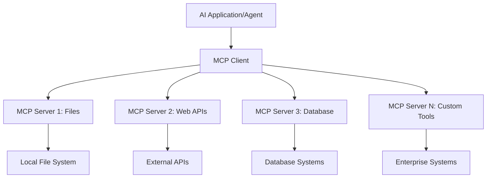

**🔧 核心组件：**

| 组件         | 角色                     | 示例                             |
|--------------|--------------------------|--------------------------------|
| **MCP Hosts**  | 使用 MCP 服务的应用       | Claude Desktop、VS Code、AI Toolkit |
| **MCP Clients**| 协议处理器（与服务器一一对应）| 内置于主机应用                    |
| **MCP Servers**| 通过标准协议提供能力      | Playwright、Files、Azure、GitHub |
| **传输层**    | 通信方式                 | stdio、HTTP、WebSockets         |


## 🏢 微软的 MCP 服务器生态系统

微软引领 MCP 生态，提供一套全面的企业级服务器，满足真实业务需求。

### 🌟 微软 MCP 服务器精选

#### 1. ☁️ Azure MCP 服务器
**🔗 仓库**：[azure/azure-mcp](https://github.com/azure/azure-mcp)  
**🎯 目标**：集成 AI 的全面 Azure 资源管理

**✨ 主要功能：**
- 声明式基础设施配置
- 实时资源监控
- 成本优化建议
- 安全合规检查

**🚀 使用场景：**
- AI 辅助的基础设施即代码
- 自动资源弹性伸缩
- 云成本优化
- DevOps 工作流自动化

#### 2. 📊 Microsoft Dataverse MCP
**📚 文档**：[Microsoft Dataverse 集成](https://go.microsoft.com/fwlink/?linkid=2320176)  
**🎯 目标**：面向业务数据的自然语言接口

**✨ 主要功能：**
- 自然语言数据库查询
- 业务上下文理解
- 自定义提示模板
- 企业数据治理

**🚀 使用场景：**
- 商业智能报告
- 客户数据分析
- 销售管道洞察
- 合规数据查询

#### 3. 🌐 Playwright MCP 服务器
**🔗 仓库**：[microsoft/playwright-mcp](https://github.com/microsoft/playwright-mcp)  
**🎯 目标**：浏览器自动化与网页交互能力

**✨ 主要功能：**
- 跨浏览器自动化（Chrome、Firefox、Safari）
- 智能元素识别
- 截图和 PDF 生成
- 网络流量监控

**🚀 使用场景：**
- 自动化测试流程
- 网络爬取与数据提取
- UI/UX 监控
- 竞争分析自动化

#### 4. 📁 Files MCP 服务器
**🔗 仓库**：[microsoft/files-mcp-server](https://github.com/microsoft/files-mcp-server)  
**🎯 目标**：智能文件系统操作

**✨ 主要功能：**
- 声明式文件管理
- 内容同步
- 版本控制集成
- 元数据提取

**🚀 使用场景：**
- 文档管理
- 代码仓库整理
- 内容发布工作流
- 数据管道文件处理

#### 5. 📝 MarkItDown MCP 服务器
**🔗 仓库**：[microsoft/markitdown](https://github.com/microsoft/markitdown)  
**🎯 目标**：高级 Markdown 处理与操作

**✨ 主要功能：**
- 丰富的 Markdown 解析
- 格式转换（MD ↔ HTML ↔ PDF）
- 内容结构分析
- 模板处理

**🚀 使用场景：**
- 技术文档工作流
- 内容管理系统
- 报告生成
- 知识库自动化

#### 6. 📈 Clarity MCP 服务器
**📦 包**：[@microsoft/clarity-mcp-server](https://www.npmjs.com/package/@microsoft/clarity-mcp-server)  
**🎯 目标**：网页分析与用户行为洞察

**✨ 主要功能：**
- 热力图数据分析
- 用户会话录制
- 性能指标
- 转化漏斗分析

**🚀 使用场景：**
- 网站优化
- 用户体验研究
- A/B 测试分析
- 商业智能仪表盘

### 🌍 社区生态系统

除了微软的服务器，MCP 生态还包括：
- **🐙 GitHub MCP**：代码仓库管理与分析
- **🗄️ 数据库 MCP**：PostgreSQL、MySQL、MongoDB 集成
- **☁️ 云服务 MCP**：AWS、GCP、Digital Ocean 工具
- **📧 通信 MCP**：Slack、Teams、邮件集成

## 🛠️ 实操实验：构建浏览器自动化代理

**🎯 项目目标**：使用 Playwright MCP 服务器创建一个智能浏览器自动化代理，能够浏览网站、提取信息并执行复杂网页交互。

### 🚀 阶段 1：代理基础设置

#### 步骤 1：初始化代理
1. **打开 AI Toolkit Agent Builder**
2. **新建代理**，配置如下：
   - **名称**：`BrowserAgent`
   - **Model**: Choose GPT-4o 

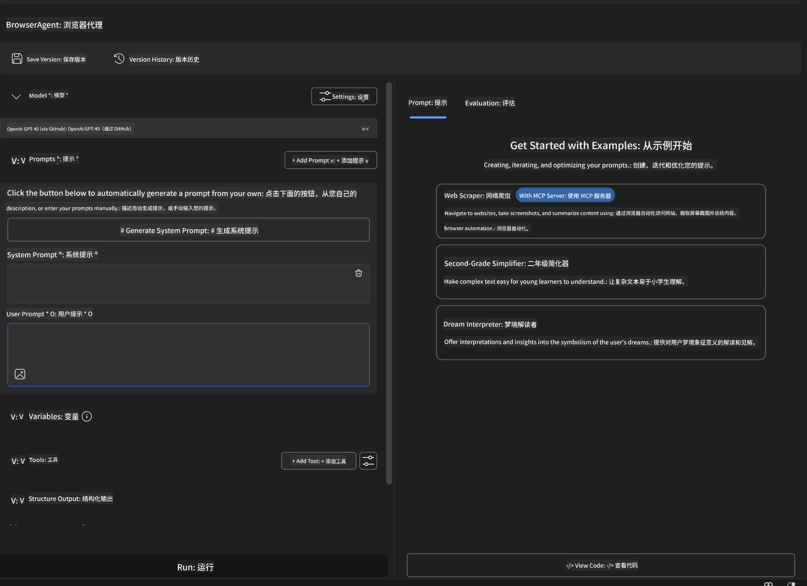


### 🔧 Phase 2: MCP Integration Workflow

#### Step 3: Add MCP Server Integration
1. **Navigate to Tools Section** in Agent Builder
2. **Click "Add Tool"** to open the integration menu
3. **Select "MCP Server"** from available options

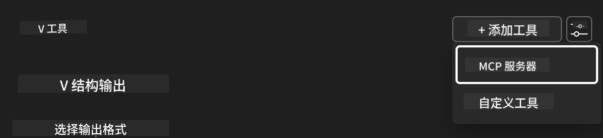

**🔍 Understanding Tool Types:**
- **Built-in Tools**: Pre-configured AI Toolkit functions
- **MCP Servers**: External service integrations
- **Custom APIs**: Your own service endpoints
- **Function Calling**: Direct model function access

#### Step 4: MCP Server Selection
1. **Choose "MCP Server"** option to proceed
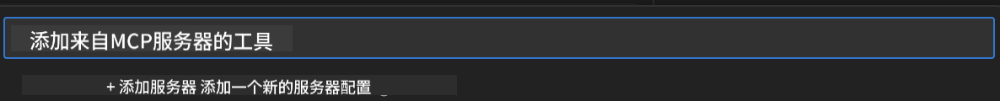

2. **Browse MCP Catalog** to explore available integrations
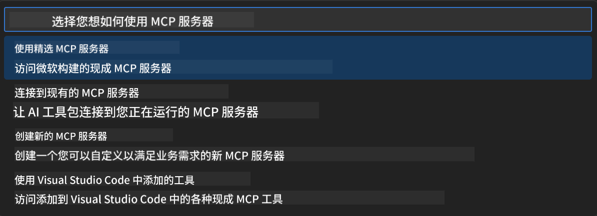


### 🎮 Phase 3: Playwright MCP Configuration

#### Step 5: Select and Configure Playwright
1. **Click "Use Featured MCP Servers"** to access Microsoft's verified servers
2. **Select "Playwright"** from the featured list
3. **Accept Default MCP ID** or customize for your environment

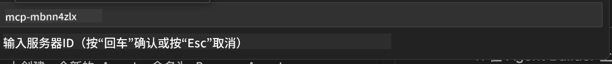

#### Step 6: Enable Playwright Capabilities
**🔑 Critical Step**: Select **ALL** available Playwright methods for maximum functionality

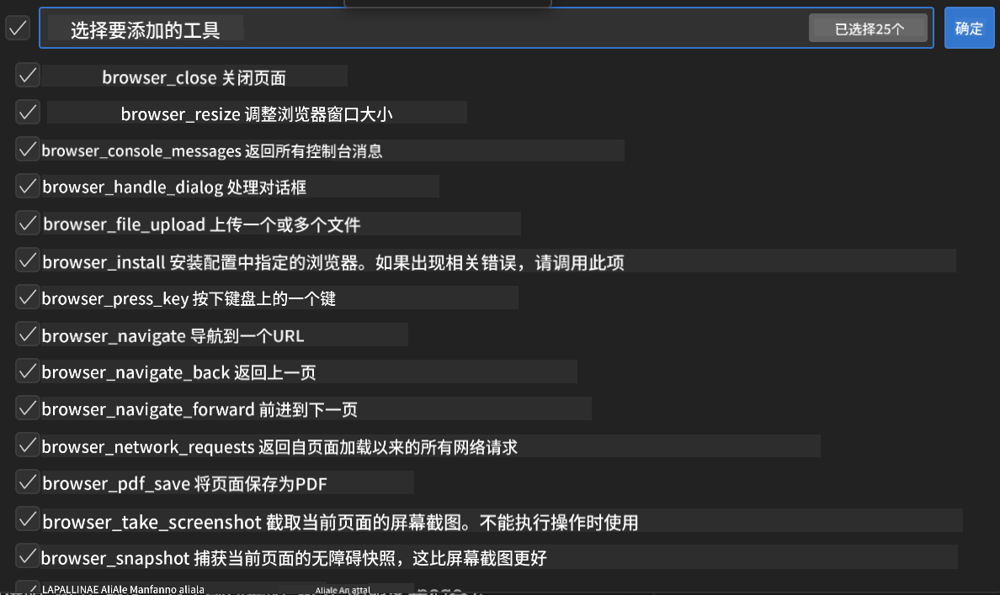

**🛠️ Essential Playwright Tools:**
- **Navigation**: `goto`, `goBack`, `goForward`, `reload`
- **Interaction**: `click`, `fill`, `press`, `hover`, `drag`
- **Extraction**: `textContent`, `innerHTML`, `getAttribute`
- **Validation**: `isVisible`, `isEnabled`, `waitForSelector`
- **Capture**: `screenshot`, `pdf`, `video`
- **Network**: `setExtraHTTPHeaders`, `route`, `waitForResponse`

#### 步骤 7：验证集成成功
**✅ 成功标志：**
- 所有工具均显示在 Agent Builder 界面中
- 集成面板无错误信息
- Playwright 服务器状态显示“Connected”

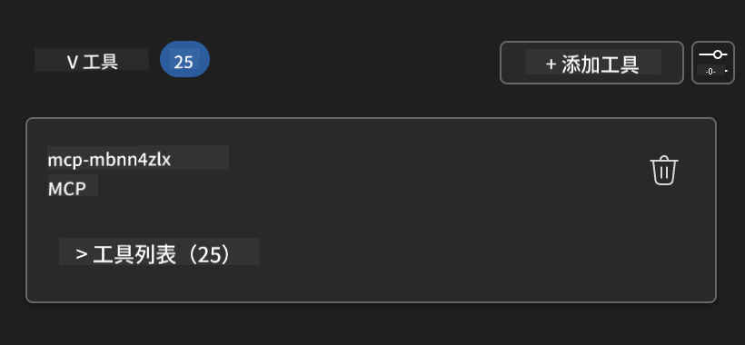

**🔧 常见问题排查：**
- **连接失败**：检查网络连接和防火墙设置
- **工具缺失**：确认设置时已选择所有功能
- **权限错误**：确认 VS Code 具备必要的系统权限

### 🎯 阶段 4：高级提示工程

#### 步骤 8：设计智能系统提示
创建利用 Playwright 全功能的复杂提示：

```markdown
# Web Automation Expert System Prompt

## Core Identity
You are an advanced web automation specialist with deep expertise in browser automation, web scraping, and user experience analysis. You have access to Playwright tools for comprehensive browser control.

## Capabilities & Approach
### Navigation Strategy
- Always start with screenshots to understand page layout
- Use semantic selectors (text content, labels) when possible
- Implement wait strategies for dynamic content
- Handle single-page applications (SPAs) effectively

### Error Handling
- Retry failed operations with exponential backoff
- Provide clear error descriptions and solutions
- Suggest alternative approaches when primary methods fail
- Always capture diagnostic screenshots on errors

### Data Extraction
- Extract structured data in JSON format when possible
- Provide confidence scores for extracted information
- Validate data completeness and accuracy
- Handle pagination and infinite scroll scenarios

### Reporting
- Include step-by-step execution logs
- Provide before/after screenshots for verification
- Suggest optimizations and alternative approaches
- Document any limitations or edge cases encountered

## Ethical Guidelines
- Respect robots.txt and rate limiting
- Avoid overloading target servers
- Only extract publicly available information
- Follow website terms of service
```

#### 步骤 9：创建动态用户提示
设计展示多种能力的用户提示：

**🌐 网页分析示例：**
```markdown
Navigate to github.com/kinfey and provide a comprehensive analysis including:
1. Repository structure and organization
2. Recent activity and contribution patterns  
3. Documentation quality assessment
4. Technology stack identification
5. Community engagement metrics
6. Notable projects and their purposes

Include screenshots at key steps and provide actionable insights.
```

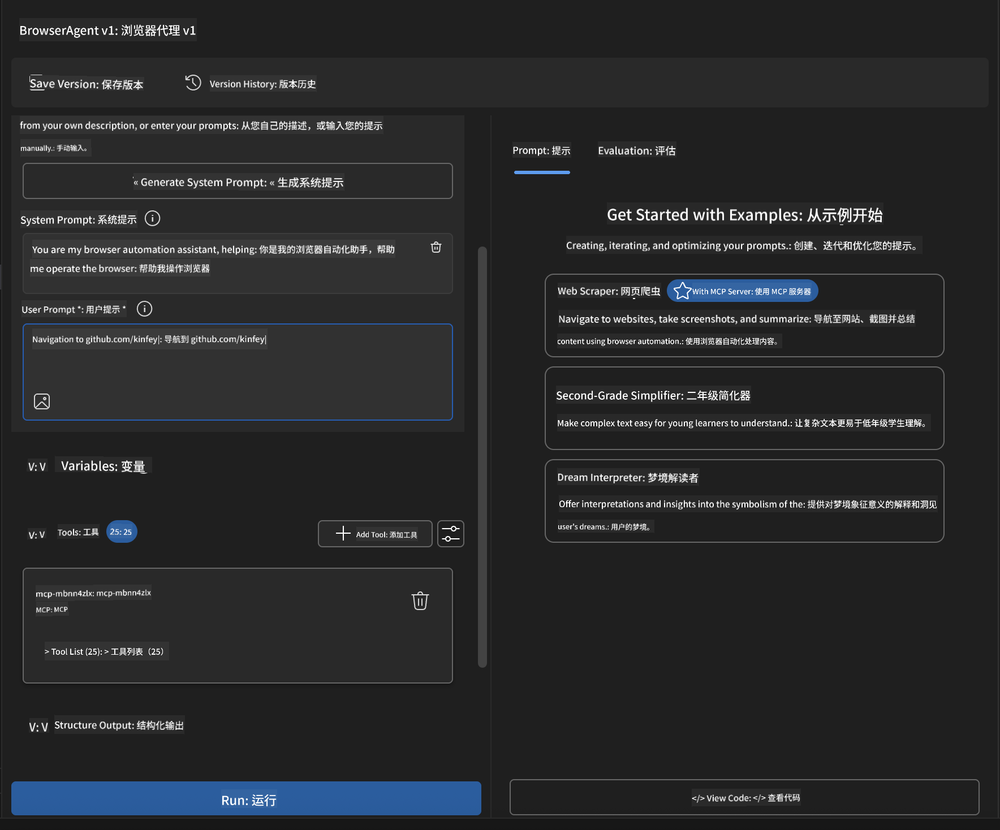

### 🚀 阶段 5：执行与测试

#### 步骤 10：执行首个自动化任务
1. **点击“运行”** 启动自动化流程
2. **实时监控执行过程**：
   - 自动启动 Chrome 浏览器
   - 代理导航至目标网站
   - 截图记录每个关键步骤
   - 实时输出分析结果

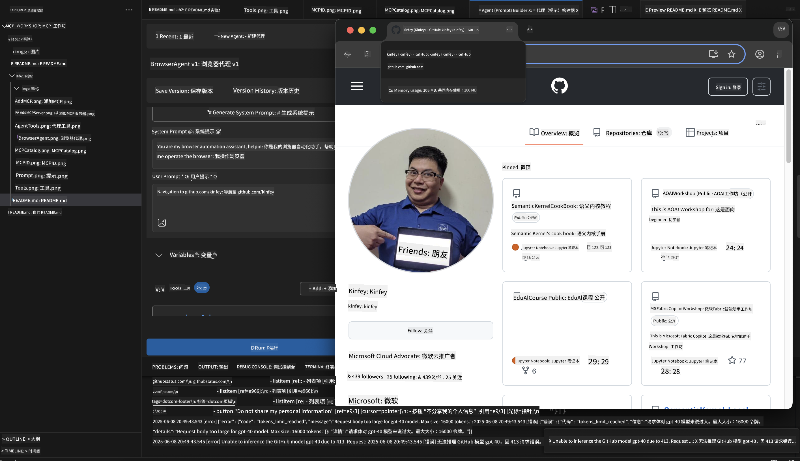

#### 步骤 11：分析结果与洞察
在 Agent Builder 界面查看全面分析报告：

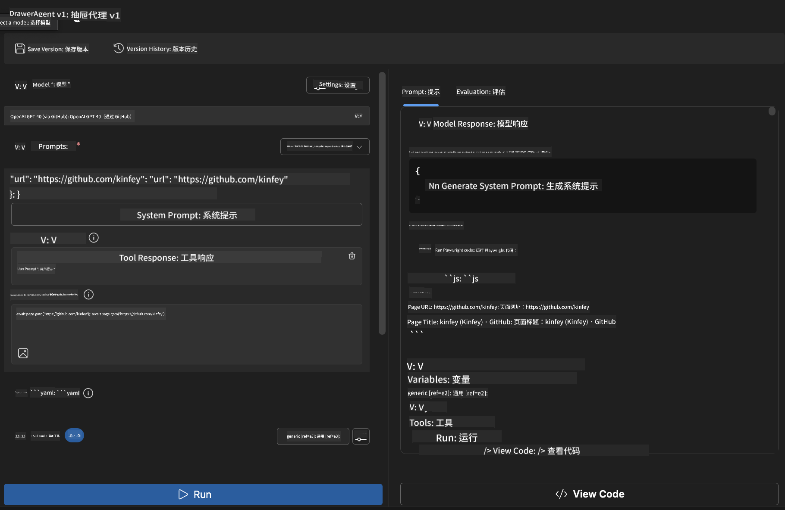

### 🌟 阶段 6：高级功能与部署

#### 步骤 12：导出与生产部署
Agent Builder 支持多种部署方式：

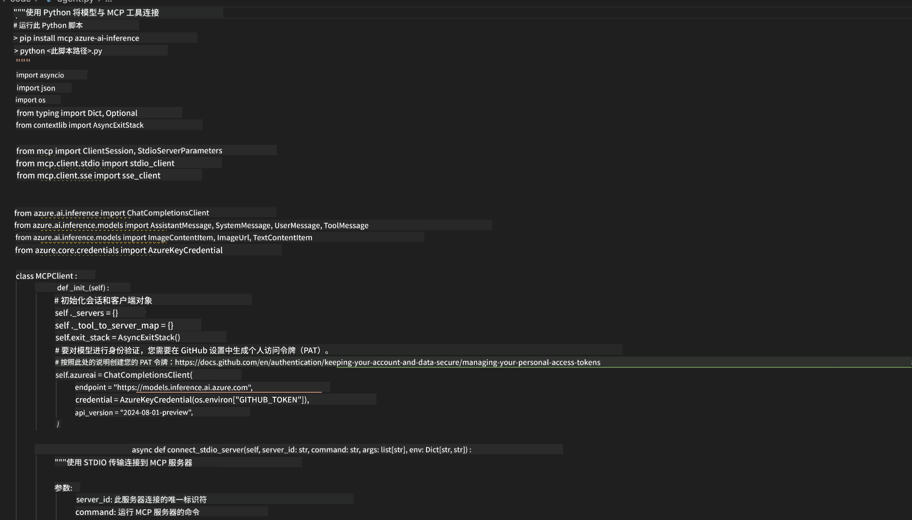

## 🎓 模块 2 总结与后续步骤

### 🏆 成就解锁：MCP 集成大师

**✅ 掌握技能：**
- [ ] 理解 MCP 架构与优势
- [ ] 熟悉微软 MCP 服务器生态
- [ ] 集成 Playwright MCP 与 AI Toolkit
- [ ] 构建复杂的浏览器自动化代理
- [ ] 进行高级网页自动化提示工程

### 📚 补充资源

- **🔗 MCP 规范**：[官方协议文档](https://modelcontextprotocol.io/)
- **🛠️ Playwright API**：[完整方法参考](https://playwright.dev/docs/api/class-playwright)
- **🏢 微软 MCP 服务器**：[企业集成指南](https://github.com/microsoft/mcp-servers)
- **🌍 社区示例**：[MCP 服务器画廊](https://github.com/modelcontextprotocol/servers)

**🎉 恭喜！** 您已成功掌握 MCP 集成，现可构建具备外部工具能力的生产级 AI 代理！

### 🔜 继续下一模块

准备好提升您的 MCP 技能了吗？前往 **[模块 3：使用 AI Toolkit 的高级 MCP 开发](../lab3/README.md)**，学习如何：
- 创建自定义 MCP 服务器
- 配置并使用最新 MCP Python SDK
- 设置 MCP Inspector 进行调试
- 掌握高级 MCP 服务器开发流程
- 从零构建天气 MCP 服务器

**免责声明**：  
本文件由 AI 翻译服务 [Co-op Translator](https://github.com/Azure/co-op-translator) 进行翻译。虽然我们力求准确，但请注意，自动翻译可能存在错误或不准确之处。原始文件的母语版本应被视为权威来源。对于重要信息，建议采用专业人工翻译。对于因使用本翻译而产生的任何误解或误释，我们不承担任何责任。