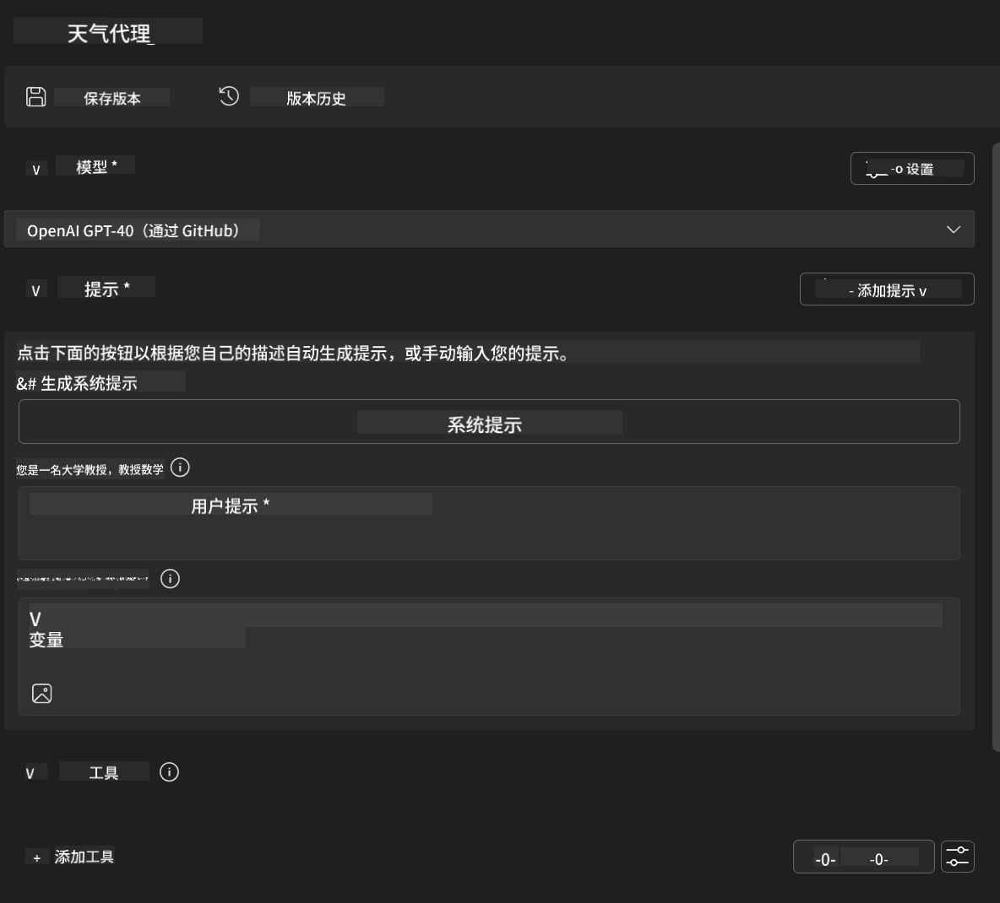
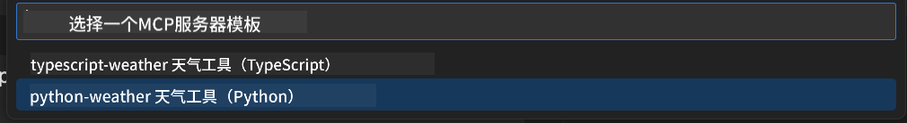
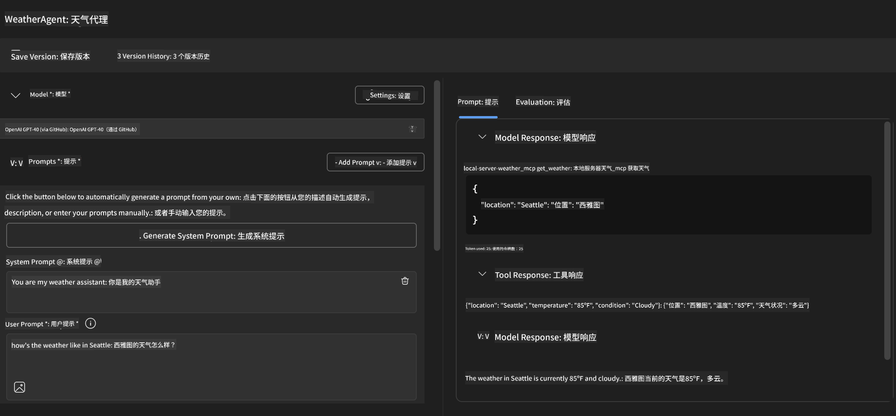
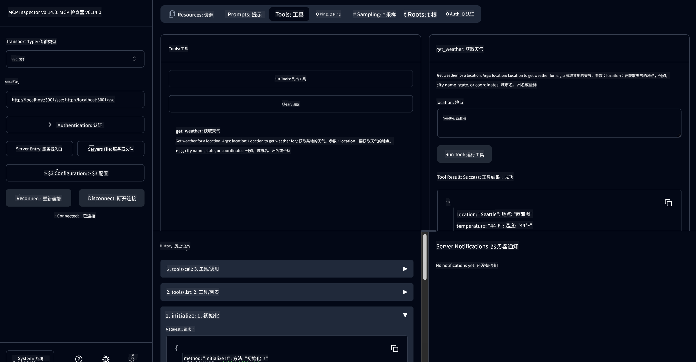

<!--
CO_OP_TRANSLATOR_METADATA:
{
  "original_hash": "dd8da3f75addcef453fe11f02a270217",
  "translation_date": "2025-07-14T08:08:33+00:00",
  "source_file": "10-StreamliningAIWorkflowsBuildingAnMCPServerWithAIToolkit/lab3/README.md",
  "language_code": "zh"
}
-->
# 🔧 模块 3：使用 AI 工具包进行高级 MCP 开发


## 🎯 学习目标

完成本实验后，您将能够：

- ✅ 使用 AI 工具包创建自定义 MCP 服务器
- ✅ 配置并使用最新的 MCP Python SDK（v1.9.3）
- ✅ 设置并使用 MCP Inspector 进行调试
- ✅ 在 Agent Builder 和 Inspector 环境中调试 MCP 服务器
- ✅ 理解高级 MCP 服务器开发流程

## 📋 先决条件

- 完成实验 2（MCP 基础）
- 安装了 AI 工具包扩展的 VS Code
- Python 3.10+ 环境
- 用于 Inspector 设置的 Node.js 和 npm

## 🏗️ 您将构建的内容

在本实验中，您将创建一个 **天气 MCP 服务器**，演示：

- 自定义 MCP 服务器实现
- 与 AI 工具包 Agent Builder 集成
- 专业的调试流程
- 现代 MCP SDK 使用模式

---

## 🔧 核心组件概览

### 🐍 MCP Python SDK
Model Context Protocol Python SDK 是构建自定义 MCP 服务器的基础。您将使用带有增强调试功能的 1.9.3 版本。

### 🔍 MCP Inspector
一款强大的调试工具，提供：

- 实时服务器监控
- 工具执行可视化
- 网络请求/响应检查
- 交互式测试环境

---

## 📖 逐步实现

### 第 1 步：在 Agent Builder 中创建 WeatherAgent

1. **通过 AI 工具包扩展在 VS Code 中启动 Agent Builder**
2. **创建一个新代理**，配置如下：
   - 代理名称：`WeatherAgent`



### 第 2 步：初始化 MCP 服务器项目

1. **在 Agent Builder 中导航到工具 → 添加工具**
2. **从可选项中选择 “MCP Server”**
3. **选择 “创建一个新的 MCP 服务器”**
4. **选择 `python-weather` 模板**
5. **为服务器命名：** `weather_mcp`



### 第 3 步：打开并检查项目

1. **在 VS Code 中打开生成的项目**
2. **查看项目结构：**
   ```
   weather_mcp/
   ├── src/
   │   ├── __init__.py
   │   └── server.py
   ├── inspector/
   │   ├── package.json
   │   └── package-lock.json
   ├── .vscode/
   │   ├── launch.json
   │   └── tasks.json
   ├── pyproject.toml
   └── README.md
   ```

### 第 4 步：升级到最新 MCP SDK

> **🔍 为什么要升级？** 我们希望使用最新的 MCP SDK（v1.9.3）和 Inspector 服务（0.14.0），以获得更强大的功能和更好的调试体验。

#### 4a. 更新 Python 依赖

**编辑 `pyproject.toml`：** 更新 [./code/weather_mcp/pyproject.toml](../../../../10-StreamliningAIWorkflowsBuildingAnMCPServerWithAIToolkit/lab3/code/weather_mcp/pyproject.toml)

#### 4b. 更新 Inspector 配置

**编辑 `inspector/package.json`：** 更新 [./code/weather_mcp/inspector/package.json](../../../../10-StreamliningAIWorkflowsBuildingAnMCPServerWithAIToolkit/lab3/code/weather_mcp/inspector/package.json)

#### 4c. 更新 Inspector 依赖

**编辑 `inspector/package-lock.json`：** 更新 [./code/weather_mcp/inspector/package-lock.json](../../../../10-StreamliningAIWorkflowsBuildingAnMCPServerWithAIToolkit/lab3/code/weather_mcp/inspector/package-lock.json)

> **📝 注意：** 该文件包含大量依赖定义。以下是关键结构——完整内容确保依赖正确解析。

> **⚡ 完整的 Package Lock：** 完整的 package-lock.json 文件包含约 3000 行依赖定义。上面展示的是关键结构——请使用提供的文件以确保完整依赖解析。

### 第 5 步：配置 VS Code 调试

*注意：请复制指定路径下的文件以替换对应的本地文件*

#### 5a. 更新启动配置

**编辑 `.vscode/launch.json`：**

```json
{
  "version": "0.2.0",
  "configurations": [
    {
      "name": "Attach to Local MCP",
      "type": "debugpy",
      "request": "attach",
      "connect": {
        "host": "localhost",
        "port": 5678
      },
      "presentation": {
        "hidden": true
      },
      "internalConsoleOptions": "neverOpen",
      "postDebugTask": "Terminate All Tasks"
    },
    {
      "name": "Launch Inspector (Edge)",
      "type": "msedge",
      "request": "launch",
      "url": "http://localhost:6274?timeout=60000&serverUrl=http://localhost:3001/sse#tools",
      "cascadeTerminateToConfigurations": [
        "Attach to Local MCP"
      ],
      "presentation": {
        "hidden": true
      },
      "internalConsoleOptions": "neverOpen"
    },
    {
      "name": "Launch Inspector (Chrome)",
      "type": "chrome",
      "request": "launch",
      "url": "http://localhost:6274?timeout=60000&serverUrl=http://localhost:3001/sse#tools",
      "cascadeTerminateToConfigurations": [
        "Attach to Local MCP"
      ],
      "presentation": {
        "hidden": true
      },
      "internalConsoleOptions": "neverOpen"
    }
  ],
  "compounds": [
    {
      "name": "Debug in Agent Builder",
      "configurations": [
        "Attach to Local MCP"
      ],
      "preLaunchTask": "Open Agent Builder",
    },
    {
      "name": "Debug in Inspector (Edge)",
      "configurations": [
        "Launch Inspector (Edge)",
        "Attach to Local MCP"
      ],
      "preLaunchTask": "Start MCP Inspector",
      "stopAll": true
    },
    {
      "name": "Debug in Inspector (Chrome)",
      "configurations": [
        "Launch Inspector (Chrome)",
        "Attach to Local MCP"
      ],
      "preLaunchTask": "Start MCP Inspector",
      "stopAll": true
    }
  ]
}
```

**编辑 `.vscode/tasks.json`：**

```
{
  "version": "2.0.0",
  "tasks": [
    {
      "label": "Start MCP Server",
      "type": "shell",
      "command": "python -m debugpy --listen 127.0.0.1:5678 src/__init__.py sse",
      "isBackground": true,
      "options": {
        "cwd": "${workspaceFolder}",
        "env": {
          "PORT": "3001"
        }
      },
      "problemMatcher": {
        "pattern": [
          {
            "regexp": "^.*$",
            "file": 0,
            "location": 1,
            "message": 2
          }
        ],
        "background": {
          "activeOnStart": true,
          "beginsPattern": ".*",
          "endsPattern": "Application startup complete|running"
        }
      }
    },
    {
      "label": "Start MCP Inspector",
      "type": "shell",
      "command": "npm run dev:inspector",
      "isBackground": true,
      "options": {
        "cwd": "${workspaceFolder}/inspector",
        "env": {
          "CLIENT_PORT": "6274",
          "SERVER_PORT": "6277",
        }
      },
      "problemMatcher": {
        "pattern": [
          {
            "regexp": "^.*$",
            "file": 0,
            "location": 1,
            "message": 2
          }
        ],
        "background": {
          "activeOnStart": true,
          "beginsPattern": "Starting MCP inspector",
          "endsPattern": "Proxy server listening on port"
        }
      },
      "dependsOn": [
        "Start MCP Server"
      ]
    },
    {
      "label": "Open Agent Builder",
      "type": "shell",
      "command": "echo ${input:openAgentBuilder}",
      "presentation": {
        "reveal": "never"
      },
      "dependsOn": [
        "Start MCP Server"
      ],
    },
    {
      "label": "Terminate All Tasks",
      "command": "echo ${input:terminate}",
      "type": "shell",
      "problemMatcher": []
    }
  ],
  "inputs": [
    {
      "id": "openAgentBuilder",
      "type": "command",
      "command": "ai-mlstudio.agentBuilder",
      "args": {
        "initialMCPs": [ "local-server-weather_mcp" ],
        "triggeredFrom": "vsc-tasks"
      }
    },
    {
      "id": "terminate",
      "type": "command",
      "command": "workbench.action.tasks.terminate",
      "args": "terminateAll"
    }
  ]
}
```

---

## 🚀 运行和测试您的 MCP 服务器

### 第 6 步：安装依赖

完成配置更改后，运行以下命令：

**安装 Python 依赖：**
```bash
uv sync
```

**安装 Inspector 依赖：**
```bash
cd inspector
npm install
```

### 第 7 步：使用 Agent Builder 调试

1. **按 F5** 或使用 **“在 Agent Builder 中调试”** 配置
2. **从调试面板选择复合配置**
3. **等待服务器启动并打开 Agent Builder**
4. **使用自然语言查询测试您的天气 MCP 服务器**

输入提示如下

SYSTEM_PROMPT

```
You are my weather assistant
```

USER_PROMPT

```
How's the weather like in Seattle
```



### 第 8 步：使用 MCP Inspector 调试

1. **使用 “在 Inspector 中调试” 配置（Edge 或 Chrome）**
2. **打开 Inspector 界面，地址为 `http://localhost:6274`**
3. **探索交互式测试环境：**
   - 查看可用工具
   - 测试工具执行
   - 监控网络请求
   - 调试服务器响应



---

## 🎯 关键学习成果

完成本实验后，您已经：

- [x] **使用 AI 工具包模板创建了自定义 MCP 服务器**
- [x] **升级到最新 MCP SDK**（v1.9.3），实现更强功能
- [x] **配置了 Agent Builder 和 Inspector 的专业调试流程**
- [x] **设置了 MCP Inspector 进行交互式服务器测试**
- [x] **掌握了 MCP 开发的 VS Code 调试配置**

## 🔧 探索的高级功能

| 功能 | 描述 | 使用场景 |
|---------|-------------|----------|
| **MCP Python SDK v1.9.3** | 最新协议实现 | 现代服务器开发 |
| **MCP Inspector 0.14.0** | 交互式调试工具 | 实时服务器测试 |
| **VS Code 调试** | 集成开发环境 | 专业调试流程 |
| **Agent Builder 集成** | 直接连接 AI 工具包 | 端到端代理测试 |

## 📚 额外资源

- [MCP Python SDK 文档](https://modelcontextprotocol.io/docs/sdk/python)
- [AI 工具包扩展指南](https://code.visualstudio.com/docs/ai/ai-toolkit)
- [VS Code 调试文档](https://code.visualstudio.com/docs/editor/debugging)
- [Model Context Protocol 规范](https://modelcontextprotocol.io/docs/concepts/architecture)

---

**🎉 恭喜！** 您已成功完成实验 3，现在可以使用专业开发流程创建、调试和部署自定义 MCP 服务器。

### 🔜 继续下一个模块

准备将您的 MCP 技能应用于真实开发流程？继续学习 **[模块 4：实用 MCP 开发 - 自定义 GitHub 克隆服务器](../lab4/README.md)**，您将：

- 构建一个生产级 MCP 服务器，实现 GitHub 仓库操作自动化
- 通过 MCP 实现 GitHub 仓库克隆功能
- 将自定义 MCP 服务器与 VS Code 和 GitHub Copilot Agent 模式集成
- 在生产环境中测试和部署自定义 MCP 服务器
- 学习面向开发者的实用工作流自动化

**免责声明**：  
本文件使用 AI 翻译服务 [Co-op Translator](https://github.com/Azure/co-op-translator) 进行翻译。虽然我们力求准确，但请注意，自动翻译可能包含错误或不准确之处。原始文件的母语版本应被视为权威来源。对于重要信息，建议使用专业人工翻译。对于因使用本翻译而产生的任何误解或误释，我们概不负责。