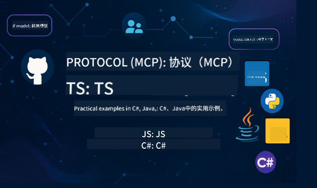

<!--
CO_OP_TRANSLATOR_METADATA:
{
  "original_hash": "b7cce20db5b5b3e9daa5db2e162aa3cf",
  "translation_date": "2025-08-12T20:14:43+00:00",
  "source_file": "README.md",
  "language_code": "zh"
}
-->
 

按照以下步骤开始使用这些资源：
1. **Fork 仓库**：点击 
2. **克隆仓库**：`git clone https://github.com/microsoft/mcp-for-beginners.git`
3. [**加入 Azure AI Foundry Discord，与专家和开发者交流**](https://discord.com/invite/ByRwuEEgH4)

### 🌐 多语言支持

#### 通过 GitHub Action 支持（自动化且始终保持最新）

[阿拉伯语](../ar/README.md) | [孟加拉语](../bn/README.md) | [保加利亚语](../bg/README.md) | [缅甸语](../my/README.md) | [中文（简体）](./README.md) | [中文（繁体，香港）](../hk/README.md) | [中文（繁体，澳门）](../mo/README.md) | [中文（繁体，台湾）](../tw/README.md) | [克罗地亚语](../hr/README.md) | [捷克语](../cs/README.md) | [丹麦语](../da/README.md) | [荷兰语](../nl/README.md) | [芬兰语](../fi/README.md) | [法语](../fr/README.md) | [德语](../de/README.md) | [希腊语](../el/README.md) | [希伯来语](../he/README.md) | [印地语](../hi/README.md) | [匈牙利语](../hu/README.md) | [印尼语](../id/README.md) | [意大利语](../it/README.md) | [日语](../ja/README.md) | [韩语](../ko/README.md) | [马来语](../ms/README.md) | [马拉地语](../mr/README.md) | [尼泊尔语](../ne/README.md) | [挪威语](../no/README.md) | [波斯语](../fa/README.md) | [波兰语](../pl/README.md) | [葡萄牙语（巴西）](../br/README.md) | [葡萄牙语（葡萄牙）](../pt/README.md) | [旁遮普语](../pa/README.md) | [罗马尼亚语](../ro/README.md) | [俄语](../ru/README.md) | [塞尔维亚语（西里尔文）](../sr/README.md) | [斯洛伐克语](../sk/README.md) | [斯洛文尼亚语](../sl/README.md) | [西班牙语](../es/README.md) | [斯瓦希里语](../sw/README.md) | [瑞典语](../sv/README.md) | [他加禄语](../tl/README.md) | [泰语](../th/README.md) | [土耳其语](../tr/README.md) | [乌克兰语](../uk/README.md) | [乌尔都语](../ur/README.md) | [越南语](../vi/README.md)

# 🚀 初学者的模型上下文协议 (MCP) 课程

## **通过 C#、Java、JavaScript、Rust、Python 和 TypeScript 的代码示例学习 MCP**

## 🧠 模型上下文协议课程概述

**模型上下文协议 (MCP)** 是一个前沿框架，旨在标准化 AI 模型与客户端应用程序之间的交互。本开源课程提供了一个结构化的学习路径，包含实用的代码示例和真实案例，涵盖 C#、Java、JavaScript、TypeScript 和 Python 等流行编程语言。

无论您是 AI 开发者、系统架构师还是软件工程师，本指南都是您掌握 MCP 基础知识和实施策略的全面资源。

## 🔗 官方 MCP 资源

- 📘 [MCP 文档](https://modelcontextprotocol.io/) – 详细教程和用户指南  
- 📜 [MCP 规范](https://modelcontextprotocol.io/docs/) – 协议架构和技术参考  
- 📜 [原始 MCP 规范](https://spec.modelcontextprotocol.io/) – 旧版技术参考（可能包含更多细节）  
- 🧑‍💻 [MCP GitHub 仓库](https://github.com/modelcontextprotocol) – 开源 SDK、工具和代码示例  
- 🌐 [MCP 社区](https://github.com/orgs/modelcontextprotocol/discussions) – 加入讨论并为社区做出贡献  

### ➡️ 按需观看 - MCP 开发者日

准备好迎接两天的深度技术洞察、社区交流和实践学习吧！MCP 开发者日是一个专注于模型上下文协议 (MCP) 的虚拟活动，这一新兴标准连接了 AI 模型及其依赖的工具。  
您可以通过注册活动页面观看 MCP 开发者日：https://aka.ms/mcpdevdays。

#### 第一天：MCP 生产力、开发工具和社区

专注于帮助开发者将 MCP 融入开发工作流，并庆祝 MCP 社区的卓越成就。我们将与社区成员和合作伙伴（如 Arcade、Block、Okta 和 Neon）一起探讨他们如何与 Microsoft 合作，共同打造一个开放、可扩展的 MCP 生态系统。  
- 展示 VS Code、Visual Studio、GitHub Copilot 和流行社区工具的真实案例  
- 实用的、以上下文为驱动的开发工作流  
- 社区主导的会议和见解  
无论您是刚开始接触 MCP 还是已经在使用它，第一天将为您提供灵感和可操作的收获。

#### 第二天：自信地构建 MCP 服务器

专为 MCP 构建者设计。我们将深入探讨创建 MCP 服务器的实施策略和最佳实践，并将 MCP 集成到您的 AI 工作流中。

### 主题包括：

- 构建 MCP 服务器并将其集成到代理体验中  
- 基于提示的开发  
- 安全最佳实践  
- 使用 Functions、ACA 和 API 管理等构建模块  
- 注册表对齐和工具（1P + 3P）  

如果您是开发者、工具构建者或 AI 产品策略师，这一天将为您提供构建可扩展、安全且面向未来的 MCP 解决方案所需的见解。

## 🧭 MCP 课程概览

### 📚 完整课程结构

| 模块 | 主题 | 描述 | 链接 |
|--------|-------|-------------|------|
| **模块 1-3：基础知识** | | | |
| 00 | MCP 简介 | 概述模型上下文协议及其在 AI 流程中的重要性 | [阅读更多](./00-Introduction/README.md) |
| 01 | 核心概念解析 | 深入探讨 MCP 的核心概念 | [阅读更多](./01-CoreConcepts/README.md) |
| 02 | MCP 安全性 | 安全威胁和最佳实践 | [阅读更多](./02-Security/README.md) |
| 03 | 开始使用 MCP | 环境设置、基本服务器/客户端、集成 | [阅读更多](./03-GettingStarted/README.md) |
| **模块 3：构建您的第一个服务器和客户端** | | | |
| 3.1 | 第一个服务器 | 创建您的第一个 MCP 服务器 | [指南](./03-GettingStarted/01-first-server/README.md) |
| 3.2 | 第一个客户端 | 开发一个基本的 MCP 客户端 | [指南](./03-GettingStarted/02-client/README.md) |
| 3.3 | 带 LLM 的客户端 | 集成大型语言模型 | [指南](./03-GettingStarted/03-llm-client/README.md) |
| 3.4 | VS Code 集成 | 在 VS Code 中使用 MCP 服务器 | [指南](./03-GettingStarted/04-vscode/README.md) |
| 3.5 | SSE 服务器 | 使用服务器发送事件创建服务器 | [指南](./03-GettingStarted/05-sse-server/README.md) |
| 3.6 | HTTP 流式传输 | 在 MCP 中实现 HTTP 流式传输 | [指南](./03-GettingStarted/06-http-streaming/README.md) |
| 3.7 | AI 工具包 | 使用 MCP 的 AI 工具包 | [指南](./03-GettingStarted/07-aitk/README.md) |
| 3.8 | 测试 | 测试您的 MCP 服务器实现 | [指南](./03-GettingStarted/08-testing/README.md) |
| 3.9 | 部署 | 将 MCP 服务器部署到生产环境 | [指南](./03-GettingStarted/09-deployment/README.md) |
| **模块 4-5：实践与高级内容** | | | |
| 04 | 实践实施 | SDK、调试、测试、可重用提示模板 | [阅读更多](./04-PracticalImplementation/README.md) |
| 05 | MCP 高级主题 | 多模态 AI、扩展、企业应用 | [阅读更多](./05-AdvancedTopics/README.md) |
| 5.1 | Azure 集成 | MCP 与 Azure 的集成 | [指南](./05-AdvancedTopics/mcp-integration/README.md) |
| 5.2 | 多模态 | 使用多种模态 | [指南](./05-AdvancedTopics/mcp-multi-modality/README.md) |
| 5.3 | OAuth2 演示 | 实现 OAuth2 认证 | [指南](./05-AdvancedTopics/mcp-oauth2-demo/README.md) |
| 5.4 | 根上下文 | 理解并实现根上下文 | [指南](./05-AdvancedTopics/mcp-root-contexts/README.md) |
| 5.5 | 路由 | MCP 路由策略 | [指南](./05-AdvancedTopics/mcp-routing/README.md) |
| 5.6 | 采样 | MCP 中的采样技术 | [指南](./05-AdvancedTopics/mcp-sampling/README.md) |
| 5.7 | 扩展 | 扩展 MCP 实现 | [指南](./05-AdvancedTopics/mcp-scaling/README.md) |
| 5.8 | 安全性 | 高级安全性考虑 | [指南](./05-AdvancedTopics/mcp-security/README.md) |
| 5.9 | 网络搜索 | 实现网络搜索功能 | [指南](./05-AdvancedTopics/web-search-mcp/README.md) |
| 5.10 | 实时流式传输 | 构建实时流式传输功能 | [指南](./05-AdvancedTopics/mcp-realtimestreaming/README.md) |
| 5.11 | 实时搜索 | 实现实时搜索 | [指南](./05-AdvancedTopics/mcp-realtimesearch/README.md) |
| 5.12 | Entra ID 认证 | 使用 Microsoft Entra ID 进行认证 | [指南](./05-AdvancedTopics/mcp-security-entra/README.md) |
| 5.13 | Foundry 集成 | 与 Azure AI Foundry 集成 | [指南](./05-AdvancedTopics/mcp-foundry-agent-integration/README.md) |
| 5.14 | 上下文工程 | 有效上下文工程的技术 | [指南](./05-AdvancedTopics/mcp-contextengineering/README.md) |
| **模块 6-10：社区与最佳实践** | | | |
| 06 | 社区贡献 | 如何为MCP生态系统做贡献 | [指南](./06-CommunityContributions/README.md) |
| 07 | 早期采用的经验 | 实际实施案例 | [指南](./07-LessonsFromEarlyAdoption/README.md) |
| 08 | MCP最佳实践 | 性能、容错性、弹性 | [指南](./08-BestPractices/README.md) |
| 09 | MCP案例研究 | 实际实施示例 | [指南](./09-CaseStudy/README.md) |
| 10 | 实践工作坊 | 使用AI工具包构建MCP服务器 | [实验](./10-StreamliningAIWorkflowsBuildingAnMCPServerWithAIToolkit/README.md) |

### 💻 示例代码项目

#### 基础MCP计算器示例

| 编程语言 | 描述 | 链接 |
|----------|-------------|------|
| C# | MCP服务器示例 | [查看代码](./03-GettingStarted/samples/csharp/README.md) |
| Java | MCP计算器 | [查看代码](./03-GettingStarted/samples/java/calculator/README.md) |
| JavaScript | MCP演示 | [查看代码](./03-GettingStarted/samples/javascript/README.md) |
| Python | MCP服务器 | [查看代码](../../03-GettingStarted/samples/python/mcp_calculator_server.py) |
| TypeScript | MCP示例 | [查看代码](./03-GettingStarted/samples/typescript/README.md) |

#### 高级MCP实现

| 编程语言 | 描述 | 链接 |
|----------|-------------|------|
| C# | 高级示例 | [查看代码](./04-PracticalImplementation/samples/csharp/README.md) |
| Java with Spring | 容器应用示例 | [查看代码](./04-PracticalImplementation/samples/java/containerapp/README.md) |
| JavaScript | 高级示例 | [查看代码](./04-PracticalImplementation/samples/javascript/README.md) |
| Python | 复杂实现 | [查看代码](../../04-PracticalImplementation/samples/python/mcp_sample.py) |
| TypeScript | 容器示例 | [查看代码](./04-PracticalImplementation/samples/typescript/README.md) |

## 🎯 学习MCP的前置条件

为了充分利用本课程内容，您应该具备以下知识：

- 至少掌握以下编程语言之一的基础知识：C#、Java、JavaScript、Python或TypeScript
- 理解客户端-服务器模型和API
- 熟悉REST和HTTP相关概念
- （可选）具备AI/ML相关背景知识

- 加入我们的社区讨论以获得支持

## 📚 学习指南与资源

本仓库包含多种资源，帮助您高效学习和导航：

### 学习指南

我们提供了全面的[学习指南](./study_guide.md)，帮助您有效地使用本仓库。指南内容包括：

- 展示所有涵盖主题的视觉课程地图
- 每个仓库部分的详细分解
- 如何使用示例项目的指导
- 针对不同技能水平的推荐学习路径
- 补充学习旅程的额外资源

### 更新日志

我们维护了详细的[更新日志](./changelog.md)，记录了课程材料的所有重要更新，包括：

- 新内容添加
- 结构调整
- 功能改进
- 文档更新

## 🛠️ 如何高效使用本课程

本指南中的每节课包括：

1. 清晰的MCP概念解释  
2. 多种编程语言的实时代码示例  
3. 构建实际MCP应用的练习  
4. 为高级学习者提供的额外资源  

## 🌟 社区感谢

感谢Microsoft Valued Professional [Shivam Goyal](https://www.linkedin.com/in/shivam2003/)贡献的重要代码示例。

## 📜 许可信息

本内容采用**MIT许可协议**。有关条款和条件，请参阅[LICENSE](../../LICENSE)。

## 🤝 贡献指南

本项目欢迎贡献和建议。大多数贡献需要您同意一份贡献者许可协议（CLA），声明您有权并实际授予我们使用您的贡献的权利。详情请访问  
<https://cla.opensource.microsoft.com>。

当您提交拉取请求时，CLA机器人会自动判断您是否需要提供CLA，并相应地标注PR（例如状态检查、评论）。只需按照机器人提供的指示操作即可。您只需在所有使用CLA的仓库中完成一次此操作。

本项目已采用[Microsoft开源行为准则](https://opensource.microsoft.com/codeofconduct/)。
有关更多信息，请参阅[行为准则FAQ](https://opensource.microsoft.com/codeofconduct/faq/)或联系[opencode@microsoft.com](mailto:opencode@microsoft.com)以提出其他问题或意见。

## 📂 仓库结构

本仓库组织如下：

- **核心课程 (00-10)**：主要内容分为十个连续模块
- **images/**：课程中使用的图表和插图
- **translations/**：多语言支持及自动翻译
- **translated_images/**：本地化版本的图表和插图
- **study_guide.md**：全面的仓库导航指南
- **changelog.md**：课程材料所有重要更改的记录
- **mcp.json**：MCP规范的配置文件
- **CODE_OF_CONDUCT.md, LICENSE, SECURITY.md, SUPPORT.md**：项目治理文件

## 🎒 其他课程
我们的团队还制作了其他课程！查看以下内容：

- [AI Agents For Beginners](https://github.com/microsoft/ai-agents-for-beginners?WT.mc_id=academic-105485-koreyst)
- [Generative AI for Beginners using .NET](https://github.com/microsoft/Generative-AI-for-beginners-dotnet?WT.mc_id=academic-105485-koreyst)
- [Generative AI for Beginners using JavaScript](https://github.com/microsoft/generative-ai-with-javascript?WT.mc_id=academic-105485-koreyst)
- [Generative AI for Beginners](https://github.com/microsoft/generative-ai-for-beginners?WT.mc_id=academic-105485-koreyst)
- [Generative AI for Beginners using Java](https://github.com/microsoft/generative-ai-for-beginners-java?WT.mc_id=academic-105485-koreyst)
- [ML for Beginners](https://aka.ms/ml-beginners?WT.mc_id=academic-105485-koreyst)
- [Data Science for Beginners](https://aka.ms/datascience-beginners?WT.mc_id=academic-105485-koreyst)
- [AI for Beginners](https://aka.ms/ai-beginners?WT.mc_id=academic-105485-koreyst)
- [Cybersecurity for Beginners](https://github.com/microsoft/Security-101?WT.mc_id=academic-96948-sayoung)
- [Web Dev for Beginners](https://aka.ms/webdev-beginners?WT.mc_id=academic-105485-koreyst)
- [IoT for Beginners](https://aka.ms/iot-beginners?WT.mc_id=academic-105485-koreyst)
- [XR Development for Beginners](https://github.com/microsoft/xr-development-for-beginners?WT.mc_id=academic-105485-koreyst)
- [Mastering GitHub Copilot for AI Paired Programming](https://aka.ms/GitHubCopilotAI?WT.mc_id=academic-105485-koreyst)
- [Mastering GitHub Copilot for C#/.NET Developers](https://github.com/microsoft/mastering-github-copilot-for-dotnet-csharp-developers?WT.mc_id=academic-105485-koreyst)
- [Choose Your Own Copilot Adventure](https://github.com/microsoft/CopilotAdventures?WT.mc_id=academic-105485-koreyst)

## ™️ 商标声明

本项目可能包含项目、产品或服务的商标或标志。使用Microsoft商标或标志需遵守并必须符合[Microsoft商标与品牌指南](https://www.microsoft.com/legal/intellectualproperty/trademarks/usage/general)。  
在修改版本中使用Microsoft商标或标志不得引起混淆或暗示Microsoft赞助。任何第三方商标或标志的使用需遵守相关第三方政策。

**免责声明**：  
本文档使用AI翻译服务 [Co-op Translator](https://github.com/Azure/co-op-translator) 进行翻译。尽管我们努力确保翻译的准确性，但请注意，自动翻译可能包含错误或不准确之处。原始语言的文档应被视为权威来源。对于重要信息，建议使用专业人工翻译。我们不对因使用此翻译而产生的任何误解或误读承担责任。