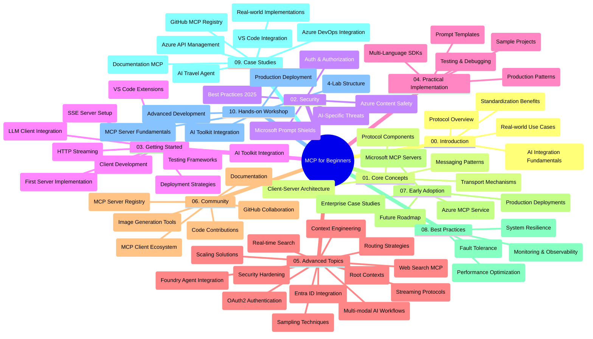

<!--
CO_OP_TRANSLATOR_METADATA:
{
  "original_hash": "719117a0a5f34ade7b5dfb61ee06fb13",
  "translation_date": "2025-09-26T17:47:51+00:00",
  "source_file": "study_guide.md",
  "language_code": "zh"
}
-->
# 初学者的模型上下文协议 (MCP) 学习指南

本学习指南概述了“模型上下文协议 (MCP) 初学者”课程的仓库结构和内容。使用此指南可以高效地浏览仓库并充分利用可用资源。

## 仓库概述

模型上下文协议 (MCP) 是一个标准化框架，用于 AI 模型与客户端应用之间的交互。MCP 最初由 Anthropic 创建，现在由更广泛的 MCP 社区通过官方 GitHub 组织进行维护。本仓库提供了一个全面的课程，包括 C#、Java、JavaScript、Python 和 TypeScript 的代码示例，专为 AI 开发者、系统架构师和软件工程师设计。

## 可视化课程地图

## 仓库结构

仓库分为十个主要部分，每部分专注于 MCP 的不同方面：

1. **简介 (00-Introduction/)**
   - 模型上下文协议概述
   - 标准化在 AI 管道中的重要性
   - 实际用例和优势

2. **核心概念 (01-CoreConcepts/)**
   - 客户端-服务器架构
   - 协议的关键组件
   - MCP 中的消息传递模式

3. **安全性 (02-Security/)**
   - MCP 系统中的安全威胁
   - 实现安全性的最佳实践
   - 身份验证和授权策略
   - **全面的安全文档**：
     - MCP 安全最佳实践 2025
     - Azure 内容安全实施指南
     - MCP 安全控制和技术
     - MCP 快速参考最佳实践
   - **关键安全主题**：
     - 提示注入和工具污染攻击
     - 会话劫持和混淆代理问题
     - 令牌传递漏洞
     - 过度权限和访问控制
     - AI 组件的供应链安全
     - Microsoft Prompt Shields 集成

4. **入门 (03-GettingStarted/)**
   - 环境设置和配置
   - 创建基本的 MCP 服务器和客户端
   - 与现有应用集成
   - 包括以下部分：
     - 第一个服务器实现
     - 客户端开发
     - LLM 客户端集成
     - VS Code 集成
     - 服务器发送事件 (SSE) 服务器
     - HTTP 流式传输
     - AI 工具包集成
     - 测试策略
     - 部署指南

5. **实践实现 (04-PracticalImplementation/)**
   - 使用不同编程语言的 SDK
   - 调试、测试和验证技术
   - 制作可重用的提示模板和工作流
   - 实现示例的项目样本

6. **高级主题 (05-AdvancedTopics/)**
   - 上下文工程技术
   - Foundry 代理集成
   - 多模态 AI 工作流
   - OAuth2 身份验证演示
   - 实时搜索功能
   - 实时流式传输
   - 根上下文实现
   - 路由策略
   - 采样技术
   - 扩展方法
   - 安全性考虑
   - Entra ID 安全集成
   - Web 搜索集成

7. **社区贡献 (06-CommunityContributions/)**
   - 如何贡献代码和文档
   - 通过 GitHub 协作
   - 社区驱动的增强和反馈
   - 使用各种 MCP 客户端（Claude Desktop、Cline、VSCode）
   - 使用流行的 MCP 服务器，包括图像生成

8. **早期采用的经验教训 (07-LessonsfromEarlyAdoption/)**
   - 实际实施和成功案例
   - 构建和部署基于 MCP 的解决方案
   - 趋势和未来路线图
   - **Microsoft MCP 服务器指南**：涵盖 10 个生产就绪的 Microsoft MCP 服务器，包括：
     - Microsoft Learn Docs MCP 服务器
     - Azure MCP 服务器（15+ 专用连接器）
     - GitHub MCP 服务器
     - Azure DevOps MCP 服务器
     - MarkItDown MCP 服务器
     - SQL Server MCP 服务器
     - Playwright MCP 服务器
     - Dev Box MCP 服务器
     - Azure AI Foundry MCP 服务器
     - Microsoft 365 Agents Toolkit MCP 服务器

9. **最佳实践 (08-BestPractices/)**
   - 性能调优和优化
   - 设计容错 MCP 系统
   - 测试和弹性策略

10. **案例研究 (09-CaseStudy/)**
    - **七个全面的案例研究**展示 MCP 在不同场景中的多样性：
    - **Azure AI 旅行代理**：使用 Azure OpenAI 和 AI 搜索进行多代理编排
    - **Azure DevOps 集成**：通过 YouTube 数据更新自动化工作流程
    - **实时文档检索**：带有流式 HTTP 的 Python 控制台客户端
    - **交互式学习计划生成器**：使用 Chainlit Web 应用和对话式 AI
    - **编辑器内文档**：VS Code 集成与 GitHub Copilot 工作流
    - **Azure API 管理**：企业 API 集成与 MCP 服务器创建
    - **GitHub MCP 注册表**：生态系统开发和代理集成平台
    - 实现示例涵盖企业集成、开发者生产力和生态系统开发

11. **动手工作坊 (10-StreamliningAIWorkflowsBuildingAnMCPServerWithAIToolkit/)**
    - 综合动手工作坊，将 MCP 与 AI 工具包结合
    - 构建将 AI 模型与现实工具连接的智能应用
    - 实用模块涵盖基础知识、自定义服务器开发和生产部署策略
    - **实验室结构**：
      - 实验室 1：MCP 服务器基础知识
      - 实验室 2：高级 MCP 服务器开发
      - 实验室 3：AI 工具包集成
      - 实验室 4：生产部署和扩展
    - 基于实验室的学习方法，提供分步指导

## 附加资源

仓库包括支持资源：

- **图片文件夹**：包含课程中使用的图表和插图
- **翻译**：多语言支持，提供文档的自动翻译
- **官方 MCP 资源**：
  - [MCP 文档](https://modelcontextprotocol.io/)
  - [MCP 规范](https://spec.modelcontextprotocol.io/)
  - [MCP GitHub 仓库](https://github.com/modelcontextprotocol)

## 如何使用此仓库

1. **顺序学习**：按章节顺序学习（00 到 10），以获得结构化的学习体验。
2. **特定语言重点**：如果对某种编程语言感兴趣，可浏览样本目录，查看您偏好的语言实现。
3. **实践实现**：从“入门”部分开始，设置环境并创建您的第一个 MCP 服务器和客户端。
4. **高级探索**：熟悉基础知识后，深入高级主题以扩展您的知识。
5. **社区参与**：通过 GitHub 讨论和 Discord 频道加入 MCP 社区，与专家和其他开发者交流。

## MCP 客户端和工具

课程涵盖了各种 MCP 客户端和工具：

1. **官方客户端**：
   - Visual Studio Code
   - MCP 在 Visual Studio Code 中
   - Claude Desktop
   - Claude 在 VSCode 中
   - Claude API

2. **社区客户端**：
   - Cline（基于终端）
   - Cursor（代码编辑器）
   - ChatMCP
   - Windsurf

3. **MCP 管理工具**：
   - MCP CLI
   - MCP Manager
   - MCP Linker
   - MCP Router

## 流行的 MCP 服务器

仓库介绍了各种 MCP 服务器，包括：

1. **官方 Microsoft MCP 服务器**：
   - Microsoft Learn Docs MCP 服务器
   - Azure MCP 服务器（15+ 专用连接器）
   - GitHub MCP 服务器
   - Azure DevOps MCP 服务器
   - MarkItDown MCP 服务器
   - SQL Server MCP 服务器
   - Playwright MCP 服务器
   - Dev Box MCP 服务器
   - Azure AI Foundry MCP 服务器
   - Microsoft 365 Agents Toolkit MCP 服务器

2. **官方参考服务器**：
   - 文件系统
   - Fetch
   - 内存
   - 顺序思维

3. **图像生成**：
   - Azure OpenAI DALL-E 3
   - Stable Diffusion WebUI
   - Replicate

4. **开发工具**：
   - Git MCP
   - 终端控制
   - 代码助手

5. **专用服务器**：
   - Salesforce
   - Microsoft Teams
   - Jira & Confluence

## 贡献

本仓库欢迎社区贡献。请参阅社区贡献部分，了解如何有效地为 MCP 生态系统做出贡献。

## 更新日志

| 日期 | 更改 |
|------|---------|
| 2025年9月26日 | - 在 09-CaseStudy 部分添加 GitHub MCP 注册表案例研究 - 更新案例研究以反映七个全面的案例研究 - 增强案例研究描述，提供具体实现细节 - 更新可视化课程地图以包含 GitHub MCP 注册表 - 修订学习指南结构以反映生态系统开发重点 |
| 2025年7月18日 | - 更新仓库结构以包含 Microsoft MCP 服务器指南 - 添加 10 个生产就绪的 Microsoft MCP 服务器的全面列表 - 增强流行 MCP 服务器部分，包含官方 Microsoft MCP 服务器 - 更新案例研究部分，提供实际文件示例 - 添加动手工作坊的实验室结构细节 |
| 2025年7月16日 | - 更新仓库结构以反映当前内容 - 添加 MCP 客户端和工具部分 - 添加流行 MCP 服务器部分 - 更新可视化课程地图，包含所有当前主题 - 增强高级主题部分，涵盖所有专用领域 - 更新案例研究以反映实际示例 - 明确 MCP 起源由 Anthropic 创建 |
| 2025年6月11日 | - 初次创建学习指南 - 添加可视化课程地图 - 概述仓库结构 - 包括项目样本和附加资源 |

---

*本学习指南更新于 2025年9月26日，概述了截至该日期的仓库内容。仓库内容可能在此日期之后更新。*

---

