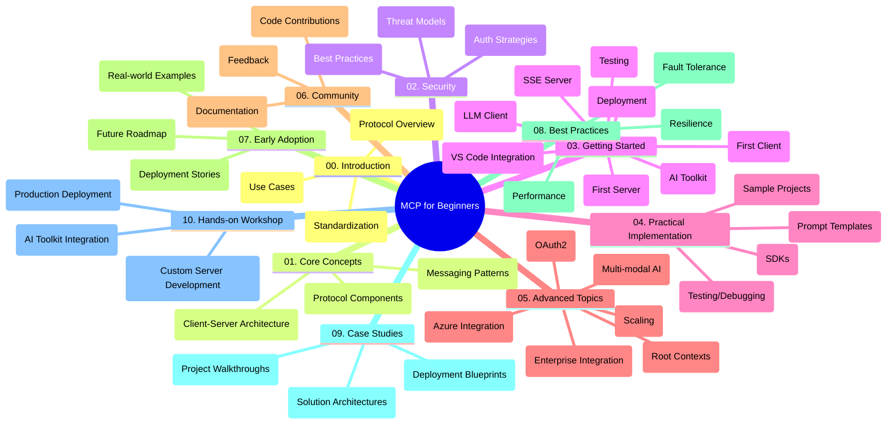

<!--
CO_OP_TRANSLATOR_METADATA:
{
  "original_hash": "a607d4febc94caee9a12b77795f7fc9a",
  "translation_date": "2025-07-13T15:10:46+00:00",
  "source_file": "study_guide.md",
  "language_code": "zh"
}
-->
# Model Context Protocol (MCP) 入门 - 学习指南

本学习指南概述了“Model Context Protocol (MCP) 入门”课程的仓库结构和内容。请使用本指南高效浏览仓库，充分利用现有资源。

## 仓库概览

Model Context Protocol (MCP) 是一个用于 AI 模型与客户端应用交互的标准化框架。本仓库提供了涵盖 C#、Java、JavaScript、Python 和 TypeScript 的实操代码示例的完整课程，面向 AI 开发者、系统架构师和软件工程师。

## 课程视觉地图

## 仓库结构

仓库分为十个主要部分，每部分聚焦 MCP 的不同方面：

1. **介绍 (00-Introduction/)**
   - Model Context Protocol 概述
   - AI 流水线中标准化的重要性
   - 实际应用场景与优势

2. **核心概念 (01-CoreConcepts/)**
   - 客户端-服务器架构
   - 关键协议组件
   - MCP 中的消息传递模式

3. **安全 (02-Security/)**
   - 基于 MCP 系统的安全威胁
   - 安全实现的最佳实践
   - 认证与授权策略

4. **入门指南 (03-GettingStarted/)**
   - 环境搭建与配置
   - 创建基础 MCP 服务器和客户端
   - 与现有应用集成
   - 包含首个服务器、首个客户端、LLM 客户端、VS Code 集成、SSE 服务器、AI 工具包、测试与部署等子章节

5. **实战实现 (04-PracticalImplementation/)**
   - 跨语言 SDK 使用
   - 调试、测试与验证技巧
   - 设计可复用的提示模板和工作流
   - 示例项目及实现案例

6. **高级主题 (05-AdvancedTopics/)**
   - 多模态 AI 工作流与扩展性
   - 安全扩展策略
   - MCP 在企业生态系统中的应用
   - 专题包括 Azure 集成、多模态、OAuth2、根上下文、路由、采样、扩展、安全、网页搜索集成及流式传输

7. **社区贡献 (06-CommunityContributions/)**
   - 如何贡献代码和文档
   - 通过 GitHub 协作
   - 社区驱动的改进与反馈

8. **早期采用经验 (07-LessonsfromEarlyAdoption/)**
   - 真实案例与成功故事
   - MCP 解决方案的构建与部署
   - 发展趋势与未来规划

9. **最佳实践 (08-BestPractices/)**
   - 性能调优与优化
   - 设计容错的 MCP 系统
   - 测试与弹性策略

10. **案例研究 (09-CaseStudy/)**
    - 深入解析 MCP 解决方案架构
    - 部署蓝图与集成建议
    - 带注释的图示与项目演示

11. **实操工作坊 (10-StreamliningAIWorkflowsBuildingAnMCPServerWithAIToolkit/)**
    - 结合 MCP 与微软 AI 工具包的综合实操工作坊
    - 构建连接 AI 模型与现实工具的智能应用
    - 涵盖基础知识、自定义服务器开发及生产部署策略的实用模块

## 示例项目

仓库包含多个示例项目，展示了不同编程语言中的 MCP 实现：

### 基础 MCP 计算器示例
- C# MCP 服务器示例
- Java MCP 计算器
- JavaScript MCP 演示
- Python MCP 服务器
- TypeScript MCP 示例

### 高级 MCP 计算器项目
- 高级 C# 示例
- Java 容器应用示例
- JavaScript 高级示例
- Python 复杂实现
- TypeScript 容器示例

## 额外资源

仓库还包含支持资源：

- **Images 文件夹**：包含课程中使用的图表和插图
- **翻译**：多语言支持，文档自动翻译
- **官方 MCP 资源**：
  - [MCP 文档](https://modelcontextprotocol.io/)
  - [MCP 规范](https://spec.modelcontextprotocol.io/)
  - [MCP GitHub 仓库](https://github.com/modelcontextprotocol)

## 如何使用本仓库

1. **按顺序学习**：依次阅读章节（00 到 10），获得系统化学习体验。
2. **语言专项**：如果关注特定编程语言，可浏览对应语言的示例目录。
3. **实战入门**：从“入门指南”开始，搭建环境并创建首个 MCP 服务器和客户端。
4. **深入探索**：掌握基础后，深入高级主题，拓展知识面。
5. **社区互动**：加入 [Azure AI Foundry Discord](https://discord.com/invite/ByRwuEEgH4)，与专家和开发者交流。

## 贡献指南

欢迎社区贡献。请参阅社区贡献章节，了解如何参与。

---

*本学习指南创建于 2025 年 6 月 11 日，内容反映当时仓库概况。仓库内容可能已更新。*

**免责声明**：  
本文件使用 AI 翻译服务 [Co-op Translator](https://github.com/Azure/co-op-translator) 进行翻译。虽然我们力求准确，但请注意，自动翻译可能包含错误或不准确之处。原始文件的母语版本应被视为权威来源。对于重要信息，建议使用专业人工翻译。对于因使用本翻译而产生的任何误解或误释，我们不承担任何责任。