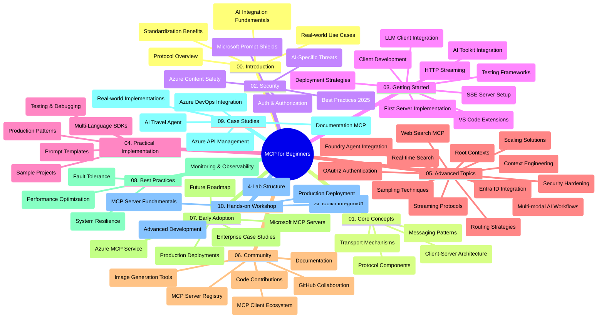

<!--
CO_OP_TRANSLATOR_METADATA:
{
  "original_hash": "e2c6ed897fa98fa08e0146101776c7ff",
  "translation_date": "2025-07-18T09:19:18+00:00",
  "source_file": "study_guide.md",
  "language_code": "zh"
}
-->
# 面向初学者的模型上下文协议（MCP）学习指南

本学习指南概述了“面向初学者的模型上下文协议（MCP）”课程的仓库结构和内容。请使用本指南高效浏览仓库，充分利用可用资源。

## 仓库概览

模型上下文协议（MCP）是AI模型与客户端应用之间交互的标准化框架。最初由Anthropic创建，现由更广泛的MCP社区通过官方GitHub组织维护。本仓库提供了涵盖C#、Java、JavaScript、Python和TypeScript的实操代码示例的完整课程，面向AI开发者、系统架构师和软件工程师。

## 课程视觉地图

## 仓库结构

仓库分为十个主要部分，每部分聚焦MCP的不同方面：

1. **介绍 (00-Introduction/)**
   - 模型上下文协议概述
   - AI流程中标准化的重要性
   - 实际应用场景与优势

2. **核心概念 (01-CoreConcepts/)**
   - 客户端-服务器架构
   - 关键协议组件
   - MCP中的消息传递模式

3. **安全 (02-Security/)**
   - 基于MCP系统的安全威胁
   - 安全实现的最佳实践
   - 认证与授权策略
   - **全面的安全文档**：
     - MCP安全最佳实践2025
     - Azure内容安全实施指南
     - MCP安全控制与技术
     - MCP最佳实践速查
   - **重点安全议题**：
     - 提示注入与工具中毒攻击
     - 会话劫持与混淆代理问题
     - 令牌透传漏洞
     - 过度权限与访问控制
     - AI组件的供应链安全
     - Microsoft提示防护集成

4. **入门指南 (03-GettingStarted/)**
   - 环境搭建与配置
   - 创建基础MCP服务器和客户端
   - 与现有应用集成
   - 包含章节：
     - 第一个服务器实现
     - 客户端开发
     - 大型语言模型客户端集成
     - VS Code集成
     - 服务器推送事件（SSE）服务器
     - HTTP流式传输
     - AI工具包集成
     - 测试策略
     - 部署指南

5. **实战实现 (04-PracticalImplementation/)**
   - 跨语言SDK使用
   - 调试、测试与验证技巧
   - 设计可复用的提示模板和工作流
   - 示例项目与实现案例

6. **高级主题 (05-AdvancedTopics/)**
   - 上下文工程技术
   - Foundry代理集成
   - 多模态AI工作流
   - OAuth2认证演示
   - 实时搜索功能
   - 实时流处理
   - 根上下文实现
   - 路由策略
   - 采样技术
   - 扩展方案
   - 安全考量
   - Entra ID安全集成
   - 网络搜索集成

7. **社区贡献 (06-CommunityContributions/)**
   - 如何贡献代码和文档
   - 通过GitHub协作
   - 社区驱动的改进与反馈
   - 使用多种MCP客户端（Claude Desktop、Cline、VSCode）
   - 使用流行的MCP服务器，包括图像生成

8. **早期采用经验 (07-LessonsfromEarlyAdoption/)**
   - 真实案例与成功故事
   - 构建和部署基于MCP的解决方案
   - 发展趋势与未来路线图
   - **微软MCP服务器指南**：涵盖10个生产级微软MCP服务器的全面指南，包括：
     - Microsoft Learn Docs MCP服务器
     - Azure MCP服务器（15+专用连接器）
     - GitHub MCP服务器
     - Azure DevOps MCP服务器
     - MarkItDown MCP服务器
     - SQL Server MCP服务器
     - Playwright MCP服务器
     - Dev Box MCP服务器
     - Azure AI Foundry MCP服务器
     - Microsoft 365 Agents Toolkit MCP服务器

9. **最佳实践 (08-BestPractices/)**
   - 性能调优与优化
   - 设计容错MCP系统
   - 测试与弹性策略

10. **案例研究 (09-CaseStudy/)**
    - Azure API管理集成示例
    - 旅行代理实现示例
    - Azure DevOps与YouTube更新集成
    - 文档MCP实现示例
    - 详细文档的实现案例

11. **实操工作坊 (10-StreamliningAIWorkflowsBuildingAnMCPServerWithAIToolkit/)**
    - 结合MCP与AI工具包的综合实操工作坊
    - 构建连接AI模型与现实工具的智能应用
    - 涵盖基础知识、自定义服务器开发及生产部署策略的实用模块
    - **实验室结构**：
      - 实验室1：MCP服务器基础
      - 实验室2：高级MCP服务器开发
      - 实验室3：AI工具包集成
      - 实验室4：生产部署与扩展
    - 基于实验室的学习方式，提供逐步指导

## 额外资源

仓库还包含支持资源：

- **Images文件夹**：包含课程中使用的图表和插图
- **翻译**：多语言支持，自动翻译文档
- **官方MCP资源**：
  - [MCP文档](https://modelcontextprotocol.io/)
  - [MCP规范](https://spec.modelcontextprotocol.io/)
  - [MCP GitHub仓库](https://github.com/modelcontextprotocol)

## 如何使用本仓库

1. **按顺序学习**：依次阅读章节（00至10），获得系统化学习体验。
2. **语言专项**：如果关注特定编程语言，可浏览对应语言的示例目录。
3. **实战入门**：从“入门指南”开始，搭建环境并创建第一个MCP服务器和客户端。
4. **深入探索**：掌握基础后，深入高级主题，拓展知识面。
5. **社区互动**：通过GitHub讨论和Discord频道加入MCP社区，连接专家和开发者。

## MCP客户端和工具

课程涵盖多种MCP客户端和工具：

1. **官方客户端**：
   - Visual Studio Code
   - Visual Studio Code中的MCP
   - Claude Desktop
   - VSCode中的Claude
   - Claude API

2. **社区客户端**：
   - Cline（终端版）
   - Cursor（代码编辑器）
   - ChatMCP
   - Windsurf

3. **MCP管理工具**：
   - MCP CLI
   - MCP Manager
   - MCP Linker
   - MCP Router

## 流行的MCP服务器

仓库介绍了多种MCP服务器，包括：

1. **微软官方MCP服务器**：
   - Microsoft Learn Docs MCP服务器
   - Azure MCP服务器（15+专用连接器）
   - GitHub MCP服务器
   - Azure DevOps MCP服务器
   - MarkItDown MCP服务器
   - SQL Server MCP服务器
   - Playwright MCP服务器
   - Dev Box MCP服务器
   - Azure AI Foundry MCP服务器
   - Microsoft 365 Agents Toolkit MCP服务器

2. **官方参考服务器**：
   - Filesystem
   - Fetch
   - Memory
   - Sequential Thinking

3. **图像生成**：
   - Azure OpenAI DALL-E 3
   - Stable Diffusion WebUI
   - Replicate

4. **开发工具**：
   - Git MCP
   - Terminal Control
   - Code Assistant

5. **专用服务器**：
   - Salesforce
   - Microsoft Teams
   - Jira & Confluence

## 贡献指南

本仓库欢迎社区贡献。请参阅社区贡献部分，了解如何有效参与MCP生态系统。

## 更新日志

| 日期 | 变更内容 |
|------|---------|
| 2025年7月18日 | - 更新仓库结构，新增微软MCP服务器指南 - 添加10个生产级微软MCP服务器完整列表 - 丰富流行MCP服务器部分，加入微软官方服务器 - 更新案例研究部分，包含实际文件示例 - 添加实操工作坊的实验室结构细节 |
| 2025年7月16日 | - 更新仓库结构以反映当前内容 - 新增MCP客户端和工具部分 - 新增流行MCP服务器部分 - 更新视觉课程地图，涵盖所有当前主题 - 丰富高级主题部分，涵盖所有专业领域 - 更新案例研究，反映实际示例 - 明确MCP由Anthropic创建 |
| 2025年6月11日 | - 初版学习指南创建 - 添加视觉课程地图 - 概述仓库结构 - 包含示例项目和额外资源 |

---

*本学习指南更新于2025年7月18日，内容反映该日期的仓库概况。仓库内容可能在此日期之后有所更新。*

**免责声明**：  
本文件使用 AI 翻译服务 [Co-op Translator](https://github.com/Azure/co-op-translator) 进行翻译。虽然我们力求准确，但请注意，自动翻译可能包含错误或不准确之处。原始文件的母语版本应被视为权威来源。对于重要信息，建议采用专业人工翻译。对于因使用本翻译而产生的任何误解或误释，我们不承担任何责任。